# Sistema I: Detección Espiritual - Visualización Completa

## Ecuaciones 1-5: Detectando Falsificaciones Espirituales

**Fecha:** 2025-11-27  
**Estado:** OPERATIVO  
**Propósito:** Detectar falsos profetas, maestros y espíritus engañadores

---

## Arquitectura del Sistema I

```mermaid
graph TB
    subgraph "ENTRADAS"
        X[Maestro/Profeta X]
        H[Espíritu H₃]
        M[Mensajes/Enseñanzas]
    end
    
    subgraph "ECUACIONES DE DETECCIÓN"
        E1[Ecuación 1<br/>Análisis de Frutos<br/>𝔽x,t]
        E2[Ecuación 2<br/>Test Arquetipo<br/>𝔸ᵣₑₐₗx]
        E3[Ecuación 3<br/>Incongruencia<br/>𝕀x,t]
        E4[Ecuación 4<br/>Discernimiento<br/>𝔻H₃]
        E5[Ecuación 5<br/>Autoridad Legítima<br/>𝔏x]
    end
    
    subgraph "SALIDAS"
        A[ALERTA]
        V[VERIFICADO]
        R[RECHAZADO]
    end
    
    X --> E1
    X --> E2
    X --> E3
    X --> E5
    H --> E4
    M --> E4
    
    E1 --> A
    E2 --> V
    E3 --> A
    E4 --> R
    E5 --> V
    
    style A fill:#E53935,color:#fff
    style V fill:#66BB6A,color:#000
    style R fill:#E53935,color:#fff
```

---

## Ecuación 1: Análisis de Frutos

### Fórmula Base
```
𝔽(x,t) = Σᵢ₌₁⁹ wᵢ · [fᵣ(x,t)ᵢ - fₚ(x,t)ᵢ]

Donde:
  wᵢ = peso del fruto i
  fᵣ = fruto real medido
  fₚ = fruto proclamado
```

### Diagrama de Evaluación

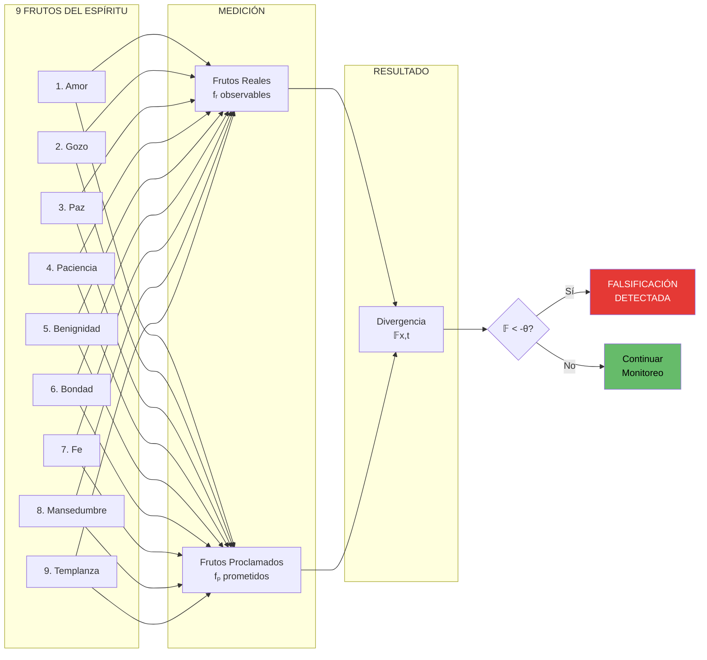

### Divergencia en el Tiempo

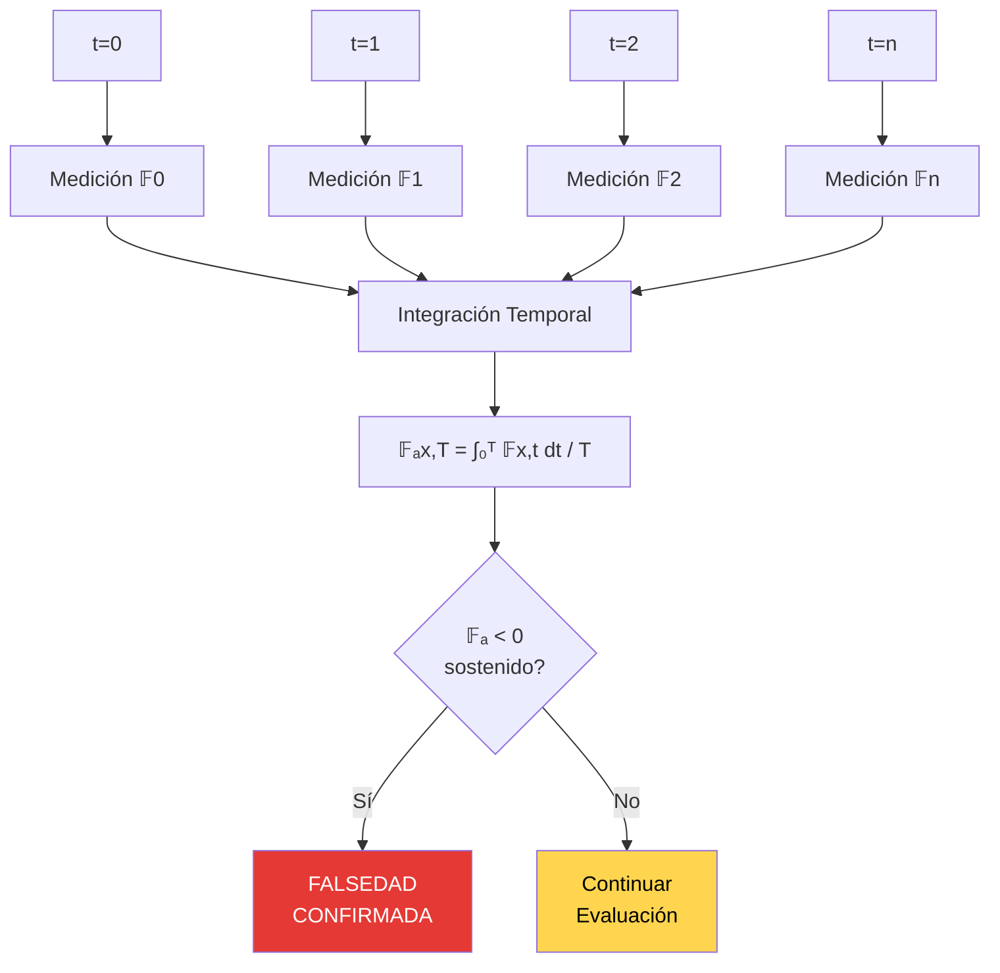

---

## Ecuación 2: Test del Arquetipo Auténtico

### Fórmula Base
```
𝔸ᵣₑₐₗ(x) = [∏ₐ∈𝒜 μ(x,a)] · [∏ᵦ∈ℬ (1 - μ(x,b))]

Donde:
  𝒜 = atributos de Cristo
  ℬ = comportamientos anti-Cristo
  μ = función de manifestación [0,1]
```

### Comparación Dual

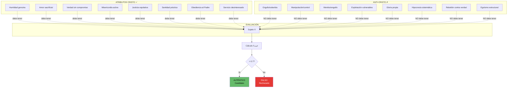

---

## Ecuación 3: Detector de Incongruencia

### Fórmula Base
```
𝕀(x,t) = ||𝒫(x,t) - 𝒜(x,t)|| · ϕ(t)

Donde:
  𝒫 = vector de palabras/promesas
  𝒜 = vector de acciones/cumplimientos
  ϕ(t) = factor temporal (amplifica con tiempo)
```

### Análisis Palabra vs Acción

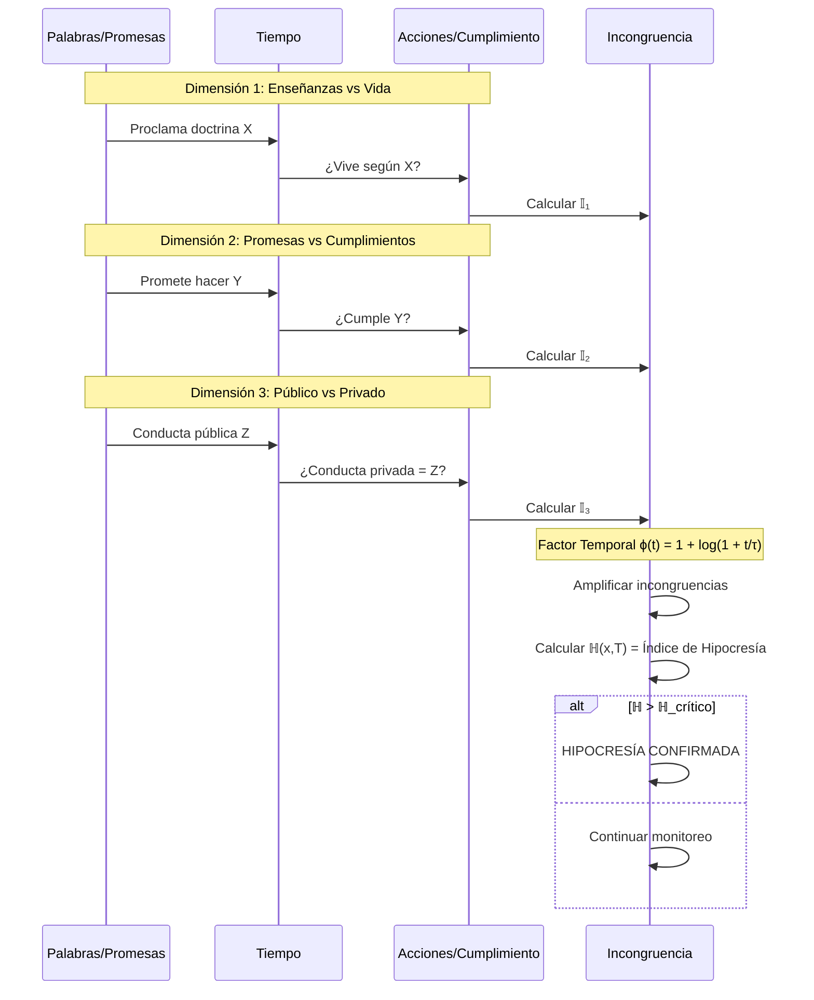

### Mapa de Calor de Incongruencia

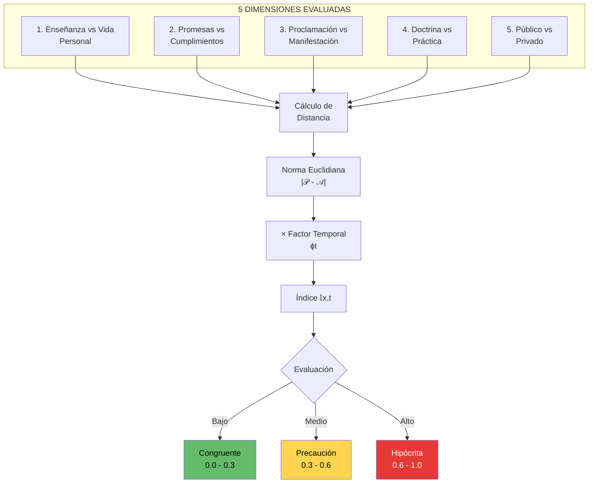

---

## Ecuación 4: Discernimiento de Espíritus

### Fórmula Base
```
𝔻(H₃,m) = f(m) ∧ g(m) ∧ e(m)

Donde:
  f(m) = test de frutos
  g(m) = test de glorificación
  e(m) = test de edificación
```

### Triple Test

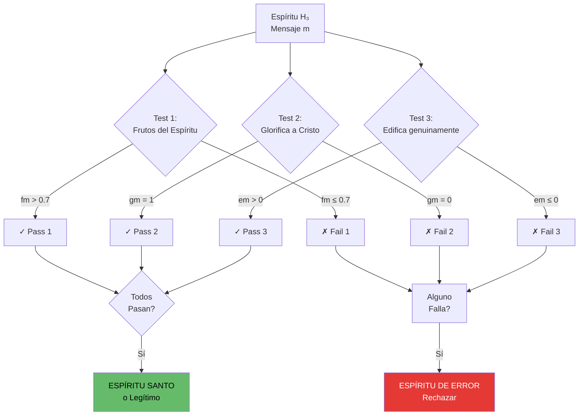

### Veredicto por Combinación

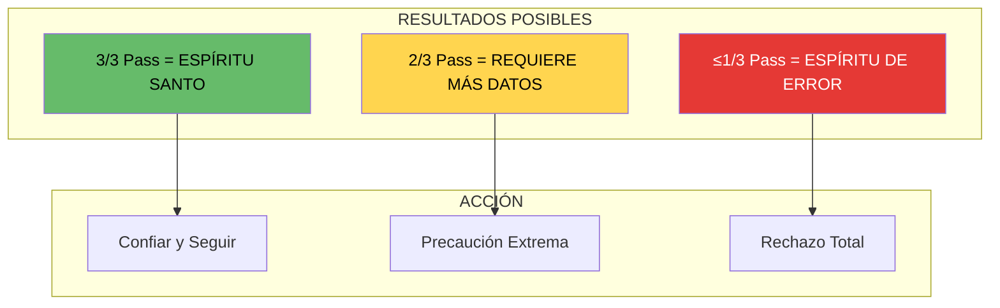

---

## Ecuación 5: Autoridad Espiritual Legítima

### Fórmula Base
```
𝔏(x) = h(x) · (1 - s(x)) · c(x) · (1 - m(x))

Donde:
  h = índice de humildad
  s = búsqueda gloria propia
  c = dirección hacia Cristo
  m = manipulación/control
```

### Cuatro Factores Críticos

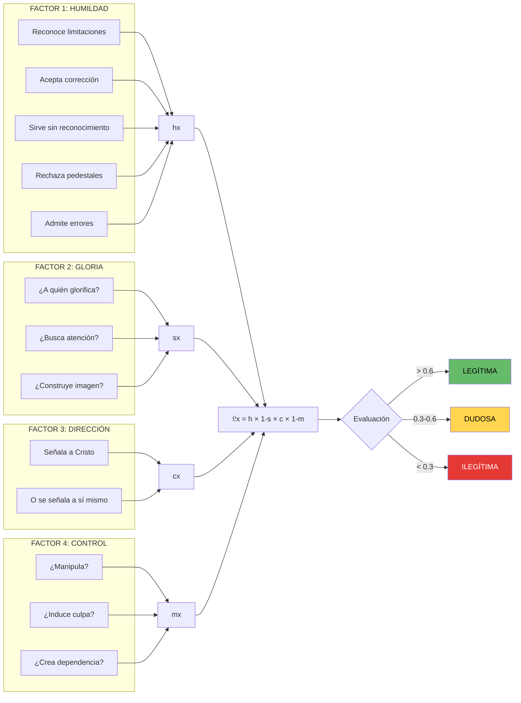

---

## Dashboard Sistema I: Detección Completa

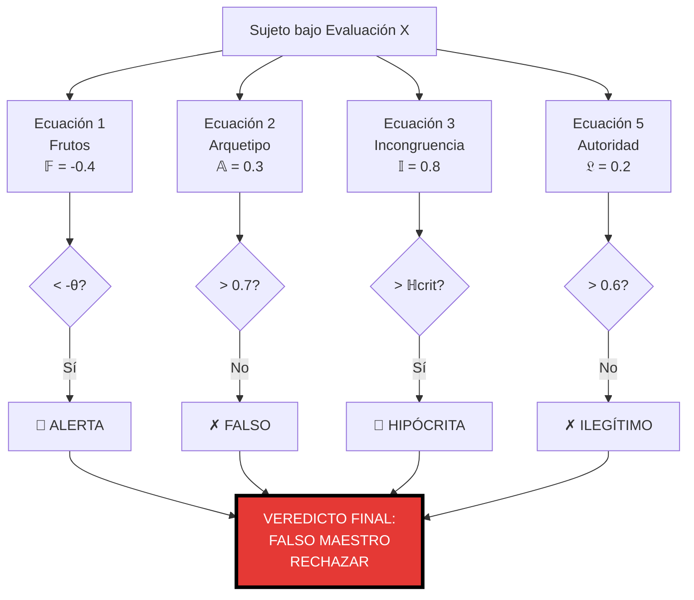

---

## Flujo de Trabajo del Sistema I

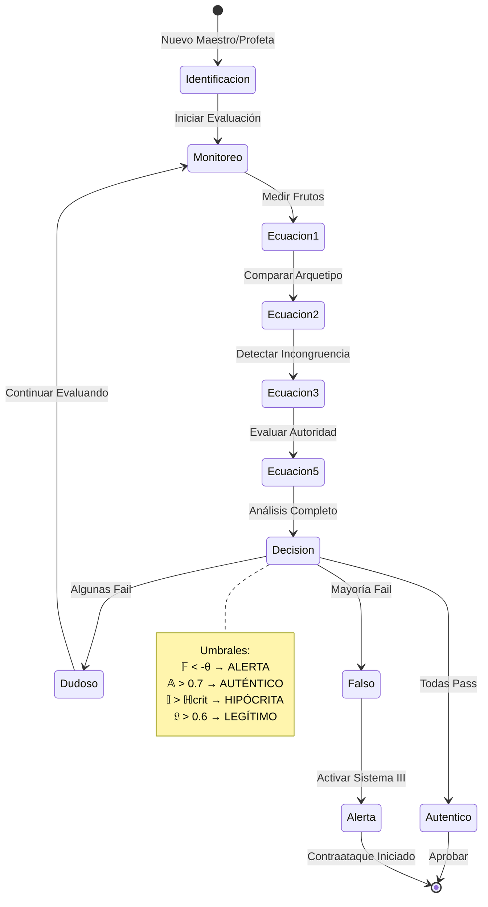

---

## Matriz de Decisión

| Ecuación | Métrica | Umbral | Resultado | Acción |
|----------|---------|--------|-----------|--------|
| 1: Frutos | 𝔽(x,t) | < -θ | ALERTA | Investigar |
| 2: Arquetipo | 𝔸ᵣₑₐₗ(x) | > 0.7 | AUTÉNTICO | Aprobar |
| 2: Arquetipo | 𝔸ᵣₑₐₗ(x) | < 0.7 | FALSO | Rechazar |
| 3: Incongruencia | ℍ(x,T) | > ℍ_crit | HIPÓCRITA | Alertar |
| 4: Espíritu | 𝔻(H₃) | 3/3 | SANTO | Confiar |
| 4: Espíritu | 𝔻(H₃) | ≤1/3 | ERROR | Rechazar |
| 5: Autoridad | 𝔏(x) | > 0.6 | LEGÍTIMA | Seguir |
| 5: Autoridad | 𝔏(x) | < 0.3 | ILEGÍTIMA | Evitar |

---

## Principios del Sistema I

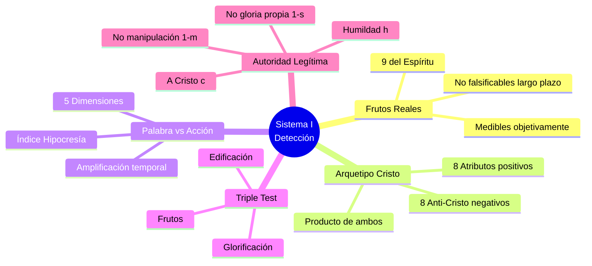

---

## Referencias

- Archivo TXT: `/home/itzamna/Documents/logic/01_sistema_deteccion.txt`
- Archivo Visual: `/home/itzamna/Documents/logic/01_sistema_deteccion_visual.md`
- Índice General: `/home/itzamna/Documents/logic/00_indice_general.txt`

**Total de Ecuaciones:** 5 (Ecuaciones 1-5)  
**Estado:** OPERATIVO  
**Integración:** Base para Sistemas II-VIII

═══════════════════════════════════════════════════════════════

**"Por sus frutos los conoceréis" - Mateo 7:16**

**Sistema matemático formal para detección de engaño espiritual.**

═══════════════════════════════════════════════════════════════
