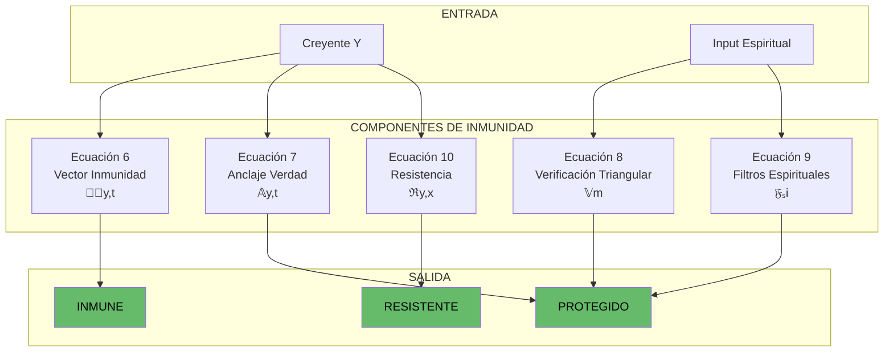
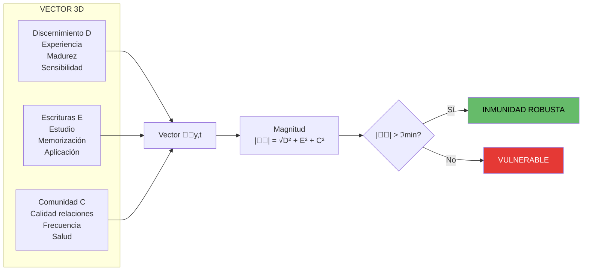
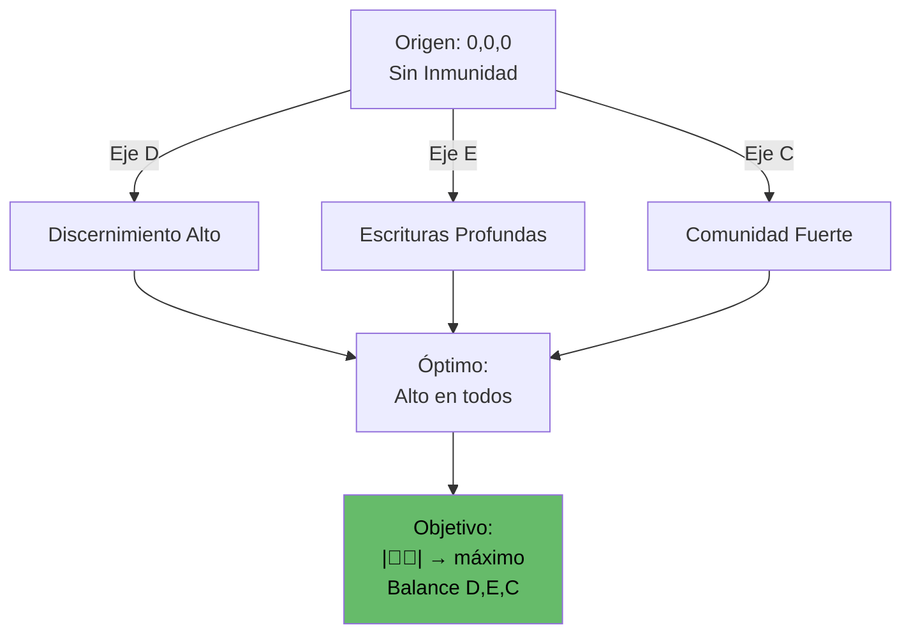
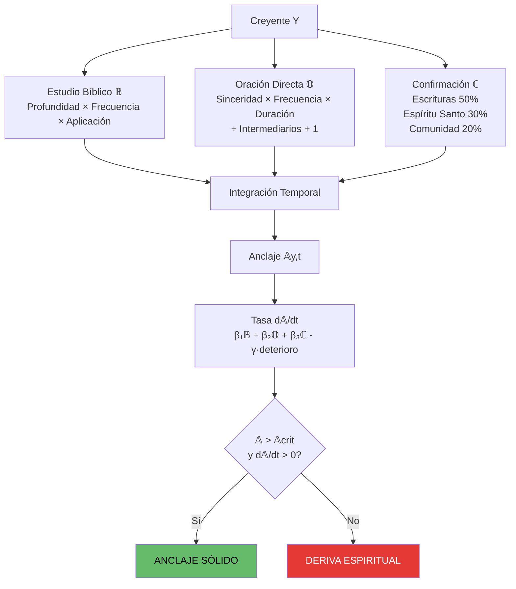
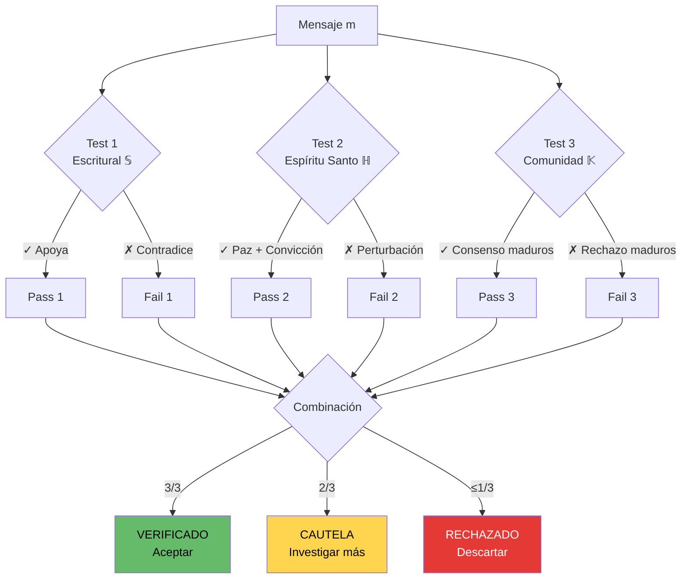
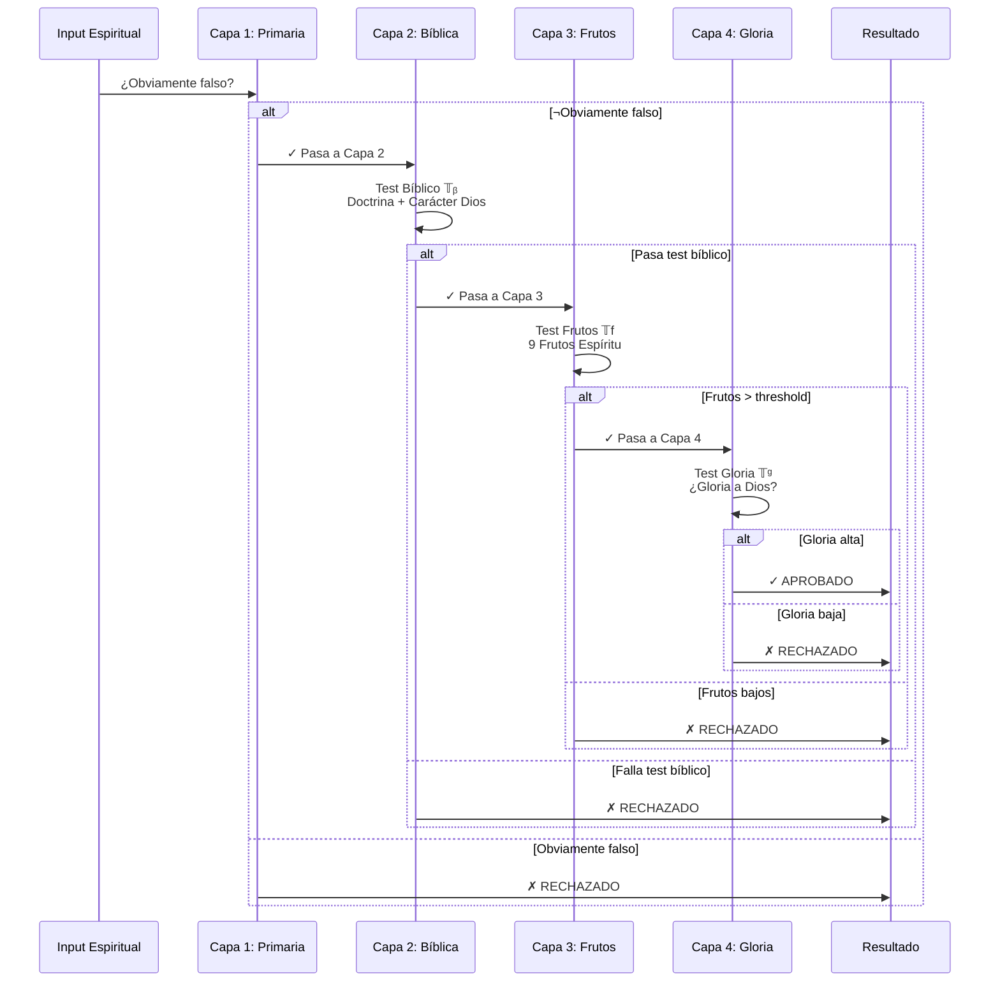
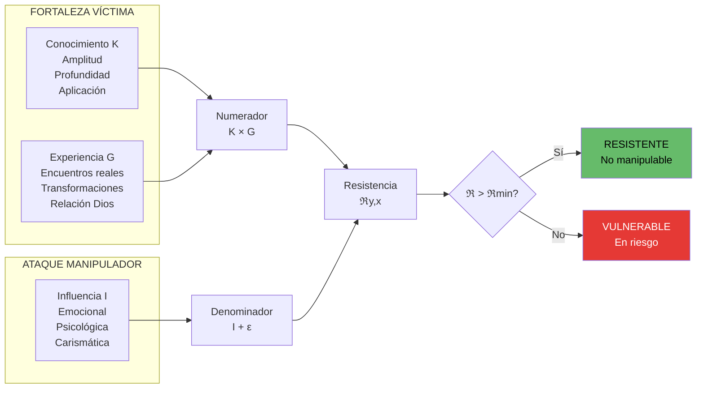
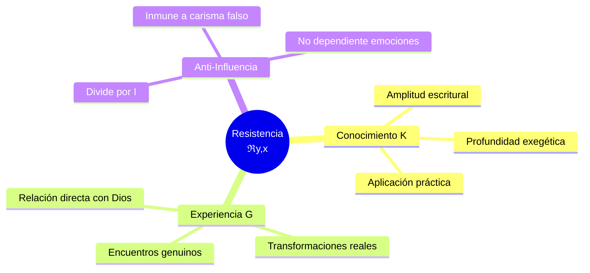
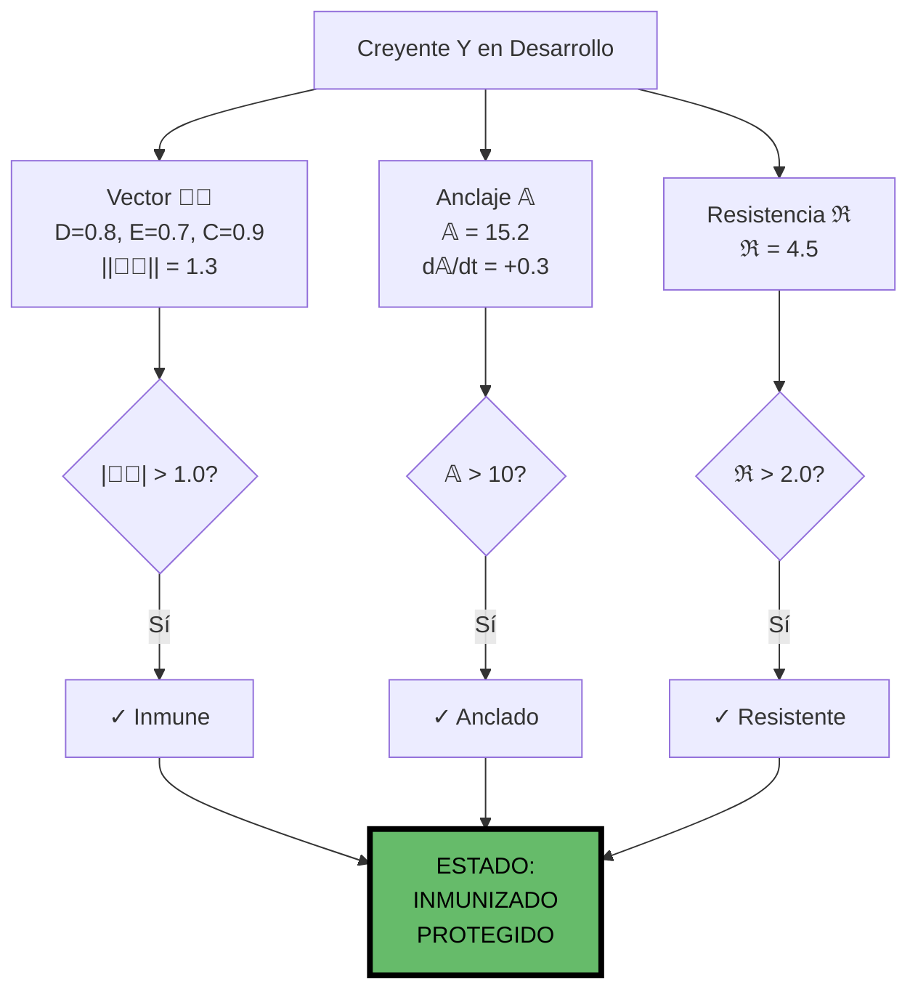
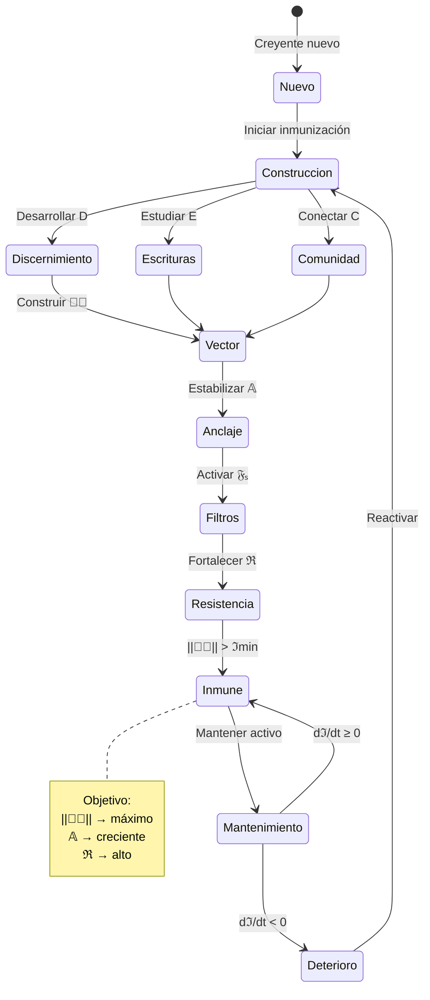

# Sistema II: Inmunización Espiritual - Visualización Completa

## Ecuaciones 6-10: Construyendo Defensas Espirituales

**Fecha:** 2025-11-27  
**Estado:** OPERATIVO  
**Propósito:** Crear inmunidad contra engaño espiritual

---

## Arquitectura del Sistema II



---

## Ecuación 6: Vector de Inmunidad Espiritual

### Fórmula
```
ℑ⃗(y,t) = [D(y,t), E(y,t), C(y,t)]ᵀ

Donde:
  D = Discernimiento espiritual
  E = Conocimiento escritural
  C = Comunidad sana
```

### Componentes del Vector



### Espacio 3D de Inmunidad



---

## Ecuación 7: Anclaje en Verdad

### Fórmula
```
𝔸(y,t) = ∫₀ᵗ [β₁·𝔹(τ) + β₂·𝕆(τ) + β₃·ℂ(τ)] dτ

Donde:
  𝔹 = Estudio bíblico
  𝕆 = Oración directa
  ℂ = Confirmación múltiple
```

### Triple Anclaje



---

## Ecuación 8: Verificación Triangular

### Fórmula
```
𝕍(m) = 𝕊(m) ∧ ℍ(m) ∧ 𝕂(m)

Donde:
  𝕊 = Verificación escritural
  ℍ = Verificación Espíritu Santo
  𝕂 = Verificación comunidad (koinonía)
```

### Triple Verificación



---

## Ecuación 9: Filtros Espirituales en Capas

### Fórmula
```
𝔉ₛ(i) = 𝔉₁(i) ∧ 𝔉₂(i) ∧ 𝔉₃(i) ∧ 𝔉₄(i)

Donde:
  𝔉₁ = Filtro primario
  𝔉₂ = Filtro bíblico
  𝔉₃ = Filtro frutos
  𝔉₄ = Filtro glorificación
```

### Sistema de 4 Capas



---

## Ecuación 10: Resistencia a Manipulación

### Fórmula
```
ℜ(y,x,t) = [K(y,t) · G(y,t)] / [I(x,t) + ε]

Donde:
  K = Conocimiento bíblico
  G = Experiencia genuina
  I = Influencia emocional del manipulador
```

### Balance de Poder



### Factores de Resistencia



---

## Dashboard Sistema II: Inmunización Completa



---

## Flujo de Construcción de Inmunidad



---

## Matriz de Inmunidad

| Componente | Métrica | Umbral | Estado |
|------------|---------|--------|--------|
| Vector Inmunidad | \|\|ℑ⃗\|\| | > ℑ_min | INMUNE / VULNERABLE |
| Discernimiento | D(y,t) | > δ_min | ACTIVO / INACTIVO |
| Escrituras | E(y,t) | > δ_min | CONOCE / IGNORANTE |
| Comunidad | C(y,t) | > δ_min | CONECTADO / AISLADO |
| Anclaje | 𝔸(y,t) | > 𝔸_crit | ANCLADO / A DERIVA |
| Tasa Anclaje | d𝔸/dt | > 0 | CRECIENDO / DETERIORO |
| Resistencia | ℜ(y,x) | > ℜ_min | RESISTENTE / MANIPULABLE |

---

## Principios del Sistema II

1. **PRINCIPIO DE INMUNIDAD ACTIVA:** dℑ/dt ≥ 0 (requiere mantenimiento)
2. **PRINCIPIO DE TRIPLE ANCLAJE:** Biblia + Oración + Confirmación
3. **PRINCIPIO DE VERIFICACIÓN:** 3 testigos (Escritura, Espíritu, Comunidad)
4. **PRINCIPIO DE FILTROS:** 4 capas secuenciales de protección
5. **PRINCIPIO DE RESISTENCIA:** Conocimiento y experiencia dividen influencia

---

## Referencias

- Archivo TXT: `/home/itzamna/Documents/logic/02_sistema_inmunizacion.txt`
- Archivo Visual: `/home/itzamna/Documents/logic/02_sistema_inmunizacion_visual.md`

**Total de Ecuaciones:** 5 (Ecuaciones 6-10)  
**Estado:** OPERATIVO  
**Objetivo:** Inmunidad espiritual robusta

═══════════════════════════════════════════════════════════════

**"Examinadlo todo; retened lo bueno" - 1 Tesalonicenses 5:21**

═══════════════════════════════════════════════════════════════
