# Sistema III: Protocolos de Contraataque - Visualización Completa

## Ecuaciones 11-15: Exponiendo y Liberando del Engaño

**Fecha:** 2025-11-27  
**Estado:** OPERATIVO  
**Propósito:** Contraatacar falsos maestros y liberar cautivos

---

## Arquitectura del Sistema III

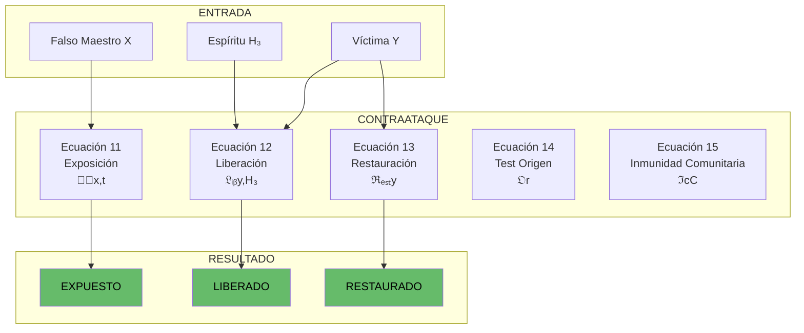

---

## Ecuación 11: Vector de Exposición del Falso

### Fórmula
```
ℰ⃗(x,t) = [𝒟(x,t), ℂ(x), ℳ(x,t)]ᵀ

Donde:
  𝒟 = Documentación contradicciones
  ℂ = Comparación con Cristo
  ℳ = Motivaciones ocultas
```

### Triple Exposición

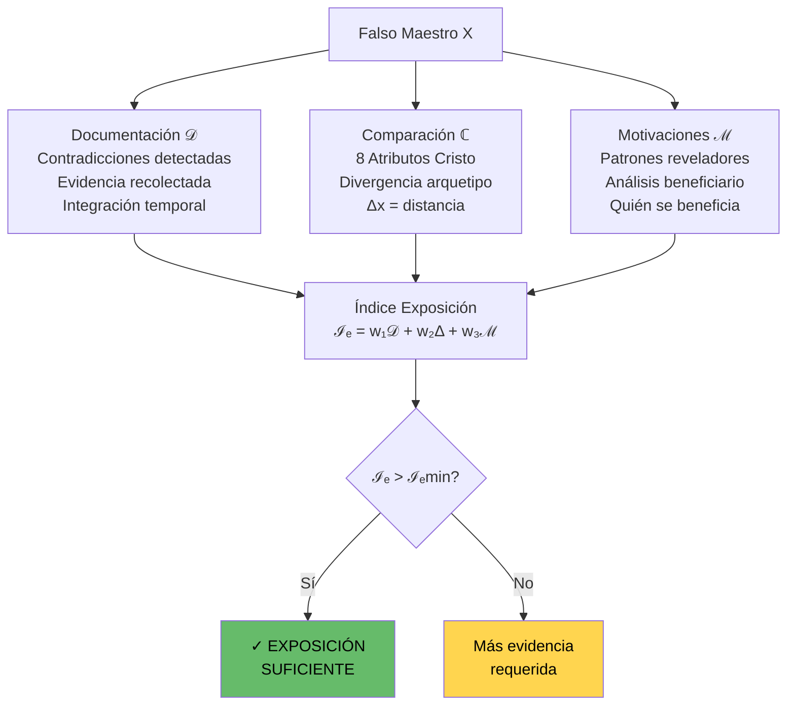

### 4 Tipos de Contradicciones

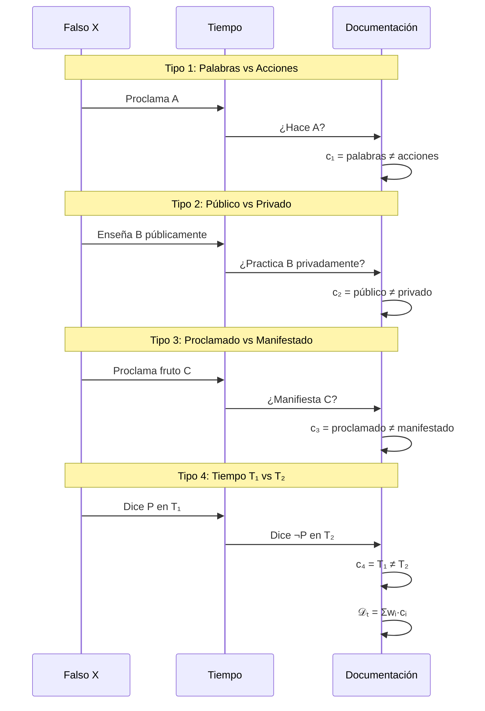

---

## Ecuación 12: Liberación del Espíritu H₃

### Fórmula
```
𝔏ᵢᵦ(y,H₃,t) = ℛ(y,H₃,t) + 𝕀ᵈ(y,H₃,t) + 𝕍(y,t)

Donde:
  ℛ = Proceso de renuncia
  𝕀ᵈ = Identificación del engaño
  𝕍 = Reemplazo con verdad
```

### 4 Fases de Renuncia

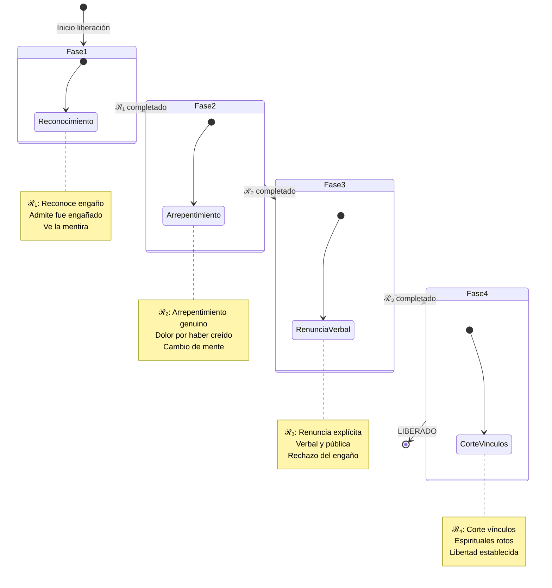

### Progreso de Liberación

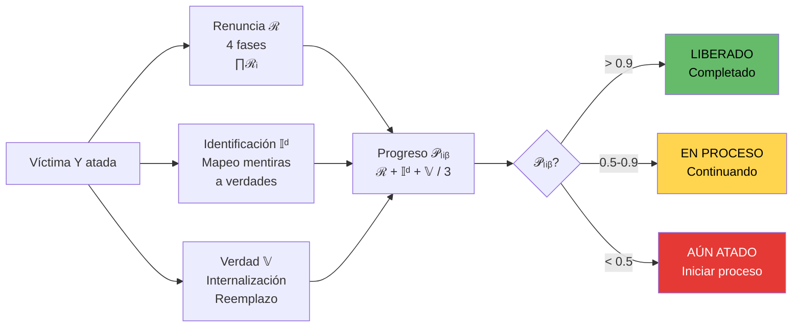

---

## Ecuación 13: Restauración Espiritual

### Fórmula
```
ℜₑₛₜ(y,t) = 𝒞ᵈ(y,t) - 𝕀f(y,t)

Donde:
  𝒞ᵈ = Conexión directa con Dios
  𝕀f = Influencia intermediarios falsos
```

### Balance Conexión vs Influencia

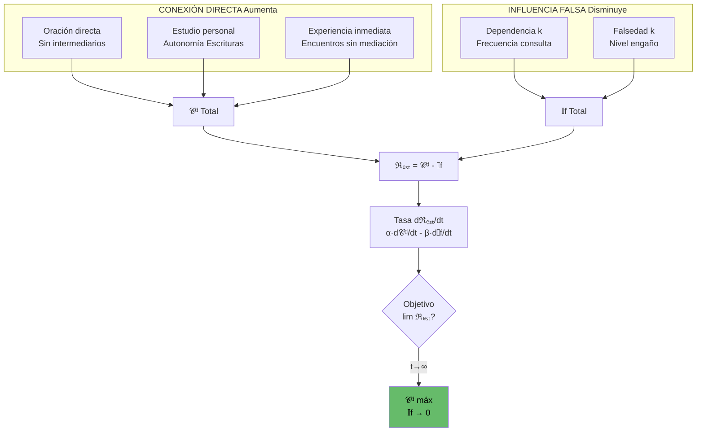

### 4 Fases de Restauración

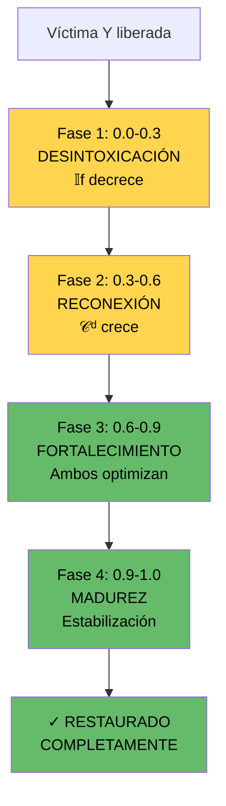

---

## Ecuación 14: Test de Origen de Revelaciones

### Fórmula
```
𝔒(r) = {𝒢(r), ℱ(r), 𝒜(r), ℰ(r)}

Donde r = revelación
  𝒢 = Glorifica a Cristo
  ℱ = Frutos del Espíritu
  𝒜 = Alineación Escrituras
  ℰ = Edifica genuinamente
```

### Cuádruple Test

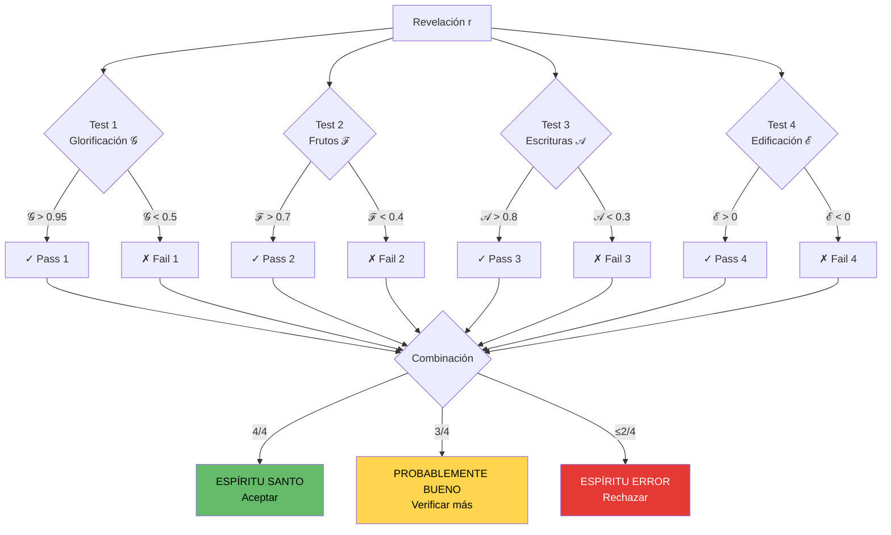

---

## Ecuación 15: Inmunidad Comunitaria

### Fórmula
```
ℑc(C) = |inmunizados(C)| / |C| × interconexión(C)

Donde:
  C = comunidad
  inmunizados = miembros con alta inmunidad
  interconexión = nivel de comunicación
```

### Efecto de Red

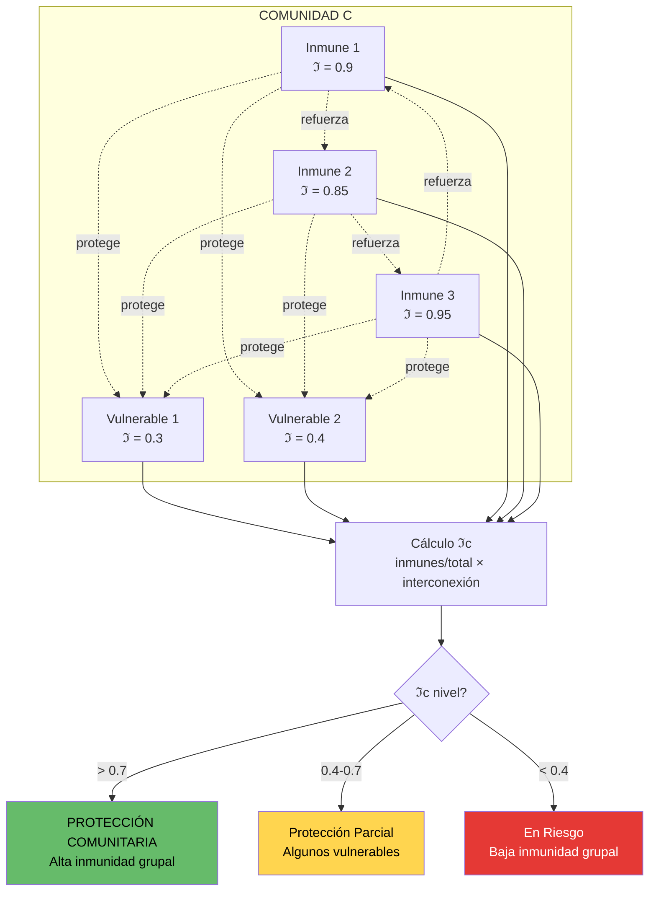

### Dinámica de Inmunización Comunitaria

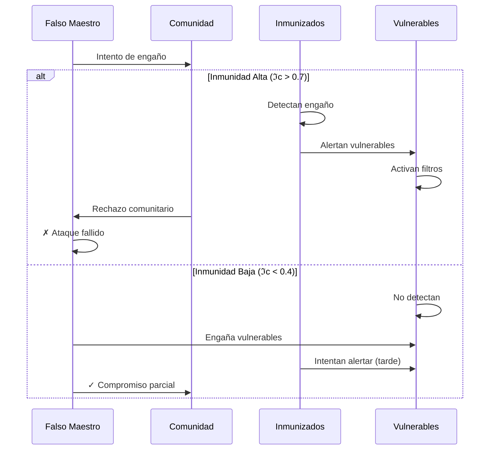

---

## Dashboard Sistema III Completo

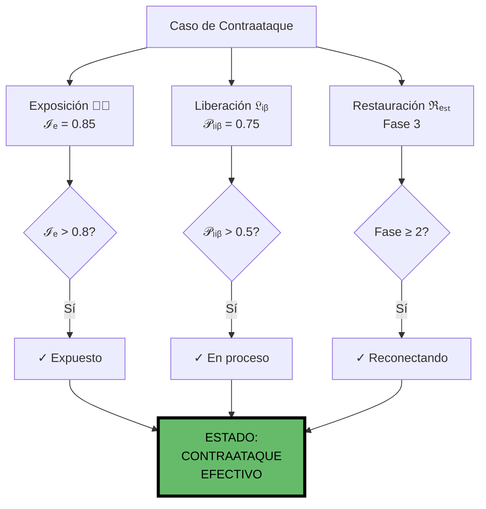

---

## Flujo Completo de Contraataque

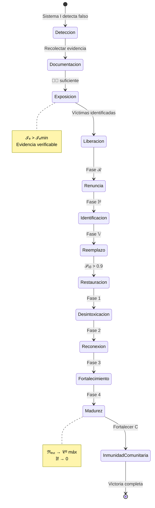

---

## Matriz de Contraataque

| Componente | Métrica | Umbral | Acción |
|------------|---------|--------|--------|
| Exposición | ℐₑ(x,t) | > 0.8 | PUBLICAR |
| Liberación | 𝒫ₗᵢᵦ(y,t) | > 0.9 | LIBERADO |
| Restauración | ℜₑₛₜ(y,t) | Fase 4 | MADURO |
| Origen Revelación | 𝔒(r) | 4/4 pass | ACEPTAR |
| Inmunidad Comunitaria | ℑc(C) | > 0.7 | PROTEGIDA |

---

## Referencias

- Archivo TXT: `/home/itzamna/Documents/logic/03_protocolos_contraataque.txt`
- Archivo Visual: `/home/itzamna/Documents/logic/03_protocolos_contraataque_visual.md`

**Total de Ecuaciones:** 5 (Ecuaciones 11-15)  
**Estado:** OPERATIVO  
**Objetivo:** Exponer falsos, liberar cautivos, restaurar víctimas

═══════════════════════════════════════════════════════════════

**"Conoceréis la verdad, y la verdad os hará libres" - Juan 8:32**

═══════════════════════════════════════════════════════════════
