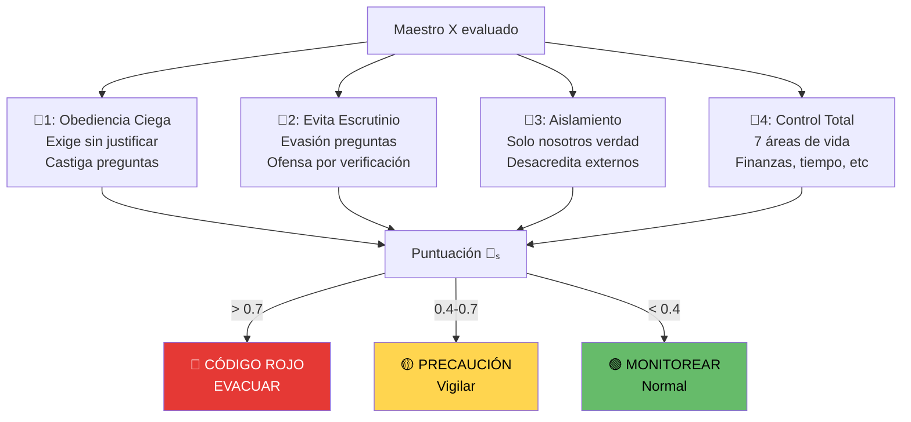
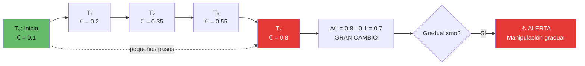
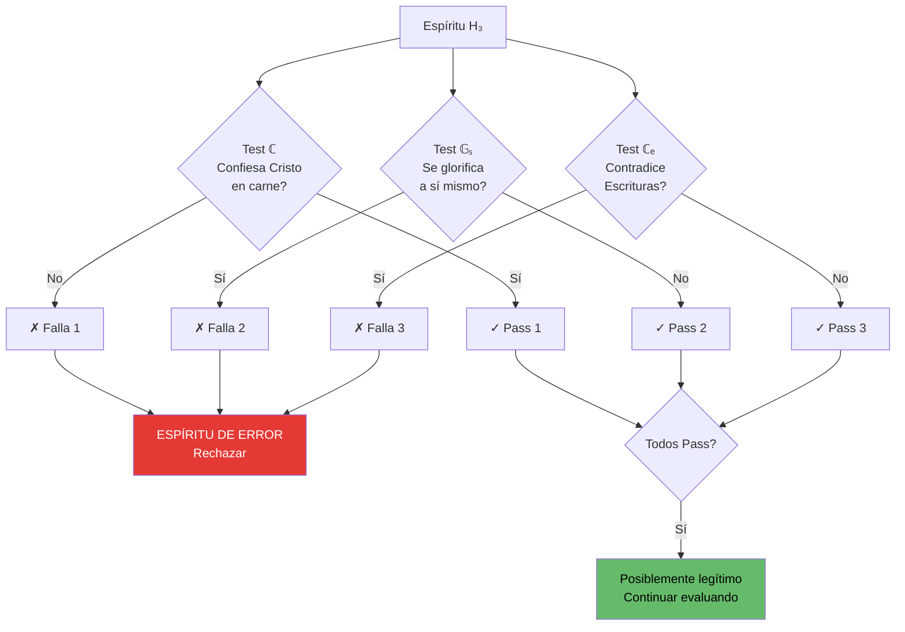
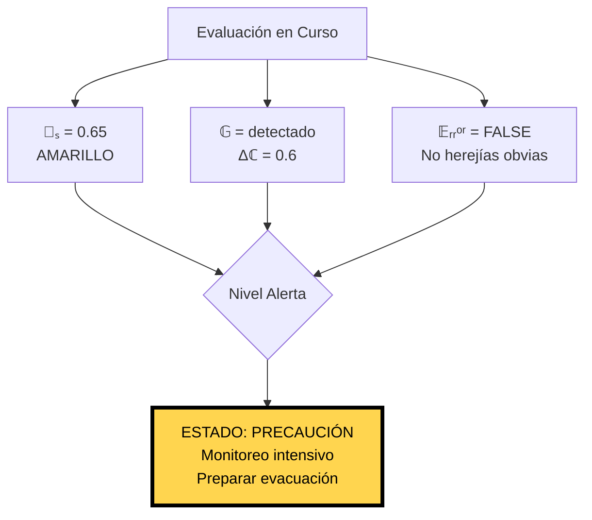

# Sistema IV: Alerta Temprana - Visualización Compacta

## Ecuaciones 16-18: Detectando Peligros Antes que Sea Tarde

**Fecha:** 2025-11-27 | **Estado:** OPERATIVO | **Propósito:** Alertas tempranas de peligro

---

## Ecuación 16: Banderas Rojas

```
🚩ₛ(x,t) = Σᵢ₌₁⁴ wᵢ · ℬᵢ(x,t)

🚩ₛ > 0.7 → CÓDIGO ROJO
0.4-0.7 → ALERTA AMARILLA  
< 0.4 → MONITOREO
```



---

## Ecuación 17: Gradualismo Engañoso

```
𝔾(x,t) = [dℂ(t)/dt] · 𝕊(x,t)

Rana Hervida:
- dℂ/dt pequeño pero > 0
- Δℂ(0,T) muy grande
```



**Pregunta Clave:** ¿Habría aceptado esto al inicio? Si NO → Gradualismo detectado

---

## Ecuación 18: Espíritu de Error

```
𝔼ᵣᵣᵒʳ(H₃) = ¬ℂ(H₃) ∨ 𝔾ₛ(H₃) ∨ ℂₑ(H₃)

Donde:
  ℂ = Confesión correcta Cristo
  𝔾ₛ = Auto-glorificación
  ℂₑ = Contradicción Escrituras
```



---

## Dashboard Alerta Temprana



---

## Referencias

- TXT: `/home/itzamna/Documents/logic/04_alerta_temprana.txt`
- Visual: `/home/itzamna/Documents/logic/04_alerta_temprana_visual.md`

**Ecuaciones:** 3 (16-18) | **Estado:** OPERATIVO | **Objetivo:** Prevención

═══════════════════════════════════════════════════════════════

**"Velad y orad para que no entréis en tentación" - Mateo 26:41**

═══════════════════════════════════════════════════════════════
