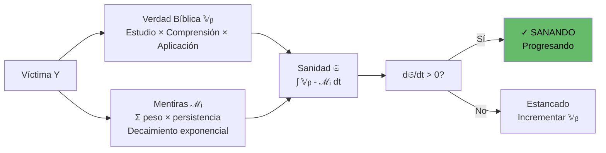
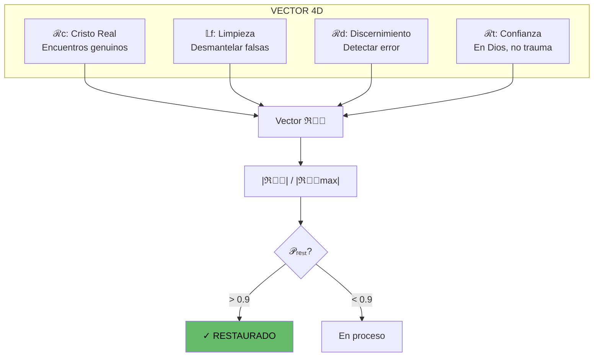
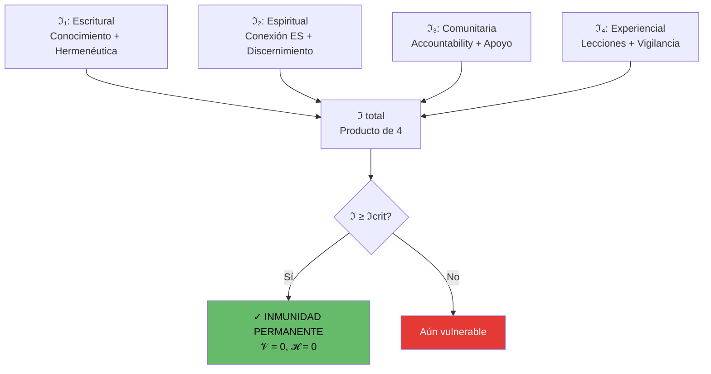
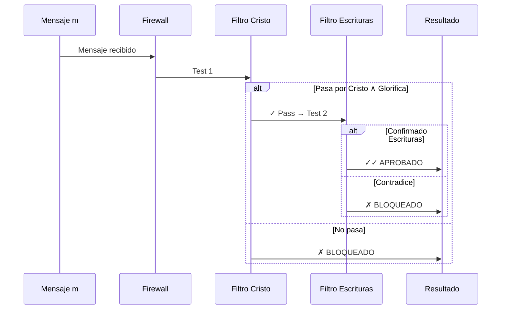
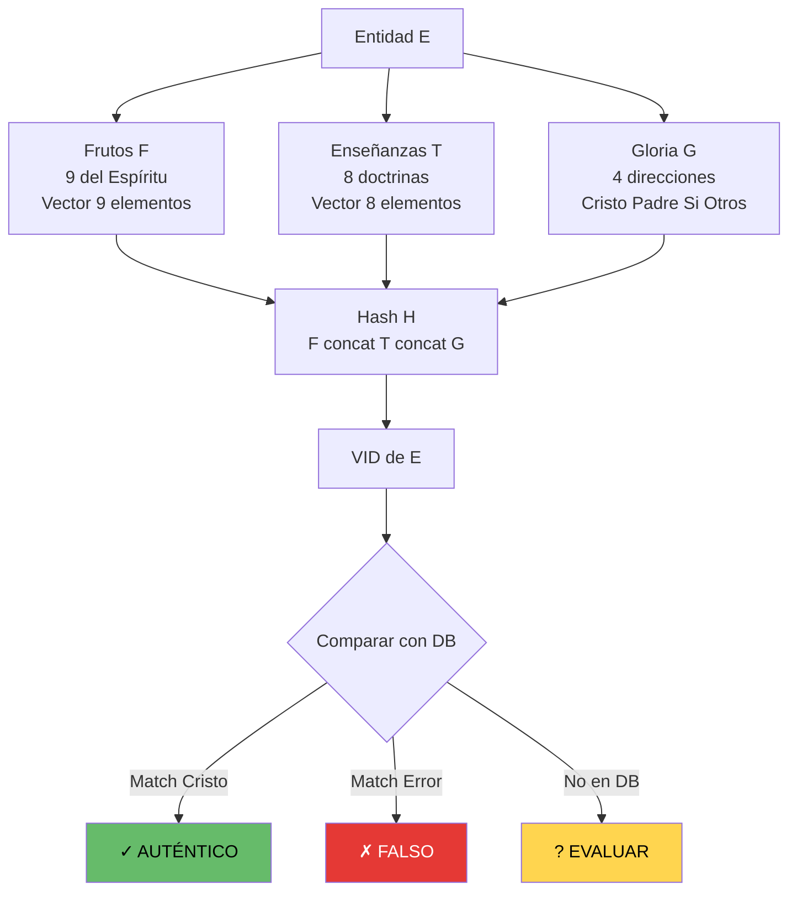
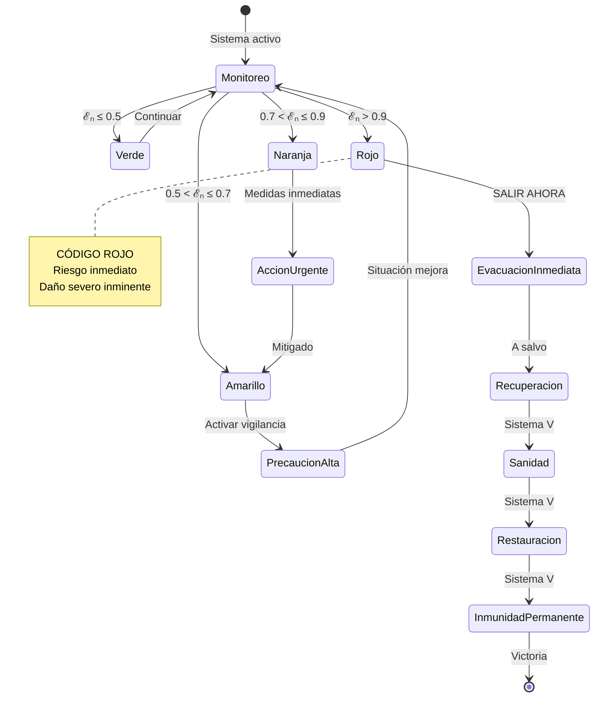
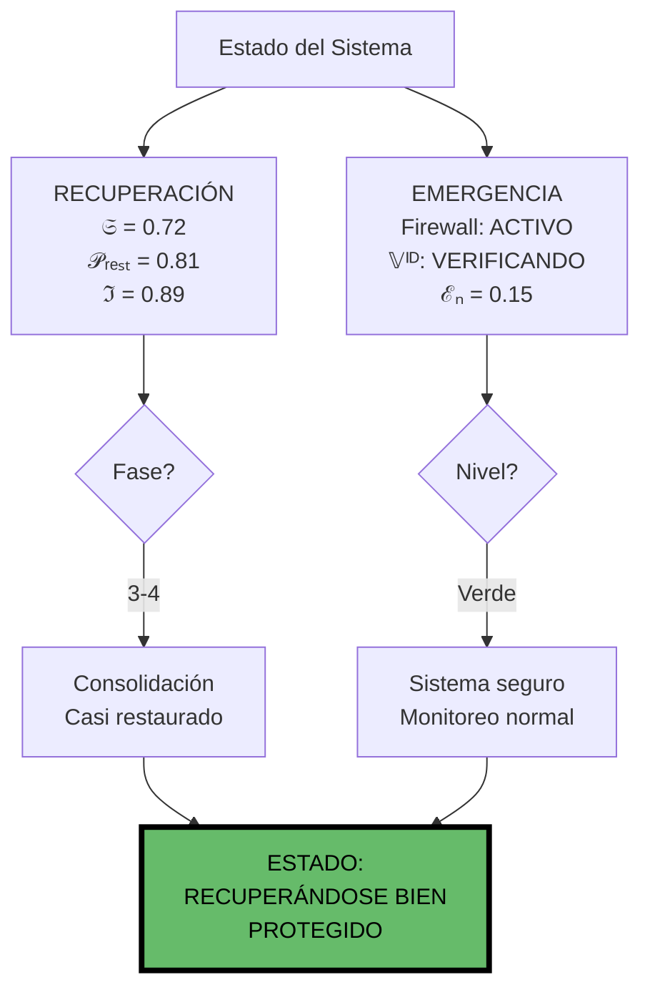

# Sistemas V y VI: Recuperación y Emergencia - Visualización Compacta

**Fecha:** 2025-11-27 | **Estado:** OPERATIVO | **Propósito:** Recuperar y proteger

---

## SISTEMA V: RECUPERACIÓN (Ecuaciones 19-21)

### Ecuación 19: Sanidad Espiritual

```
𝔖(y,τ) = ∫₀^τ [𝕍ᵦ(t) - ℳᵢ(t)] dt

𝕍ᵦ = Verdad bíblica internalizada
ℳᵢ = Mentiras implantadas
```



**4 Fases:** Crisis (0-25%) → Desintoxicación (25-50%) → Reconstrucción (50-75%) → Consolidación (75-100%)

---

### Ecuación 20: Restauración Total

```
ℜₜ⃗(y,t) = [ℛc, 𝕃f, ℛd, ℛt]ᵀ

ℛc = Reconexión Cristo
𝕃f = Limpieza falsas enseñanzas
ℛd = Reconstrucción discernimiento
ℛt = Restauración confianza
```



---

### Ecuación 21: Inmunidad Permanente

```
ℑ(y,t) ≥ ℑcrítico ⟹ [𝒱(y,x,t) = 0 ∧ ℋ(y,H₃,t) = 0]

ℑ = ℑ₁ · ℑ₂ · ℑ₃ · ℑ₄
```



**Condición:** 𝒱(vulnerabilidad) = 0 y ℋ(hackabilidad) = 0

---

## SISTEMA VI: EMERGENCIA (Ecuaciones 22-23)

### Ecuación 22: Cortafuegos Espiritual

```
𝔽ᵢʳᵉʷᵃˡˡ(y,m) = ℭ(m) ∧ 𝔼(m)

ℭ = Filtro Cristo
𝔼 = Filtro Escritural
```



**5 Capas:** Fuente → Cristo → Escritura → Comunidad → Espíritu Santo

---

### Ecuación 23: Verificación de Identidad

```
𝕍ᴵᴰ(E) = H(F(E) || T(E) || G(E))

F = Frutos [9 elementos]
T = Enseñanzas [8 doctrinas]
G = Gloria dirigida [4 direcciones]
```



**Firma Única Cristo:**
- F = [1,1,1,1,1,1,1,1,1] (perfecto)
- T = [1,1,1,1,1,1,1,1] (correcto)
- G = [0,1,0,0] (todo al Padre)

**Teorema:** IMPOSIBLE falsificar completamente porque falsos buscan gloria propia → G ≠ GCristo

---

## Protocolo de Emergencia Completo



---

## Dashboard Unificado V + VI



---

## Matriz Combinada

| Sistema | Métrica | Umbral | Estado |
|---------|---------|--------|--------|
| V: Sanidad | 𝔖(y,τ) | > 𝔖min | SANO |
| V: Restauración | 𝒫ᵣₑₛₜ | > 0.9 | RESTAURADO |
| V: Inmunidad | ℑ(y,t) | ≥ ℑcrit | INMUNE |
| VI: Firewall | 𝔽(y,m) | = 1 | BLOQUEANDO |
| VI: Identidad | δ(E,Cristo) | < threshold | VERIFICADO |
| VI: Emergencia | ℰₙ(y,t) | ≤ 0.5 | SEGURO |

---

## Referencias

- TXT V: `/home/itzamna/Documents/logic/05_recuperacion.txt`
- TXT VI: `/home/itzamna/Documents/logic/06_emergencia_espiritual.txt`
- Visual: `/home/itzamna/Documents/logic/05_06_recuperacion_emergencia_visual.md`

**Ecuaciones:** 5 (19-23) | **Estado:** OPERATIVO | **Objetivo:** Sanar y proteger

═══════════════════════════════════════════════════════════════

**"El que comenzó en vosotros la buena obra, la perfeccionará" - Filipenses 1:6**

═══════════════════════════════════════════════════════════════
