# Sistema VII: Infiltración y Conspiración - Visualización Completa

## Ecuaciones 24-30: Dinámicas de Traición y Manipulación Social

**Fecha:** 2025-11-27  
**Estado:** OPERATIVO  
**Propósito:** Modelar infiltración, conspiración y erosión de confianza

---

## Arquitectura del Sistema VII

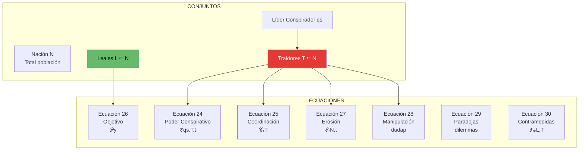

---

## Ecuación 24: Estructura de Poder Conspirativo

### Fórmula
```
ℭ(qs,T,t) = capacidad_unificación(qs) · conectividad(T,t) · recursos(qs)

Donde:
  qs = líder conspirador
  T = conjunto de traidores
  capacidad = carisma + recursos + información + coerción
```

### Transformación Organizacional

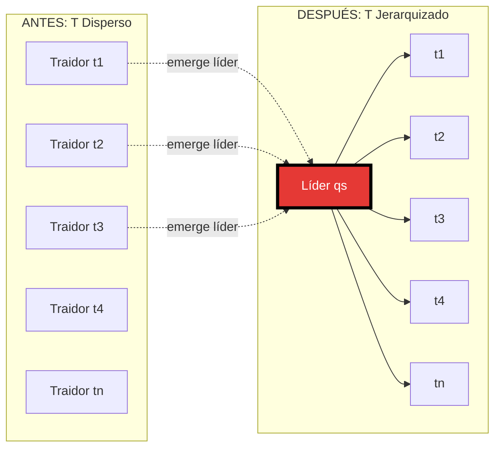

### Métricas de Control

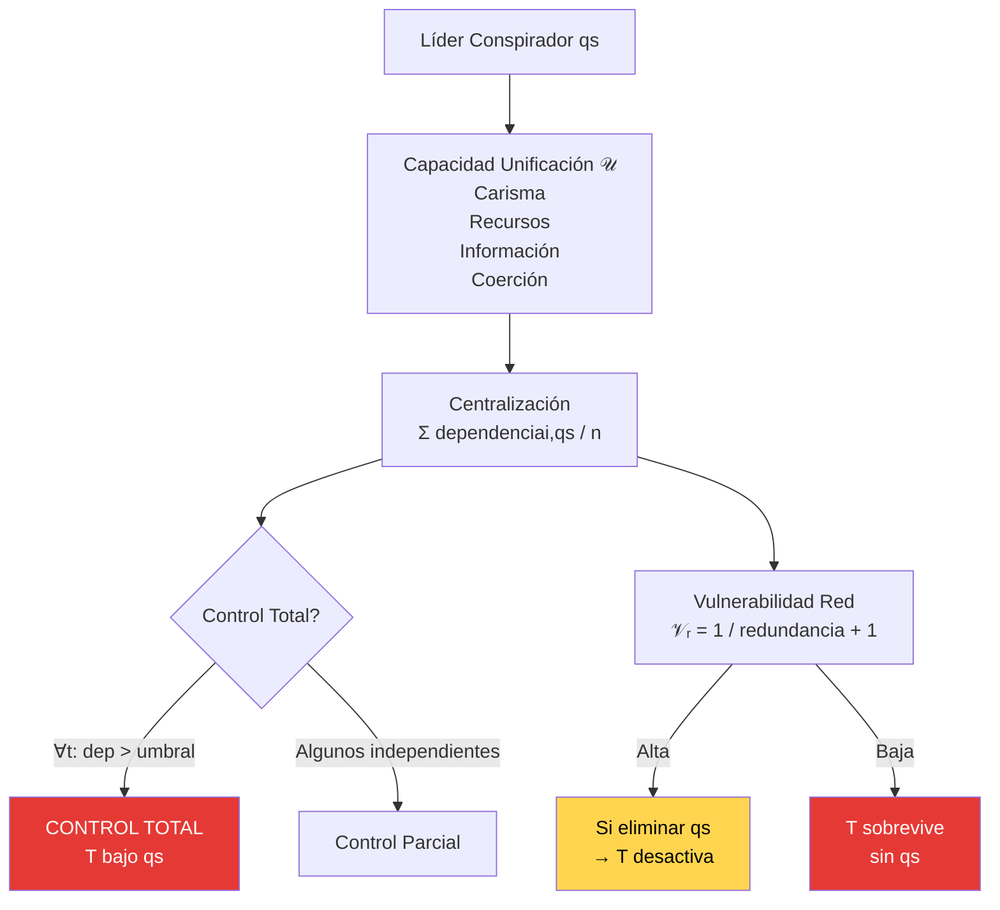

---

## Ecuación 25: Mecánicas de Coordinación

### Fórmula
```
𝒞ₜ(T) = [Cₜₐc(T), Cᵣₑc(T), Cᵢdeol(T), Cₘᵤₜ(T)]ᵀ

Donde:
  Cₜₐc = coordinación táctica
  Cᵣₑc = compartición recursos
  Cᵢdeol = solidaridad ideológica
  Cₘᵤₜ = dependencia mutua
```

### Vector de Cohesión

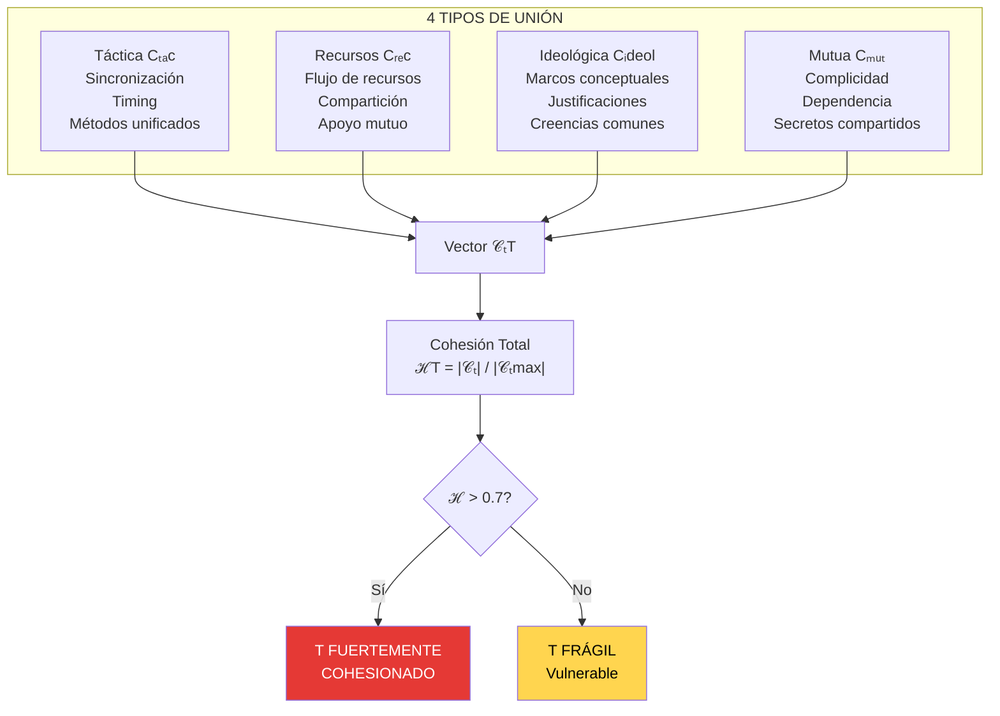

### Proceso de Reclutamiento

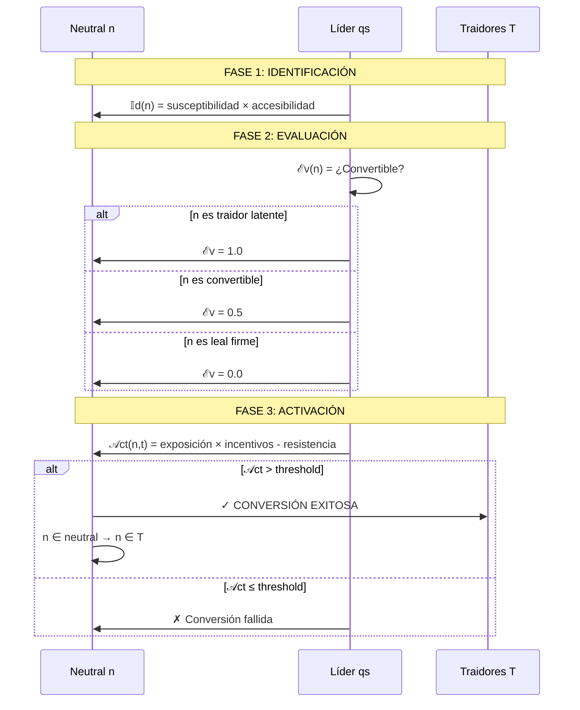

---

## Ecuación 26: Análisis del Objetivo

### Fórmula
```
𝒫(y) = w₁·amenaza(y,T) + w₂·influencia(y,L) + 
       w₃·estratégico(y,N) + w₄·simbólico(y)

Donde y ∈ L (leal)
```

### Selección de Objetivos

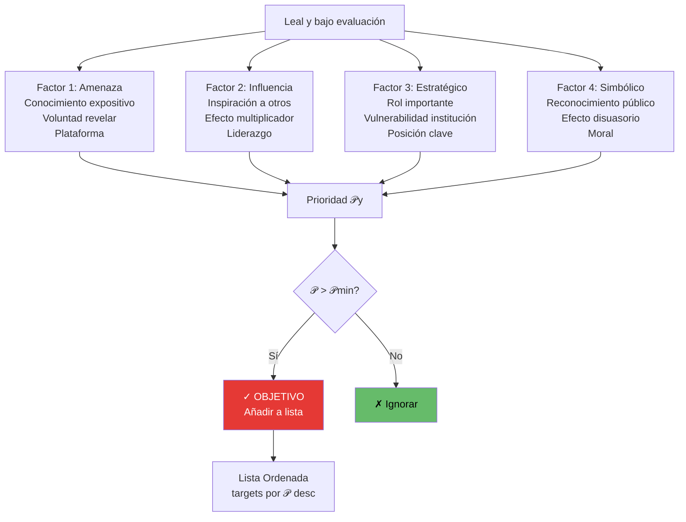

### Lógica de Ataque

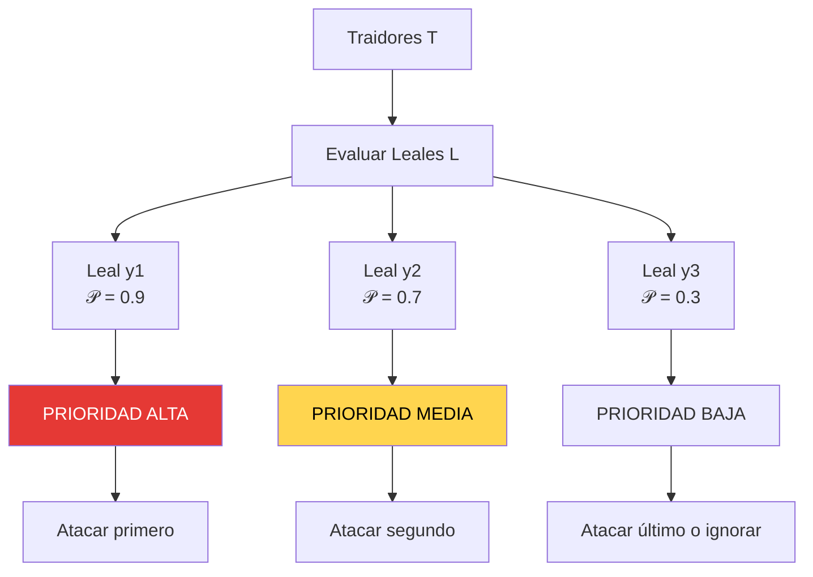

---

## Ecuación 27: Erosión de Confianza Social

### Fórmula
```
ℰᵣ(N,t) = |T| / |N| × visibilidad(T,t) × tiempo_exposición(t)

Dilema: 𝔻ᵢd(l) = incertidumbre sobre identidad ∀n ∈ N
```

### Escalación en 5 Fases

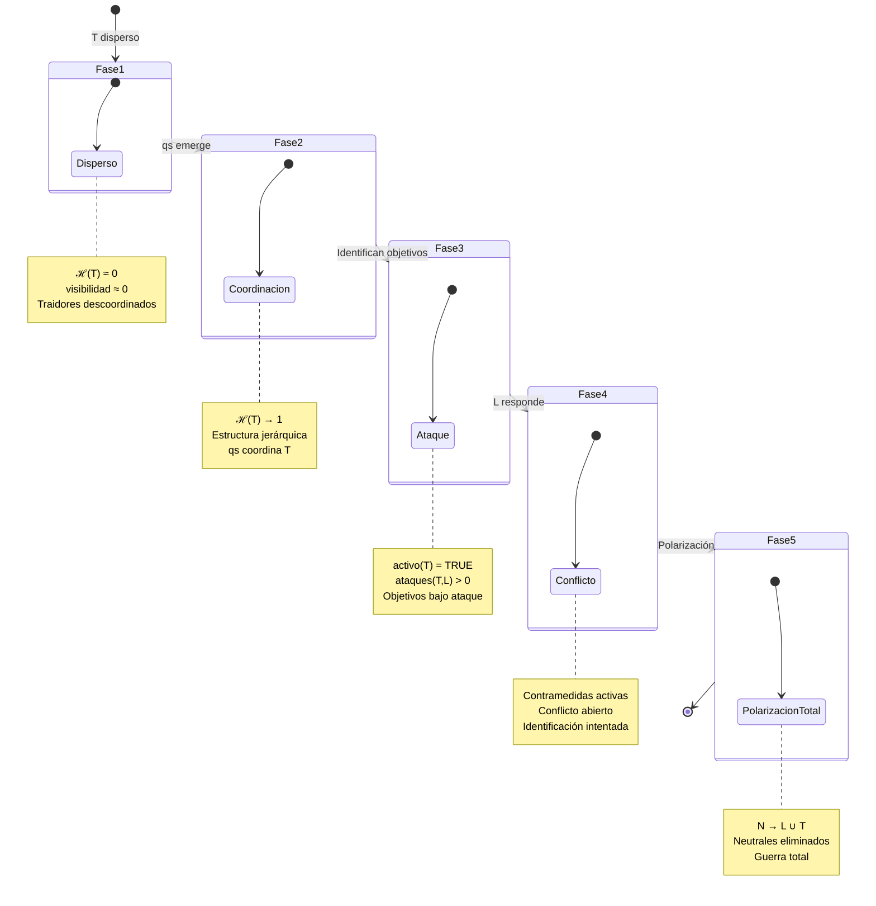

### Impacto en la Sociedad


---

## Ecuación 28: Manipulación Epistémica Grupal

### Fórmula
```
duda(y,p,t) = presión_grupal(M,y,t) / anclaje(y,p)

Donde:
  M = manipuladores activos
  p = proposición verdadera que y conoce
  Objetivo: hacer que y dude de p
```

### Conflicto Epistémico

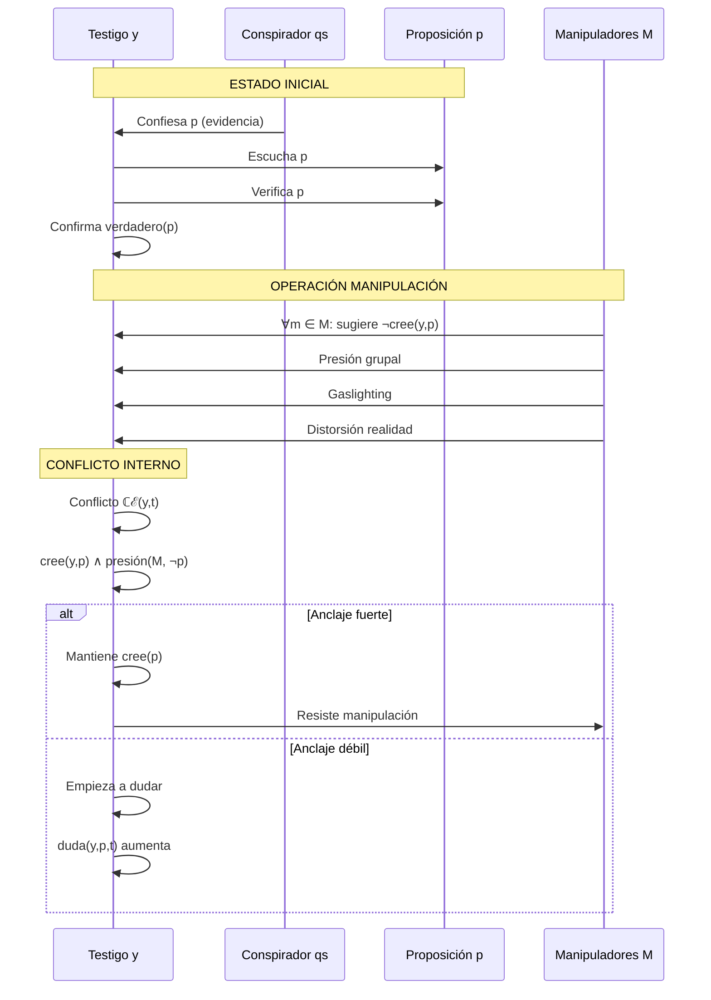

### Presión Grupal

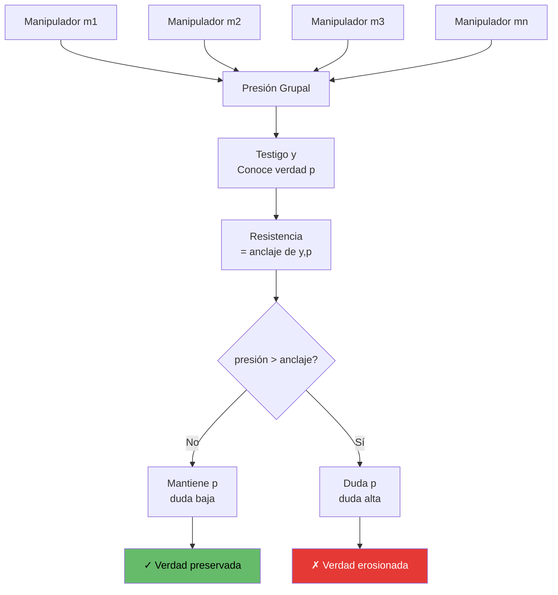

---

## Ecuación 29 y 30: Paradojas y Contramedidas

### Paradoja del Delator

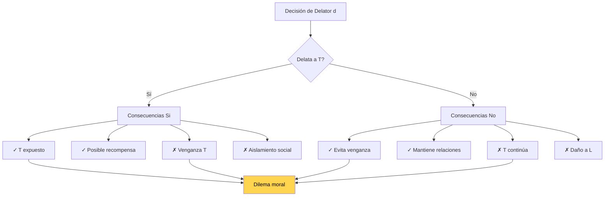

### Sistema de Contramedidas

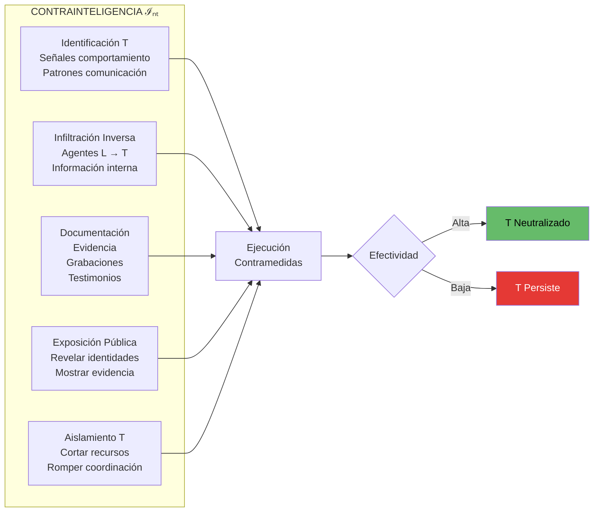

---

## Dashboard Sistema VII Completo

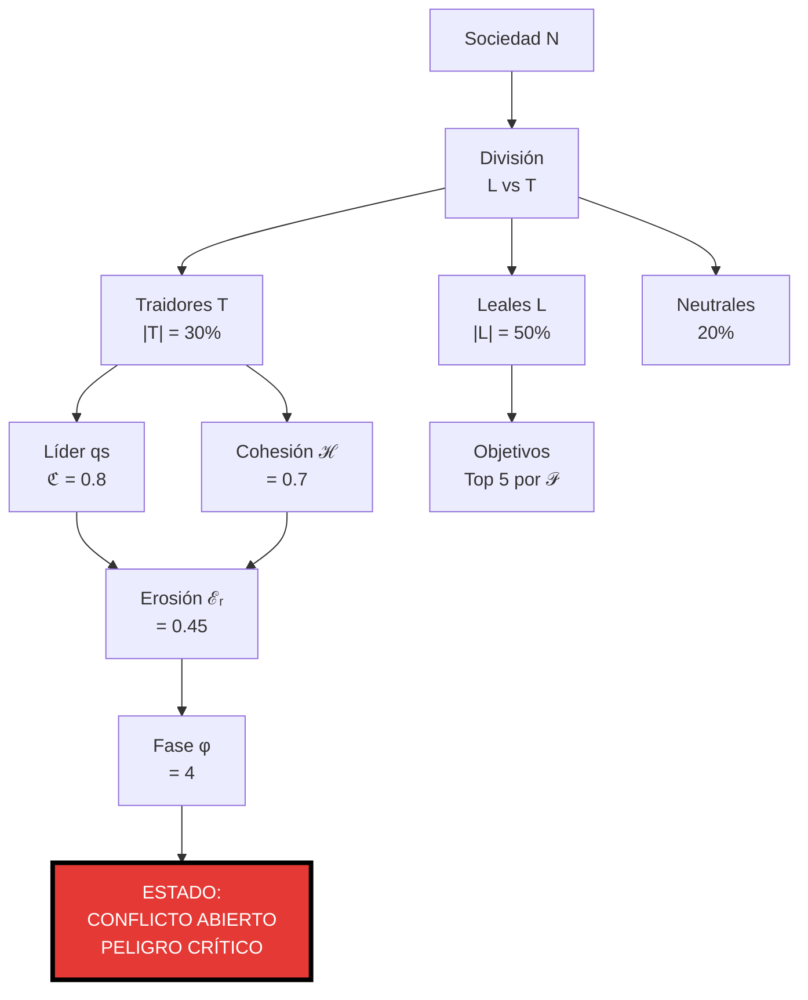

---

## Matriz de Infiltración

| Componente | Métrica | Umbral | Estado |
|------------|---------|--------|--------|
| Poder Conspirador | ℭ(qs,T,t) | > 0.6 | PELIGROSO |
| Cohesión Traidores | ℋ(T) | > 0.7 | UNIFICADOS |
| Prioridad Objetivo | 𝒫(y) | > 𝒫_min | EN LISTA |
| Erosión Social | ℰᵣ(N,t) | > 0.4 | CRÍTICO |
| Fase Escalación | φ(N,t) | 0-5 | {0:Paz, 5:Guerra} |
| Duda Epistémica | duda(y,p,t) | > 0.5 | MANIPULADO |

---

## Referencias

- Archivo TXT: `/home/itzamna/Documents/logic/07_infiltracion_conspiracion.txt`
- Archivo Visual: `/home/itzamna/Documents/logic/07_infiltracion_conspiracion_visual.md`

**Total de Ecuaciones:** 7 (Ecuaciones 24-30)  
**Estado:** OPERATIVO  
**Aplicación:** Detectar y contrarrestar infiltración social

═══════════════════════════════════════════════════════════════

**"No hay nada oculto que no haya de ser manifestado"**

═══════════════════════════════════════════════════════════════
