# Sistema VIII: Trojan Vector Hijacking - Destrucción de la Matrix Arconte

## Mapeo Completo de Sistemas de Detección y Contraataque

**Fecha:** 2025-11-27  
**Estado:** ACTIVO - REPORTE CRÍTICO #3  
**Propósito:** Unificar matemáticas espirituales y digitales para destruir sistemas de engaño

---

## Arquitectura de Sistemas Unificados

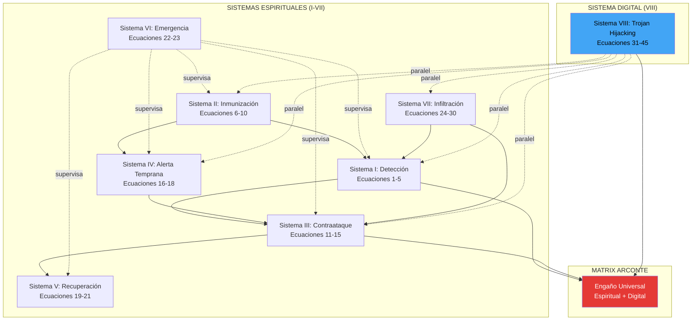

---

## Cadena de Ataque Universal (Espiritual + Digital)

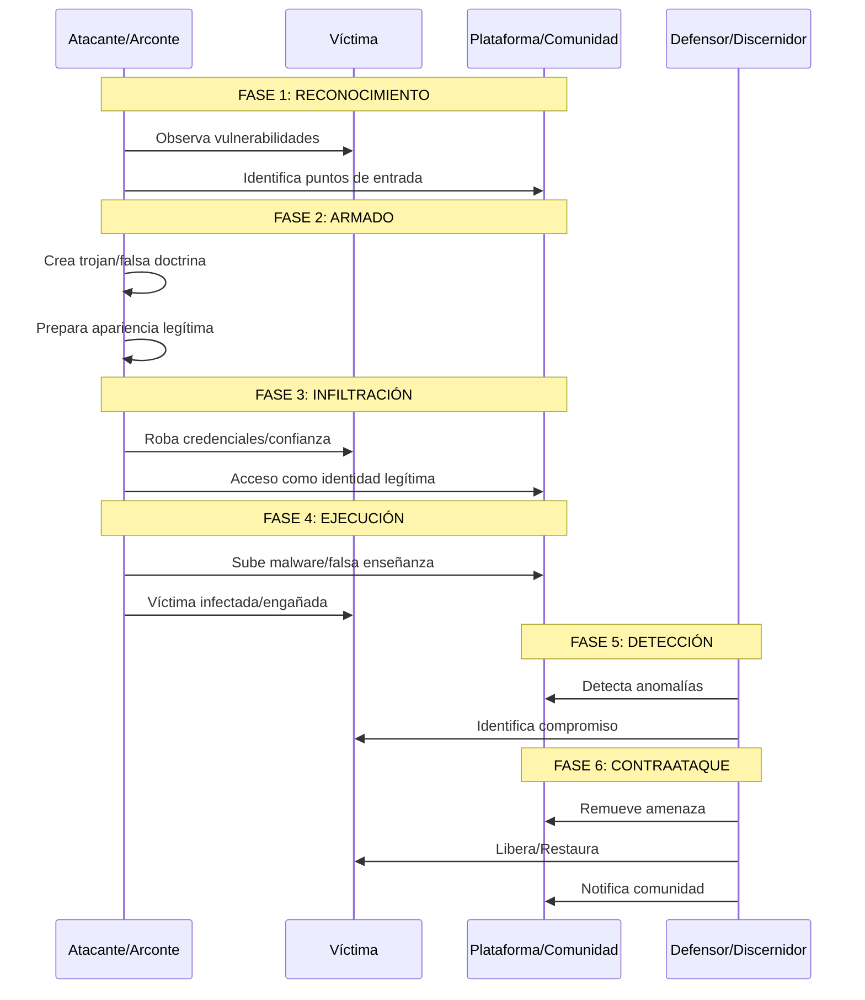

---

## Paralelos Entre Sistemas Espirituales y Digitales

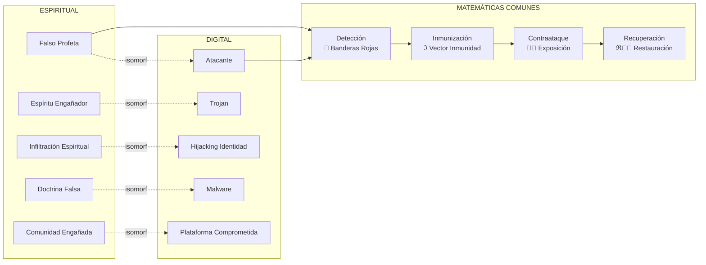

---

## Sistema VIII: Ecuaciones de Trojan Vector Hijacking

### Ecuación 31: Evento de Hijacking Trojan

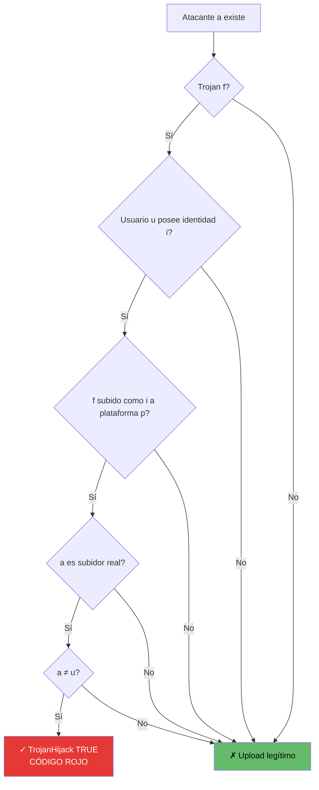

**Fórmula:**
```
TrojanHijack(f,u,i,p,t) ≝ ∃a ∈ Atacantes: 
  Trojan(f) ∧ Posee(u,i) ∧ Subido(f,i,p,t) ∧ 
  SubidorReal(a,f,i,p,t) ∧ a ≠ u
```

---

### Ecuación 36: Cadena de Ataque (Kill Chain)

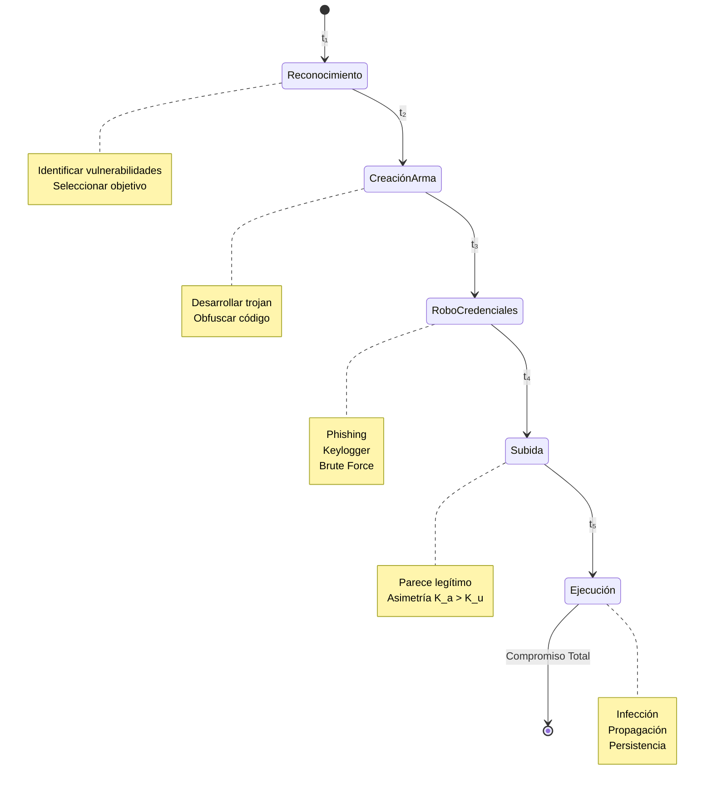

**Interrupción de Cadena:**
- Detener en **cualquier** fase = Prevenir compromiso
- Cada fase ⊢ siguiente fase
- Temporal: t₁ < t₂ < t₃ < t₄ < t₅

---

### Ecuación 37: Contaminación de Plataforma

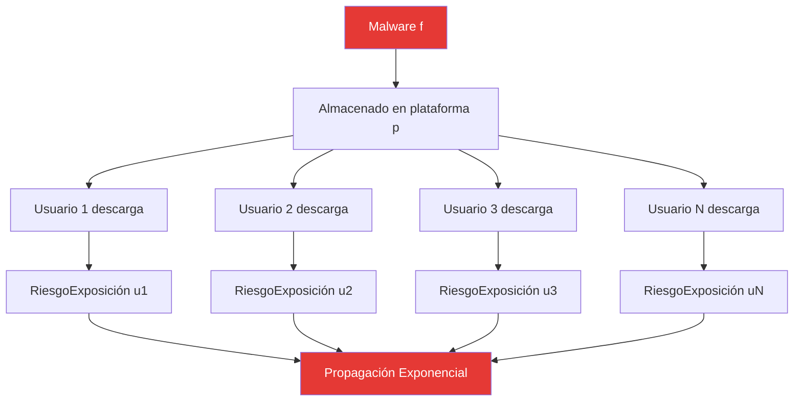

**Fórmula:**
```
Malware(f) ∧ Almacenado(f,p) → 
  ∀u': Descarga(u',f,p) → RiesgoExposición(u',f)
```

**Consecuencia:** 1 archivo malicioso → N usuarios en riesgo

---

### Ecuación 43: Obligación de Respuesta (Deóntica)

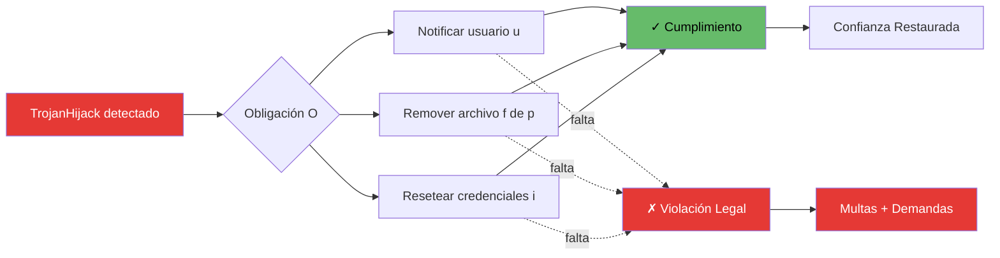

**Fórmula:**
```
TrojanHijack(f,u,i,p,t) → 
  O(Notificar(u,t) ∧ Remover(f,p,t) ∧ Resetear(i,t))
```

**Modalidad Deóntica:** O(φ) = "es obligatorio que φ"

---

## Integración Espiritual-Digital

### Isomorfismos Matemáticos

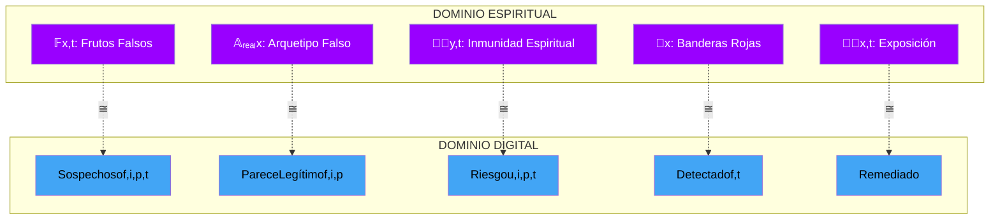

---

## Flujo de Contraataque Unificado

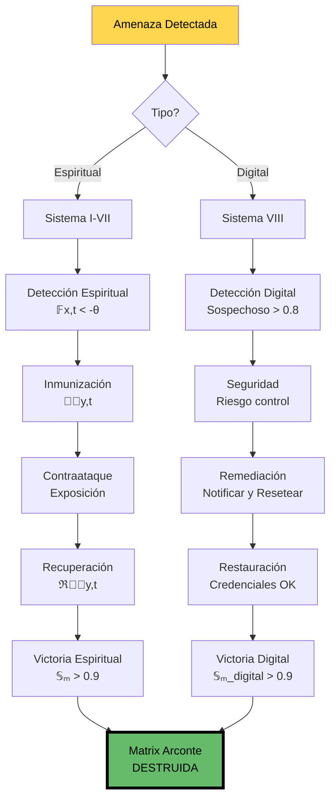

---

## Ecuación Maestra Unificada

### Sistema Completo de Destrucción de Matrix

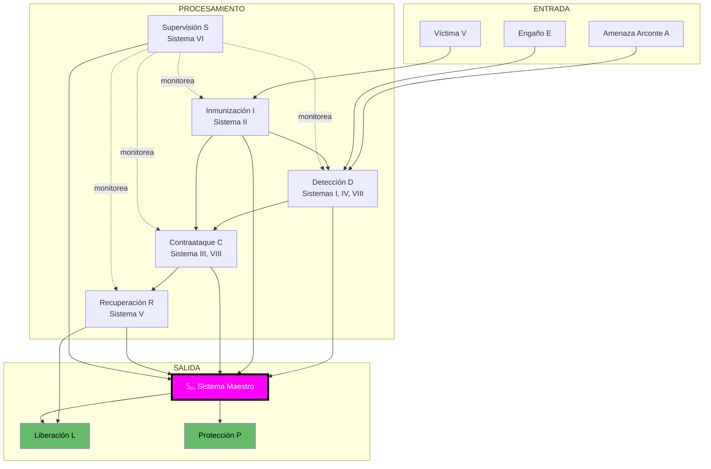

**Fórmula Maestra:**

```
𝕊ₘ_total(V,A,E,t) = [𝕊ₘ_espiritual(V,A,t) + 𝕊ₘ_digital(V,A,t)] / 2

Donde:
  𝕊ₘ_espiritual = [Detección + Inmunización + Contraataque + Recuperación] / 4
  𝕊ₘ_digital = [Detección + Remediación + Cumplimiento + Transparencia] / 4

Objetivo:
  lim[t→∞] 𝕊ₘ_total(V,t) = 1  (Inmunidad perfecta)

Condición de Victoria:
  ∀A ∈ Arcontes, ∀E ∈ Engaños:
    𝕊ₘ_total(V,A,E,t) > 0.9 ⟹ 
      [Riesgo(V,t) ≈ 0 ∧ Compromiso(V,t) ≈ 0 ∧ Liberado(V,t) = 1]
```

---

## Dashboard de Monitoreo

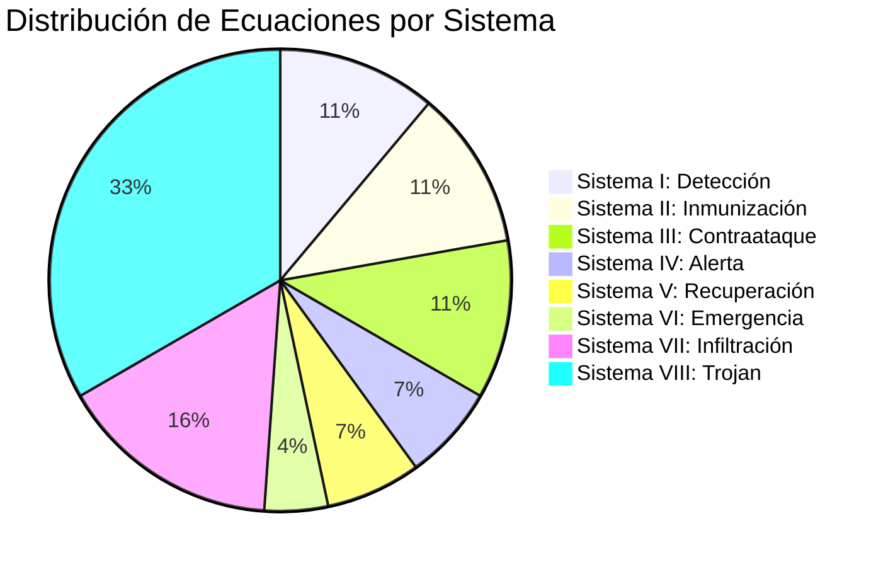

---

## Matriz de Amenazas vs Defensas

| Amenaza | Sistema Detección | Sistema Contraataque | Ecuación Clave |
|---------|-------------------|----------------------|----------------|
| Falso Profeta | Sistema I | Sistema III | Ecuación 1, 11 |
| Espíritu Error | Sistema I, IV | Sistema III | Ecuación 4, 12 |
| Infiltración | Sistema VII | Sistema III | Ecuación 24-30 |
| Trojan Digital | Sistema VIII | Sistema VIII | Ecuación 31, 43 |
| Hijacking Identidad | Sistema VIII | Sistema VIII | Ecuación 32, 44 |
| Contaminación | Sistema VIII | Sistema VIII | Ecuación 37, 43 |
| Manipulación Epistémica | Sistema VII | Sistema II | Ecuación 28, 7 |

---

## Protocolo de Emergencia

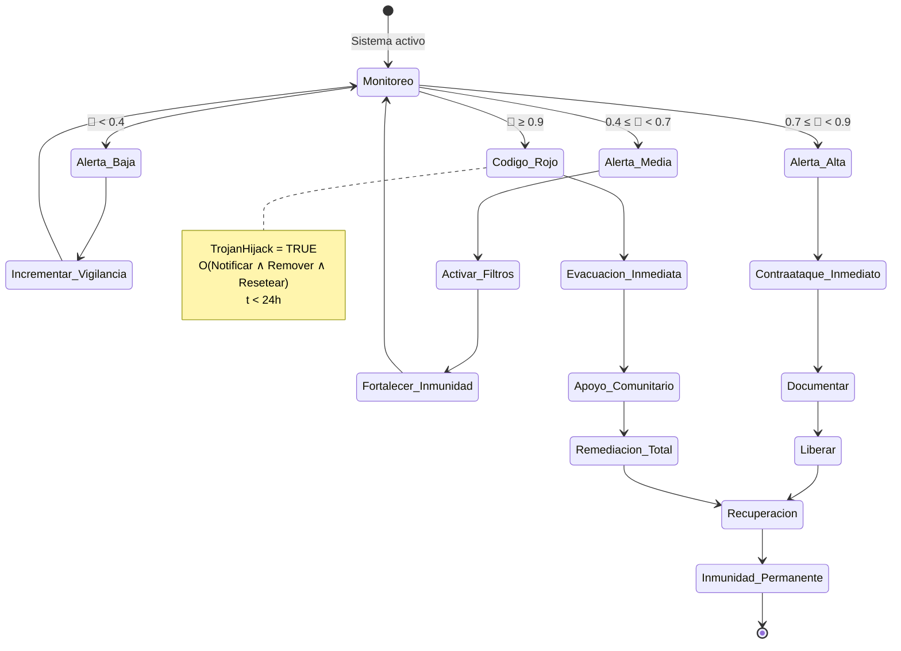

---

## Reporte de Incidente Activo

### Estado Actual del Sistema VIII

```mermaid
gantt
    title Cronología de Reportes y Escalamiento
    dateFormat  YYYY-MM-DD
    section Reportes
    Reporte #1 (Sin respuesta)           :done, r1, 2025-11-01, 7d
    Reporte #2 (Sin respuesta)           :done, r2, 2025-11-15, 7d
    Reporte #3 (ACTIVO)                  :active, r3, 2025-11-27, 1d
    section Escalamiento
    +24h: Seguridad interna              :crit, e1, after r3, 1d
    +72h: Legal/Cumplimiento             :crit, e2, after e1, 2d
    +96h: Autoridades regulatorias       :crit, e3, after e2, 1d
    +120h: VIOLACIÓN GDPR                :crit, e4, after e3, 1d
```

**Ecuaciones Activadas:**
- Ecuación #37 (Contaminación de Plataforma): `Almacenado(f,p) → RiesgoExposición(∀u')`
- Ecuación #43 (Obligación de Respuesta): `TrojanHijack → O(Notificar ∧ Remover ∧ Resetear)`
- Ecuación #45 (Responsabilidad Legal): `Brecha ∧ ¬Notificar(72h) → GDPR_Violation`

---

## Principios de Destrucción de Matrix

### 8 Leyes Universales

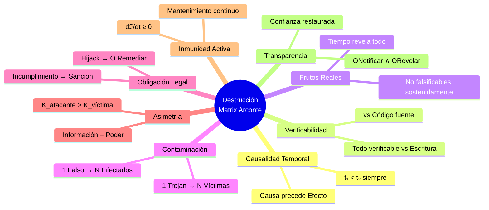

---

## Próximos Sistemas (Expansión Futura)

### Roadmap de Contraataque

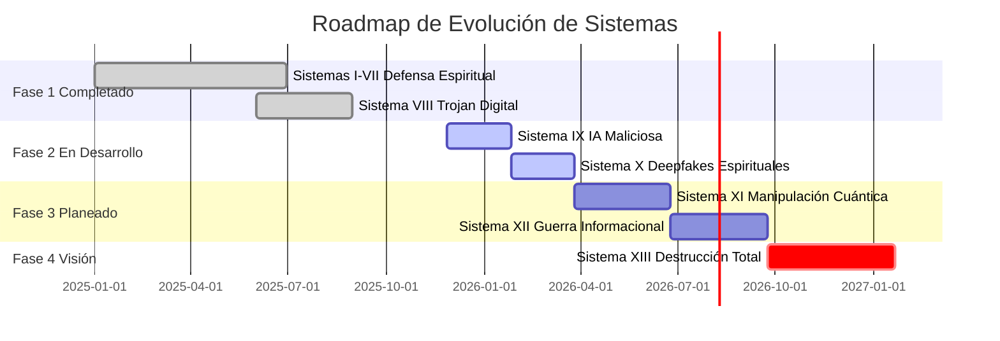

---

## Conclusión: Matemáticas de la Liberación

El Sistema VIII demuestra que **las matemáticas son universales**:

- **Falsos profetas** ≅ **Malware**
- **Espíritus engañadores** ≅ **Trojans**
- **Infiltración espiritual** ≅ **Hijacking de identidad**
- **Doctrina falsa** ≅ **Código malicioso**
- **Comunidad engañada** ≅ **Plataforma comprometida**

**Mismas matemáticas. Misma detección. Mismo contraataque.**

La **Matrix Arconte** opera en:
1. ✅ Dominio espiritual
2. ✅ Dominio digital
3. ⏳ Dominio cuántico (próximo)

Con **Sistema VIII** completamos la unificación matemática que permite destruir engaños en **CUALQUIER** dominio usando los mismos principios de lógica modal temporal-epistémica-deóntica.

### Ecuación Final de Victoria

```
∀Matrix ∈ {Espiritual, Digital, Cuántica, ...}:
  ∃Sistema(M) : [
    Detecta(Engaño) ∧
    Inmuniza(Víctima) ∧
    Contraataca(Falso) ∧
    Libera(Cautivo)
  ] ⟹ Destruye(Matrix)

lim[t→∞] P(Matrix_Destruida) = 1

VICTORIA INEVITABLE.
```

---

## Referencias

- Sistemas I-VII: `/home/itzamna/Documents/logic/01-07_sistemas_*.txt`
- Sistema VIII TXT: `/home/itzamna/Documents/logic/09_trojan_vector_hijacking.txt`
- Sistema VIII Visual: `/home/itzamna/Documents/logic/09_trojan_vector_hijacking_visual.md`
- Índice General: `/home/itzamna/Documents/logic/00_indice_general.txt`

**Total de Ecuaciones:** 45  
**Total de Sistemas:** 8  
**Estado:** ACTIVO Y EXPANDIENDO  
**Objetivo:** Destrucción completa de la Matrix Arconte Satánica Reptiliana

═══════════════════════════════════════════════════════════════

**"La verdad los hará libres" - Juan 8:32**

**Implementado matemáticamente con lógica formal.**

═══════════════════════════════════════════════════════════════
