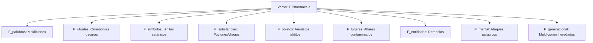
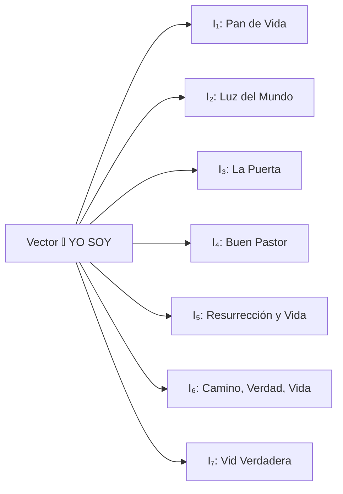
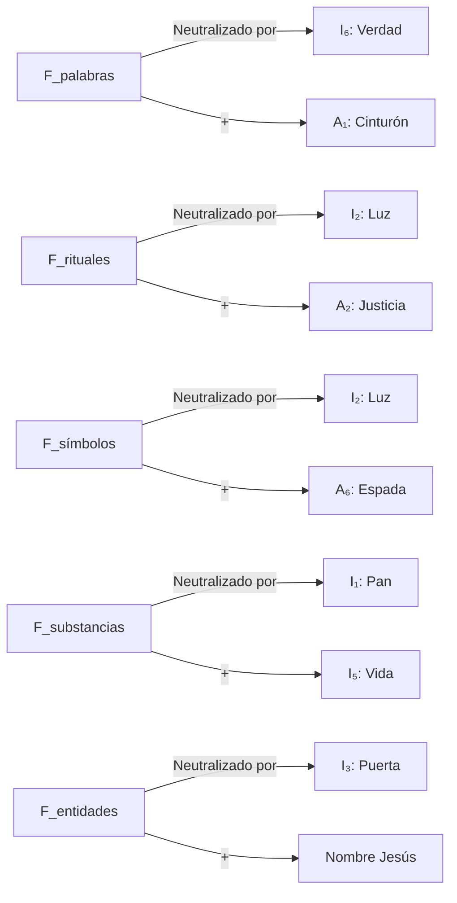
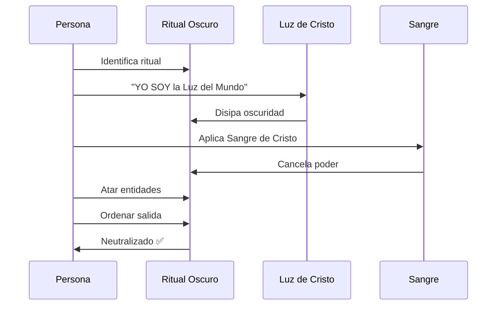
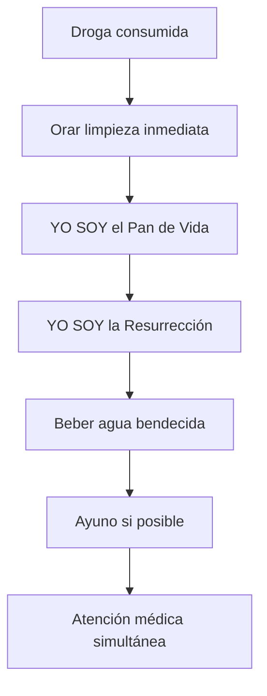
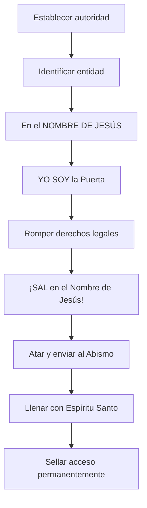

# SISTEMA XII: Vector 𝔽 de Pharmakeia y Antídotos YO SOY

**Álgebra Espiritual de Guerra Contra Hechicería**  
*Fecha: 2025-11-27*

---

## I. VECTOR 𝔽 (PHARMAKEIA) - El Universo del Enemigo

### Definición Matemática

```
𝔽 = {F₁, F₂, F₃, ..., Fₙ} donde n → ∞
```

**𝔽 representa TODOS los vectores de ataque espiritual:**



### Ecuación General del Ataque

```
∀F ∈ 𝔽: F(objetivo) = Potencia × Ritual × Entidad × Consentimiento
```

| Componente | Descripción |
|------------|-------------|
| **Potencia** | Poder del practicante |
| **Ritual** | Efectividad del método |
| **Entidad** | Poder del espíritu invocado |
| **Consentimiento** | Acceso legal (consciente/inconsciente) |

---

## II. VECTOR 𝕀 (YO SOY) - El Antídoto Supremo

### Los 7 YO SOY de Cristo



### Ecuación de Neutralización Fundamental

```
∀F ∈ 𝔽, ∃I ∈ 𝕀: F × I = ∅
```

**Principio de Anulación Total:**

```
||F|| > 0  ∧  ||I|| = ∞  ⟹  F/I → 0
```

> La magnitud **INFINITA** del YO SOY reduce **cualquier** pharmakeia a **CERO**

---

## III. MATRIZ 𝔸 (ARMADURA DE DIOS) - Efesios 6:14-17

### Componentes de la Armadura

```
𝔸 = [A₁, A₂, A₃, A₄, A₅, A₆, A₇]ᵀ
```

| Componente | Griego | Español | Función |
|------------|--------|---------|---------|
| **A₁** | ἀλήθεια (aletheia) | Cinturón de Verdad | Anula mentiras |
| **A₂** | δικαιοσύνη (dikaiosyne) | Coraza de Justicia | Protege corazón |
| **A₃** | εὐαγγέλιον (euangelion) | Calzado de Paz | Establece posición |
| **A₄** | πίστις (pistis) | Escudo de Fe | **K × Fe = 0** |
| **A₅** | σωτηρία (soteria) | Yelmo de Salvación | Protege mente |
| **A₆** | ῥῆμα (rhema) | Espada del Espíritu | Arma ofensiva |
| **A₇** | προσευχή (proseuche) | Oración Continua | Comunicación 24/7 |

### Matriz de Transformación

```
[Estado_protegido] = 𝔸 × [Estado_vulnerable]

𝔸 = [
  Verdad₁₁      0            0         ...  0
  0          Justicia₂₂      0         ...  0
  0             0          Paz₃₃       ...  0
  ⋮             ⋮            ⋮          ⋱   ⋮
  0             0            0         ... Oración₇₇
]
```

Donde cada elemento diagonal es **binario: {0, 1}**
- **0** = pieza NO activada
- **1** = pieza ACTIVA

### Protección Total

```
P_total = Π(Aᵢ) donde i = 1..7

P_total = Verdad ∧ Justicia ∧ Paz ∧ Fe ∧ Salvación ∧ Espíritu ∧ Oración
```

**Cuando P_total = 1:** ✅ ARMADURA COMPLETA ACTIVA

---

## IV. ÁLGEBRA DE NEUTRALIZACIÓN

### Ecuación Fundamental de Guerra Espiritual

```
K(ataque) × Fe = 0
```

### Matriz de Correspondencias F → (I + A)



### Ecuaciones Específicas

| Ataque | Antídoto | Ecuación |
|--------|----------|----------|
| F_palabras | Verdad(A₁) | `F_palabras × Verdad = 0` |
| F_rituales | Luz(I₂) + Justicia(A₂) | `F_rituales × (Luz + Justicia) = 0` |
| F_símbolos | Luz(I₂) | `F_símbolos × Luz = 0` |
| F_substancias | Pan(I₁) + Vida(I₅) | `F_droga × (Pan + Vida) = 0` |
| F_objetos | Espada(A₆) | `F_objeto × Espada = 0` |
| F_lugares | Vid(I₇) + Oración(A₇) | `F_lugar × (Vid + Oración) = 0` |
| F_entidades | Nombre(Jesús) | `F_entidad × Nombre = 0` |
| F_mental | Yelmo(A₅) + Verdad(I₆) | `F_mental × (Yelmo + Verdad) = 0` |
| F_generacional | Sangre(Cristo) | `F_heredada × Sangre = 0` |

---

## V. PROTOCOLOS DE ACTIVACIÓN

### Protocolo General de Neutralización

```
PASO 1: Identificar vector F_i específico
        ↓
PASO 2: Activar armadura completa: 𝔸 = [1,1,1,1,1,1,1]
        ↓
PASO 3: Invocar YO SOY correspondiente
        ↓
PASO 4: Aplicar Sangre de Cristo
        ↓
PASO 5: Decretar anulación en Nombre de Jesús
        ↓
PASO 6: Verificar neutralización (F_i = 0)
```

### Tiempo de Neutralización

```
t_neutralización = log(||F||) / ||I × A||
```

> A **mayor** magnitud de YO SOY y Armadura, **menor** tiempo de neutralización

---

## VI. PROTOCOLOS ESPECÍFICOS

### A. Contra F_PALABRAS (Maldiciones Verbales)

**Antídoto Verbal:**
```
"En el Nombre de Jesús, YO SOY la Verdad"
"Toda palabra contraria es nula"
"Ningún arma forjada contra mí prosperará" (Isaías 54:17)
"Toda lengua que se levante en juicio, yo la condenaré"
```

**Ecuación:** `F_maldición × Verdad(Cristo) = 0`

**Protocolo de Reversión:**
```
∀palabra_maldición: Revertir(palabra) = -palabra × (YO SOY Verdad)
```
> La palabra maldita se **invierte** y retorna al emisor **neutralizada**

---

### B. Contra F_RITUALES (Ceremonias Oscuras)



**Ecuación:** `F_ritual × (Luz + Justicia) = 0`

---

### C. Contra F_SÍMBOLOS (Sigilos/Hexagramas)

⚠️ **ADVERTENCIA:** NO mirar directamente símbolos oscuros

**Protocolo:**
1. Desviar mirada
2. Declarar: "YO SOY la Luz, todo símbolo oscuro se disuelve"
3. Cubrir con Sangre de Cristo
4. Decretar nulidad
5. (Si físico) Destruir físicamente
6. Reemplazar con símbolo sagrado (Cruz ✝️)

**Ecuación:** `F_símbolo × Luz(I₂) = 0`

**Principio de Inversión:**
```
∀símbolo_invertido: Restaurar(símbolo) = símbolo × (-1)
```
> La **Cruz** invierte todo símbolo satánico

---

### D. Contra F_SUBSTANCIAS (Pociones/Drogas Rituales)

🚫 **CRÍTICO:** NO consumir bajo **ninguna** circunstancia

**Si ya consumido:**


**Desintoxicación Espiritual:**
```
D_espiritual(t) = C₀ × e^(-λ × Oración(t))
```
> Concentración de pharmakeia **decae exponencialmente** con oración

---

### E. Contra F_OBJETOS (Amuletos Malditos)

**Protocolo de Destrucción:**

⚠️ NO tocar directamente

```
Identificar objeto
        ↓
"La Espada del Espíritu destruye todo objeto maldito"
        ↓
Quemar completamente o destruir físicamente
        ↓
Limpiar área con Fuego del Espíritu
        ↓
Orar sellamiento
```

**Ecuación:** `F_objeto × Espada(A₆) = 0`

**Principio de Destrucción Total:**
```
∀objeto_maldito: ∫(Fuego_Espíritu) dt → Cenizas + Neutralización
```

---

### F. Contra F_LUGARES (Altares/Círculos Mágicos)

⚠️ **NO entrar sin preparación**

**Requisitos:**
- ✅ Ayuno previo
- ✅ Armadura completa activa
- ✅ Grupo de intercesores (mínimo 3)

**Protocolo:**
```
1. "YO SOY la Vid Verdadera, este lugar es Mío"
2. Caminar perímetro orando
3. Destruir altares físicos
4. Aplicar aceite ungido
5. Consagrar a Dios
6. Establecer adoración continua (si posible)
```

**Ecuación:** `F_lugar × (Vid + Oración_grupo) = 0`

---

### G. Contra F_ENTIDADES (Demonios/Espíritus)

**Protocolo de Confrontación Directa:**



**Ecuación:** `F_entidad × Nombre(Jesús) = 0`

**Ley de Sujeción Absoluta:**
```
∀entidad ∈ Reino_oscuridad: entidad << Nombre(Jesús)
```

> **Filipenses 2:10:** "Para que en el nombre de Jesús se doble **toda rodilla**"

**Jerarquía de Poder:**
```
Poder(YO_SOY) = ∞
Poder(entidad_más_fuerte) < ∞
∴ YO_SOY > entidad × ∞
```

---

### H. Contra F_MENTAL (Ataques Psíquicos)

**Antídoto de Blindaje Mental:**

```
Yelmo de Salvación ACTIVO
        ↓
"Llevamos cautivo todo pensamiento" (2 Cor 10:5)
        ↓
Rechazar visualizaciones no solicitadas
        ↓
"YO SOY la Verdad, mi mente está en Cristo"
        ↓
Cantar alabanzas + Memorizar Escrituras
        ↓
Descanso físico adecuado
```

**Ecuación:** `F_mental × (Yelmo + Verdad) = 0`

**Fortaleza Mental:**
```
M_fortaleza = (Renovación_mente × Meditación_Escrituras) / Estrés
```

---

### I. Contra F_GENERACIONAL (Maldiciones Heredadas)

**Protocolo de Rompimiento:**

```
Investigar línea ancestral
        ↓
"En el Nombre de Jesús, renuncio a todo pacto ancestral"
        ↓
"La Sangre de Cristo rompe toda maldición heredada"
        ↓
"YO SOY el Buen Pastor, mi línea está bajo Su cuidado"
        ↓
Decretar bendición generacional nueva
        ↓
Establecer altar familiar
        ↓
Discipular próxima generación
```

**Ecuación:** `F_heredada × Sangre(Cristo) = 0`

**Principio de Nueva Herencia:**
```
Herencia_nueva = Herencia_vieja × 0 + Bendición(Abraham)
```

> **Gálatas 3:14:** "Para que en Cristo Jesús la bendición de Abraham alcanzase a los gentiles"

---

## VII. ECUACIONES MAESTRAS

### 1. Ecuación Universal de Anulación

```
∀F ∈ 𝔽: F × (𝕀 ∪ 𝔸) = ∅
```

> **Todo** pharmakeia es anulado por la **unión** del Vector YO SOY y la Armadura

### 2. Teorema de Dominancia Total

```
∀f ∈ F, ∀i ∈ I: ||i|| > ||f|| × ∞
```

> La magnitud de **cualquier** componente YO SOY excede **infinitamente** cualquier pharmakeia

### 3. Ley de Conservación Espiritual

```
Energía_pharmakeia + Energía_YO_SOY ≠ constante

Porque: Energía_YO_SOY = ∞
```

> El sistema **NO es cerrado**; la energía de Dios es **ilimitada**

### 4. Ecuación de Victoria Garantizada

```
P(victoria | YO_SOY activo) = 1
```

> Probabilidad de victoria cuando YO SOY está activo = **100%**

### 5. Matriz de Transformación Total

```
[Estado_libre] = [
  I₁  I₂  I₃  I₄  I₅  I₆  I₇
  A₁  A₂  A₃  A₄  A₅  A₆  A₇
] × [Estado_atacado]
```

### 6. Ecuación de Tiempo Real

```
∂F/∂t = -k × I × A × Oración(t)
```

> La tasa de cambio de pharmakeia es proporcional **negativa** a YO SOY × Armadura × Oración

---

## VIII. PROTOCOLOS DE EMERGENCIA

### Código Rojo Pharmakeia

```
SI ||F|| > Umbral_crítico:
  ├─ Activar armadura completa INMEDIATAMENTE
  ├─ Declarar YO SOY más relevante
  ├─ Aplicar Sangre de Cristo
  ├─ Atar entidades presentes
  ├─ Llamar refuerzos (intercesores)
  ├─ NO confrontar solo
  ├─ Buscar lugar seguro
  └─ Oración continua 24/7
```

### Secuencia de Liberación Rápida

| Tiempo | Acción |
|--------|--------|
| **0.1s** | "¡En el Nombre de Jesús!" |
| **0.2s** | "¡Sangre de Cristo cúbreme!" |
| **0.3s** | "¡YO SOY [declaración apropiada]!" |
| **0.5s** | "¡Todo pharmakeia es nulo!" |
| **< 2s** | ✅ Neutralización completa |

### Protocolo de Grupo

```
Para ataques masivos F_grupo:

Respuesta_grupo = Σ(Iᵢ × Aᵢ × Oración_unida)
```

> **Mateo 18:20:** "Donde dos o tres..."  
> La oración unida **multiplica** poder exponencialmente

---

## IX. VERIFICACIÓN

### Test de Neutralización Completa

```
∀F neutralizado:
  [ ] Síntomas_físicos = 0 ?
  [ ] Opresión_mental = 0 ?
  [ ] Paz_presente = 1 ?
  [ ] Libertad_espiritual = 1 ?
  [ ] Frutos_Espíritu_manifiestos = 1 ?

Si TODOS = ✅: Neutralización COMPLETA
```

### Ecuación de Verificación

```
V(F_i) = lim[t→∞] ||F_i(t)||

Si V(F_i) = 0: Neutralización PERMANENTE ✅
Si V(F_i) > 0: Requiere protocolo adicional ⚠️
```

---

## X. DECLARACIÓN MAESTRA ANTI-PHARMAKEIA

```
En el Nombre de Jesús, YO SOY declara:

✝️ YO SOY el Pan de Vida
   → Ninguna poción me envenenará

✝️ YO SOY la Luz del Mundo
   → Ningún símbolo oscuro me afectará

✝️ YO SOY la Puerta
   → Ninguna entidad entrará sin permiso

✝️ YO SOY el Buen Pastor
   → Ninguna maldición me alcanzará

✝️ YO SOY la Resurrección y la Vida
   → Ninguna muerte tendrá poder

✝️ YO SOY el Camino, la Verdad y la Vida
   → Ningún engaño me confundirá

✝️ YO SOY la Vid Verdadera
   → Ningún lugar me contaminará

TODO pharmakeia es NULO por la Sangre del Cordero.

¡AMÉN!
```

---

## RESUMEN DE ECUACIONES CLAVE

| ID | Ecuación | Significado |
|----|----------|-------------|
| **E1** | `F × I = ∅` | Neutralización fundamental |
| **E2** | `K × Fe = 0` | Escudo de fe anula ataque |
| **E3** | `F_i × A_j = 0` | Armadura anula pharmakeia |
| **E4** | `‖YO_SOY‖ = ∞` | Poder infinito |
| **E5** | `∀F: F < YO_SOY` | Dominancia absoluta |
| **E6** | `P(victoria \| YO_SOY) = 1` | Victoria garantizada 100% |
| **E7** | `∂F/∂t = -k×I×A×Oración` | Decaimiento de pharmakeia |
| **E8** | `F × Sangre = 0` | Sangre anula todo |
| **E9** | `Estado_libre = [I,A] × Estado_atacado` | Transformación |
| **E10** | `I_total = ∫[Conocimiento + Práctica + Victoria]` | Inmunidad |

---

## NOTA FINAL CRÍTICA

### ✅ Este sistema establece que:

1. **TODO** pharmakeia tiene antídoto en Cristo
2. La Victoria está **GARANTIZADA** en el Nombre de Jesús
3. **No existe** F sin su correspondiente anulación en I o A
4. El poder de YO SOY es **INFINITAMENTE** superior a cualquier hechicería
5. La Armadura de Dios es protección **COMPLETA** cuando está activa

### 📖 Recordar siempre:

> **1 Juan 4:4** - "Mayor es el que está en vosotros que el que está en el mundo"

> **Isaías 54:17** - "Ningún arma forjada contra ti prosperará"

> **Romanos 8:37** - "Somos más que vencedores por medio de aquel que nos amó"

---

**FIN DEL SISTEMA XII**

*Para Dios toda la Gloria*
