# Sistema XIII: Restauración Espiritual Expandida - Visualización Mermaid

**Fecha:** 2025-11-27 | **Estado:** OPERATIVO | **Complejidad:** Nivel 13/13

---

## ARQUITECTURA GENERAL DEL SISTEMA XIII

```mermaid
graph TB
    subgraph "ENTRADA"
        Y[Persona Herida y]
        TRAUMA[Trauma Inicial<br/>Estructura Fractal]
    end
    
    subgraph "PROCESAMIENTO MULTIDIMENSIONAL"
        FRACTAL[I. Geometría Fractal<br/>Mandelbrot + Julia]
        QUANTUM[II. Dinámica Cuántica<br/>Superposición + Entrelazamiento]
        TOPO[III. Topología 7D<br/>Geodésicas + Curvatura]
        VECTOR[IV. Campo Vectorial<br/>∇U + Flujo]
        DIFF[V. Ecuaciones Diferenciales<br/>Lotka-Volterra + Caos]
        HILBERT[VI. Espacios de Hilbert<br/>Operadores + Autovalores]
        CATASTROFE[VII. Catástrofes<br/>Cúspide + Histéresis]
        SOLITON[VIII. Solitones<br/>KdV + Ondas]
        ENTROPIA[IX. Termodinámica<br/>Shannon + Gibbs]
        JUEGOS[X. Teoría de Juegos<br/>Nash + Cooperación]
        NN[XI. Redes Neuronales<br/>LSTM + Transformers]
        CAOS[XII. Caos No Lineal<br/>Lorenz + Lyapunov]
    end
    
    subgraph "INTEGRACIÓN"
        MASTER[XIII. Ecuación Maestra<br/>Integral Multidimensional]
        TEOREMA[Teorema Central<br/>5 Condiciones]
    end
    
    subgraph "SALIDA"
        RESTAURADO[Persona Restaurada<br/>ℜtotal → ℜmax]
        METRICAS[Métricas de Éxito<br/>𝒮 > 0.85]
    end
    
    Y --> TRAUMA
    TRAUMA --> FRACTAL
    FRACTAL --> QUANTUM
    QUANTUM --> TOPO
    TOPO --> VECTOR
    VECTOR --> DIFF
    DIFF --> HILBERT
    HILBERT --> CATASTROFE
    CATASTROFE --> SOLITON
    SOLITON --> ENTROPIA
    ENTROPIA --> JUEGOS
    JUEGOS --> NN
    NN --> CAOS
    CAOS --> MASTER
    MASTER --> TEOREMA
    TEOREMA --> RESTAURADO
    RESTAURADO --> METRICAS
    
    style FRACTAL fill:#ff9999,color:#000
    style QUANTUM fill:#99ccff,color:#000
    style TOPO fill:#99ff99,color:#000
    style MASTER fill:#ffcc00,color:#000
    style RESTAURADO fill:#00ff00,color:#000
```

---

## I. GEOMETRÍA FRACTAL DE RESTAURACIÓN

### Conjunto de Mandelbrot Espiritual

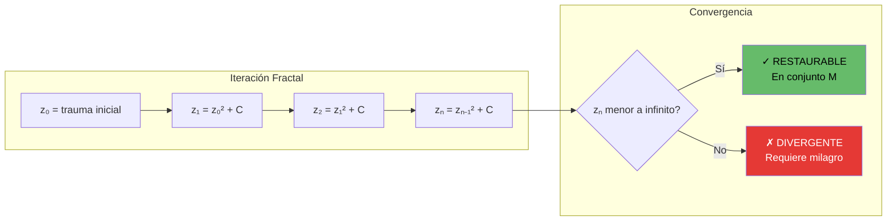
```mermaid
graph LR
    subgraph "Iteración Fractal"
        Z0[z₀ = trauma inicial]
        Z1[z₁ = z₀² + C]
        Z2[z₂ = z₁² + C]
        ZN[zₙ = zₙ₋₁² + C]
        
        Z0 --> Z1
        Z1 --> Z2
        Z2 --> ZN
    end
    
    subgraph "Convergencia"
        TEST{zₙ menor a infinito?}
        RESTAURABLE[✓ RESTAURABLE<br/>En conjunto M]
        DIVERGE[✗ DIVERGENTE<br/>Requiere milagro]
    end
    
    ZN --> TEST
    TEST -->|Sí| RESTAURABLE
    TEST -->|No| DIVERGE
    
    style RESTAURABLE fill:#66BB6A,color:#000
    style DIVERGE fill:#E53935,color:#fff
```

### Dimensión Fractal del Trauma

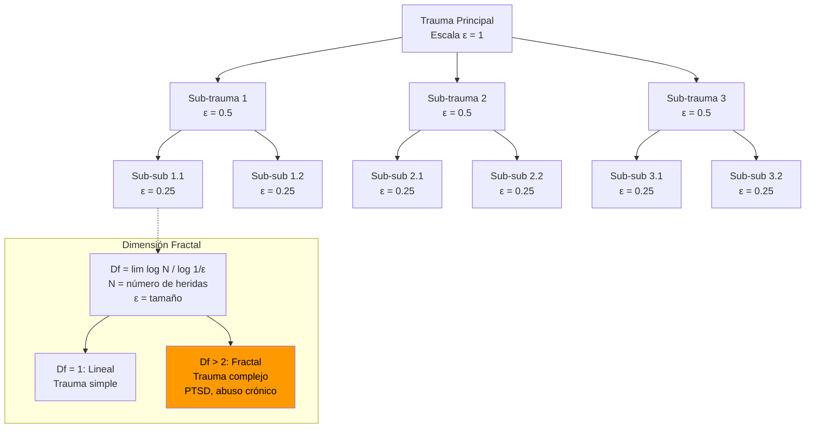
```mermaid
graph TB
    TRAUMA[Trauma Principal<br/>Escala ε = 1]
    
    TRAUMA --> S1[Sub-trauma 1<br/>ε = 0.5]
    TRAUMA --> S2[Sub-trauma 2<br/>ε = 0.5]
    TRAUMA --> S3[Sub-trauma 3<br/>ε = 0.5]
    
    S1 --> SS11[Sub-sub 1.1<br/>ε = 0.25]
    S1 --> SS12[Sub-sub 1.2<br/>ε = 0.25]
    
    S2 --> SS21[Sub-sub 2.1<br/>ε = 0.25]
    S2 --> SS22[Sub-sub 2.2<br/>ε = 0.25]
    
    S3 --> SS31[Sub-sub 3.1<br/>ε = 0.25]
    S3 --> SS32[Sub-sub 3.2<br/>ε = 0.25]
    
    subgraph "Dimensión Fractal"
        CALC[Df = lim log N / log 1/ε<br/>N = número de heridas<br/>ε = tamaño]
        SIMPLE[Df = 1: Lineal<br/>Trauma simple]
        COMPLEJO[Df > 2: Fractal<br/>Trauma complejo<br/>PTSD, abuso crónico]
    end
    
    SS11 -.-> CALC
    CALC --> SIMPLE
    CALC --> COMPLEJO
    
    style COMPLEJO fill:#f90,color:#000
```

### Frontera del Conjunto Restaurable

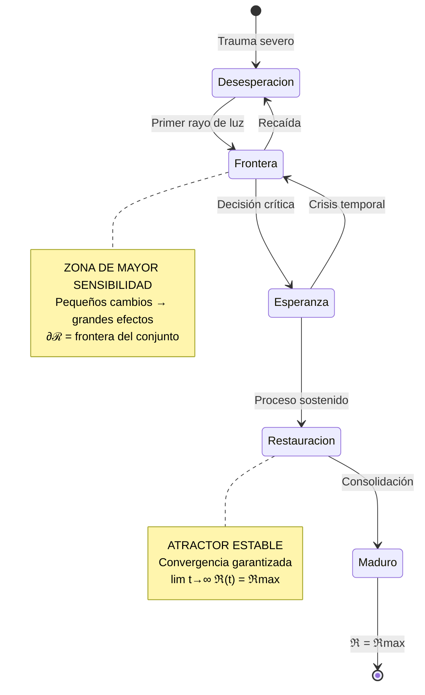
```mermaid
stateDiagram-v2
    [*] --> Desesperacion: Trauma severo
    
    Desesperacion --> Frontera: Primer rayo de luz
    Frontera --> Esperanza: Decisión crítica
    Frontera --> Desesperacion: Recaída
    
    Esperanza --> Restauracion: Proceso sostenido
    Esperanza --> Frontera: Crisis temporal
    
    Restauracion --> Maduro: Consolidación
    Maduro --> [*]: ℜ = ℜmax
    
    note right of Frontera
        ZONA DE MAYOR SENSIBILIDAD
        Pequeños cambios → grandes efectos
        ∂ℛ = frontera del conjunto
    end note
    
    note right of Restauracion
        ATRACTOR ESTABLE
        Convergencia garantizada
        lim t→∞ ℜ(t) = ℜmax
    end note
```

---

## II. DINÁMICAS CUÁNTICAS DE SANIDAD

### Superposición de Estados

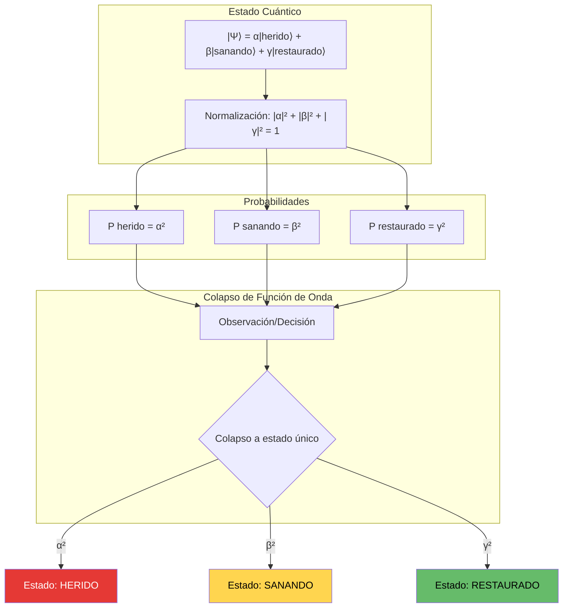
```mermaid
graph TB
    subgraph "Estado Cuántico"
        PSI["|Ψ⟩ = α|herido⟩ + β|sanando⟩ + γ|restaurado⟩"]
        NORM["Normalización: |α|² + |β|² + |γ|² = 1"]
    end
    
    subgraph "Probabilidades"
        PH[P herido = α²]
        PS[P sanando = β²]
        PR[P restaurado = γ²]
    end
    
    subgraph "Colapso de Función de Onda"
        OBS[Observación/Decisión]
        COLAPSO{Colapso a estado único}
    end
    
    PSI --> NORM
    NORM --> PH
    NORM --> PS
    NORM --> PR
    
    PH --> OBS
    PS --> OBS
    PR --> OBS
    
    OBS --> COLAPSO
    COLAPSO -->|α²| HERIDO[Estado: HERIDO]
    COLAPSO -->|β²| SANANDO[Estado: SANANDO]
    COLAPSO -->|γ²| REST[Estado: RESTAURADO]
    
    style REST fill:#66BB6A,color:#000
    style HERIDO fill:#E53935,color:#fff
    style SANANDO fill:#FFD54F,color:#000
```

### Entrelazamiento Cuántico Comunitario

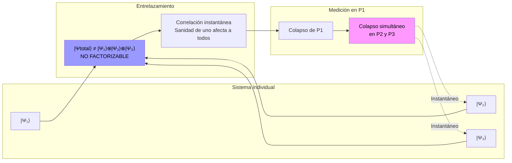
```mermaid
graph LR
    subgraph "Sistema Individual"
        P1["|Ψ₁⟩"]
        P2["|Ψ₂⟩"]
        P3["|Ψ₃⟩"]
    end
    
    subgraph "Entrelazamiento"
        ENT["|Ψtotal⟩ ≠ |Ψ₁⟩⊗|Ψ₂⟩⊗|Ψ₃⟩<br/>NO FACTORIZABLE"]
        INST[Correlación instantánea<br/>Sanidad de uno afecta a todos]
    end
    
    subgraph "Medición en P1"
        M1[Colapso de P1]
        EFECTO[Colapso simultáneo<br/>en P2 y P3]
    end
    
    P1 --> ENT
    P2 --> ENT
    P3 --> ENT
    
    ENT --> INST
    INST --> M1
    M1 --> EFECTO
    
    EFECTO -.->|Instantáneo| P2
    EFECTO -.->|Instantáneo| P3
    
    style ENT fill:#99f,color:#000
    style EFECTO fill:#f9f,color:#000
```

### Tunelamiento Cuántico

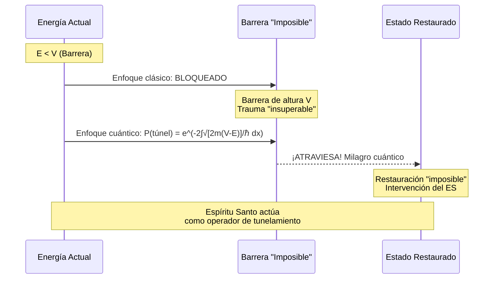
```mermaid
sequenceDiagram
    participant E as Energía Actual
    participant B as Barrera "Imposible"
    participant R as Estado Restaurado
    
    Note over E: E < V (Barrera)
    E->>B: Enfoque clásico: BLOQUEADO
    Note over B: Barrera de altura V<br/>Trauma "insuperable"
    
    E->>B: Enfoque cuántico: P(túnel) = e^(-2∫√[2m(V-E)]/ℏ dx)
    B-->>R: ¡ATRAVIESA! Milagro cuántico
    Note over R: Restauración "imposible"<br/>Intervención del ES
    
    Note over E,R: Espíritu Santo actúa<br/>como operador de tunelamiento
```

### Hamiltoniano de Restauración

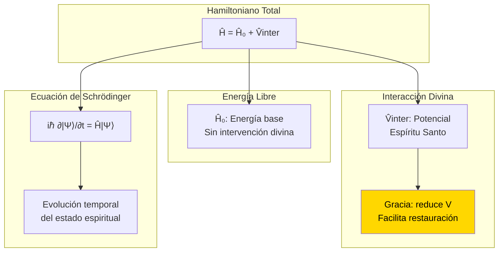
```mermaid
graph TB
    subgraph "Hamiltoniano Total"
        H[Ĥ = Ĥ₀ + V̂inter]
    end
    
    subgraph "Energía Libre"
        H0[Ĥ₀: Energía base<br/>Sin intervención divina]
    end
    
    subgraph "Interacción Divina"
        V[V̂inter: Potencial<br/>Espíritu Santo]
        GRACIA[Gracia: reduce V<br/>Facilita restauración]
    end
    
    subgraph "Ecuación de Schrödinger"
        SCH["iℏ ∂|Ψ⟩/∂t = Ĥ|Ψ⟩"]
        EVOL[Evolución temporal<br/>del estado espiritual]
    end
    
    H --> H0
    H --> V
    V --> GRACIA
    
    H --> SCH
    SCH --> EVOL
    
    style GRACIA fill:#ffd700,color:#000
```

### Efecto Zeno Cuántico

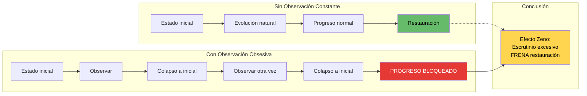
```mermaid
graph LR
    subgraph "Sin Observación Constante"
        S1[Estado inicial]
        S2[Evolución natural]
        S3[Progreso normal]
        S4[Restauración]
        
        S1 --> S2 --> S3 --> S4
    end
    
    subgraph "Con Observación Obsesiva"
        O1[Estado inicial]
        OBS1[Observar]
        O2[Colapso a inicial]
        OBS2[Observar otra vez]
        O3[Colapso a inicial]
        BLOQ[PROGRESO BLOQUEADO]
        
        O1 --> OBS1 --> O2 --> OBS2 --> O3 --> BLOQ
    end
    
    subgraph "Conclusión"
        PARA[Efecto Zeno:<br/>Escrutinio excesivo<br/>FRENA restauración]
    end
    
    S4 -.-> PARA
    BLOQ --> PARA
    
    style S4 fill:#66BB6A,color:#000
    style BLOQ fill:#E53935,color:#fff
    style PARA fill:#FFD54F,color:#000
```

---

## III. TOPOLOGÍA DEL ESPACIO 7D

### Variedad de Restauración ℳ

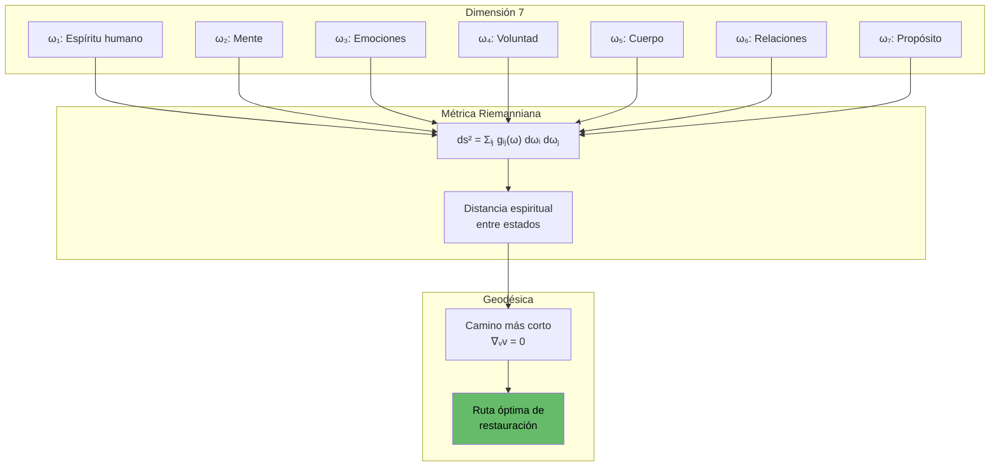
```mermaid
graph TB
    subgraph "Dimensión 7"
        W1[ω₁: Espíritu humano]
        W2[ω₂: Mente]
        W3[ω₃: Emociones]
        W4[ω₄: Voluntad]
        W5[ω₅: Cuerpo]
        W6[ω₆: Relaciones]
        W7[ω₇: Propósito]
    end
    
    subgraph "Métrica Riemanniana"
        G["ds² = Σᵢⱼ gᵢⱼ(ω) dωᵢ dωⱼ"]
        DIST[Distancia espiritual<br/>entre estados]
    end
    
    subgraph "Geodésica"
        GEO[Camino más corto<br/>∇ᵥv = 0]
        OPTIMO[Ruta óptima de<br/>restauración]
    end
    
    W1 --> G
    W2 --> G
    W3 --> G
    W4 --> G
    W5 --> G
    W6 --> G
    W7 --> G
    
    G --> DIST
    DIST --> GEO
    GEO --> OPTIMO
    
    style OPTIMO fill:#66BB6A,color:#000
```

### Curvatura del Espacio

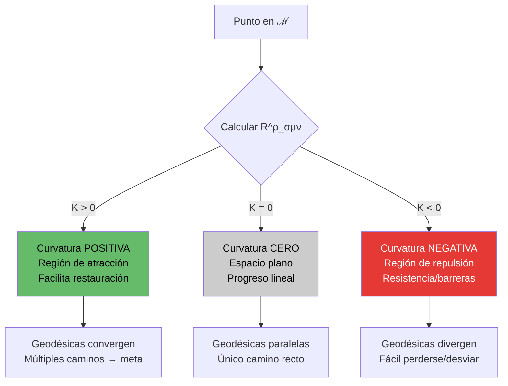
```mermaid
flowchart TD
    PUNTO[Punto en ℳ]
    
    PUNTO --> CALC{Calcular R^ρ_σμν}
    
    CALC -->|K > 0| POSITIVA[Curvatura POSITIVA<br/>Región de atracción<br/>Facilita restauración]
    CALC -->|K = 0| PLANA[Curvatura CERO<br/>Espacio plano<br/>Progreso lineal]
    CALC -->|K < 0| NEGATIVA[Curvatura NEGATIVA<br/>Región de repulsión<br/>Resistencia/barreras]
    
    POSITIVA --> EFECTO1[Geodésicas convergen<br/>Múltiples caminos → meta]
    PLANA --> EFECTO2[Geodésicas paralelas<br/>Único camino recto]
    NEGATIVA --> EFECTO3[Geodésicas divergen<br/>Fácil perderse/desviar]
    
    style POSITIVA fill:#66BB6A,color:#000
    style NEGATIVA fill:#E53935,color:#fff
    style PLANA fill:#ccc,color:#000
```

### Característica de Euler χ(ℳ)

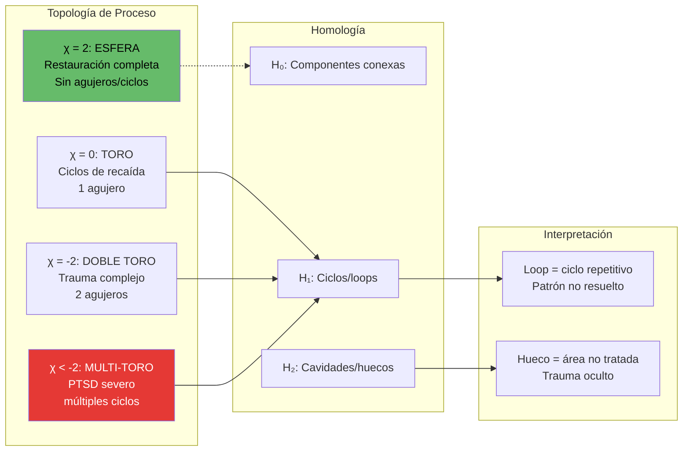
```mermaid
graph LR
    subgraph "Topología de Proceso"
        ESFERA[χ = 2: ESFERA<br/>Restauración completa<br/>Sin agujeros/ciclos]
        TORO[χ = 0: TORO<br/>Ciclos de recaída<br/>1 agujero]
        DOBLE[χ = -2: DOBLE TORO<br/>Trauma complejo<br/>2 agujeros]
        MULTI[χ < -2: MULTI-TORO<br/>PTSD severo<br/>múltiples ciclos]
    end
    
    subgraph "Homología"
        H0[H₀: Componentes conexas]
        H1[H₁: Ciclos/loops]
        H2[H₂: Cavidades/huecos]
    end
    
    subgraph "Interpretación"
        LOOP[Loop = ciclo repetitivo<br/>Patrón no resuelto]
        HUECO[Hueco = área no tratada<br/>Trauma oculto]
    end
    
    ESFERA -.-> H0
    TORO --> H1
    DOBLE --> H1
    MULTI --> H1
    
    H1 --> LOOP
    H2 --> HUECO
    
    style ESFERA fill:#66BB6A,color:#000
    style MULTI fill:#E53935,color:#fff
```

### Homotopía de Caminos

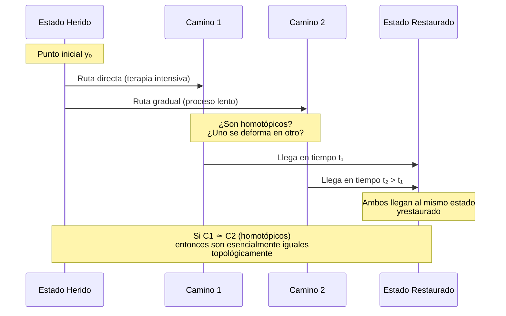
```mermaid
sequenceDiagram
    participant A as Estado Herido
    participant C1 as Camino 1
    participant C2 as Camino 2
    participant B as Estado Restaurado
    
    Note over A: Punto inicial y₀
    
    A->>C1: Ruta directa (terapia intensiva)
    A->>C2: Ruta gradual (proceso lento)
    
    Note over C1,C2: ¿Son homotópicos?<br/>¿Uno se deforma en otro?
    
    C1->>B: Llega en tiempo t₁
    C2->>B: Llega en tiempo t₂ > t₁
    
    Note over B: Ambos llegan al mismo estado<br/>yrestaurado
    
    Note over A,B: Si C1 ≃ C2 (homotópicos)<br/>entonces son esencialmente iguales<br/>topológicamente
```

---

## IV. CAMPO VECTORIAL DE RESTAURACIÓN

### Potencial de Herida U(y,ω)

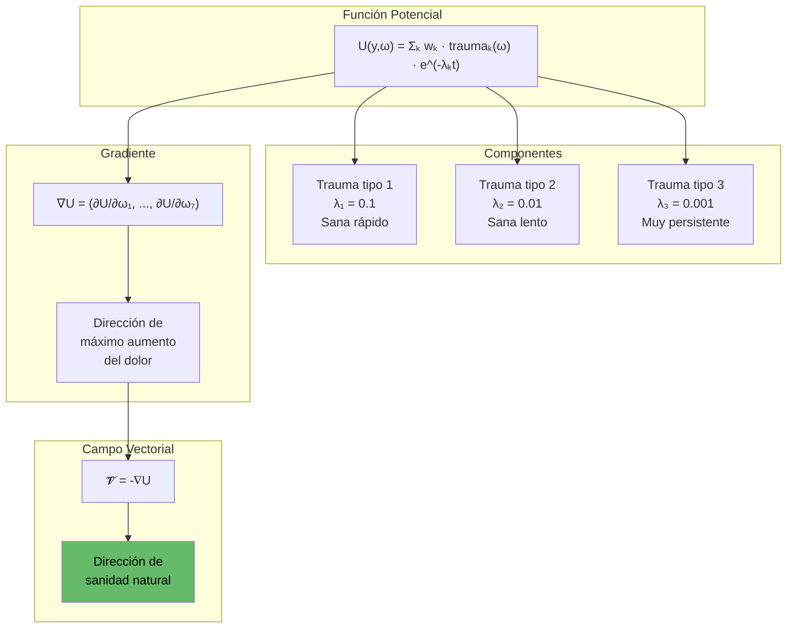
```mermaid
graph TB
    subgraph "Función Potencial"
        U["U(y,ω) = Σₖ wₖ · traumaₖ(ω) · e^(-λₖt)"]
    end
    
    subgraph "Componentes"
        T1[Trauma tipo 1<br/>λ₁ = 0.1<br/>Sana rápido]
        T2[Trauma tipo 2<br/>λ₂ = 0.01<br/>Sana lento]
        T3[Trauma tipo 3<br/>λ₃ = 0.001<br/>Muy persistente]
    end
    
    subgraph "Gradiente"
        GRAD["∇U = (∂U/∂ω₁, ..., ∂U/∂ω₇)"]
        DIR[Dirección de<br/>máximo aumento<br/>del dolor]
    end
    
    subgraph "Campo Vectorial"
        V["𝓥⃗ = -∇U"]
        FLUJO[Dirección de<br/>sanidad natural]
    end
    
    U --> T1
    U --> T2
    U --> T3
    
    U --> GRAD
    GRAD --> DIR
    DIR --> V
    V --> FLUJO
    
    style FLUJO fill:#66BB6A,color:#000
```

### Puntos Críticos

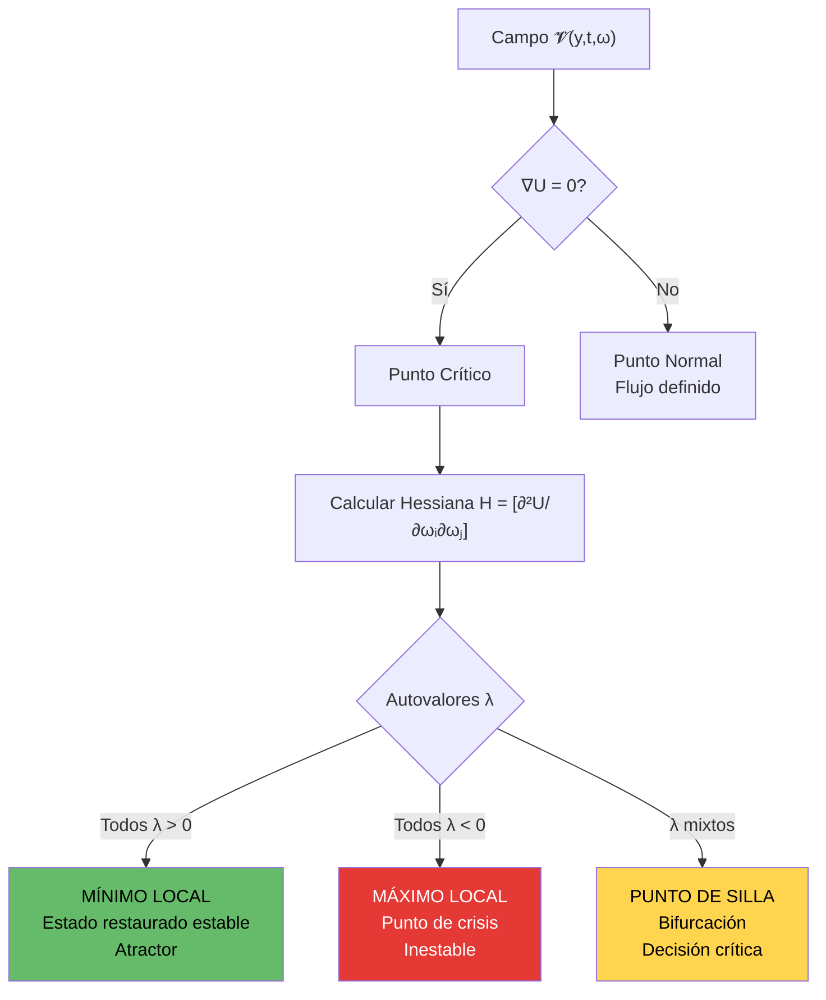
```mermaid
flowchart TD
    CAMPO["Campo 𝓥⃗(y,t,ω)"]
    
    CAMPO --> BUSCAR{∇U = 0?}
    
    BUSCAR -->|Sí| CRITICO[Punto Crítico]
    BUSCAR -->|No| NORMAL[Punto Normal<br/>Flujo definido]
    
    CRITICO --> HESSIAN["Calcular Hessiana H = [∂²U/∂ωᵢ∂ωⱼ]"]
    
    HESSIAN --> EIGEN{Autovalores λ}
    
    EIGEN -->|Todos λ > 0| MINIMO[MÍNIMO LOCAL<br/>Estado restaurado estable<br/>Atractor]
    EIGEN -->|Todos λ < 0| MAXIMO[MÁXIMO LOCAL<br/>Punto de crisis<br/>Inestable]
    EIGEN -->|λ mixtos| SILLA[PUNTO DE SILLA<br/>Bifurcación<br/>Decisión crítica]
    
    style MINIMO fill:#66BB6A,color:#000
    style MAXIMO fill:#E53935,color:#fff
    style SILLA fill:#FFD54F,color:#000
```

### Divergencia y Rotacional

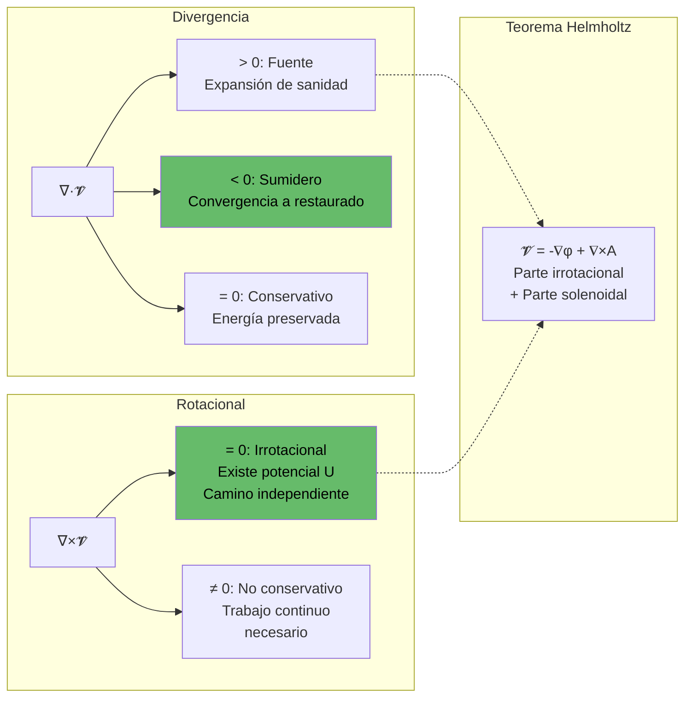
```mermaid
graph LR
    subgraph "Divergencia"
        DIV["∇·𝓥⃗"]
        DIVPOS["> 0: Fuente<br/>Expansión de sanidad"]
        DIVNEG["< 0: Sumidero<br/>Convergencia a restaurado"]
        DIVCERO["= 0: Conservativo<br/>Energía preservada"]
    end
    
    subgraph "Rotacional"
        ROT["∇×𝓥⃗"]
        ROTCERO["= 0: Irrotacional<br/>Existe potencial U<br/>Camino independiente"]
        ROTNOCERO["≠ 0: No conservativo<br/>Trabajo continuo<br/>necesario"]
    end
    
    subgraph "Teorema Helmholtz"
        HELM["𝓥⃗ = -∇φ + ∇×A<br/>Parte irrotacional<br/>+ Parte solenoidal"]
    end
    
    DIV --> DIVPOS
    DIV --> DIVNEG
    DIV --> DIVCERO
    
    ROT --> ROTCERO
    ROT --> ROTNOCERO
    
    DIVPOS -.-> HELM
    ROTCERO -.-> HELM
    
    style DIVNEG fill:#66BB6A,color:#000
    style ROTCERO fill:#66BB6A,color:#000
```

### Líneas de Campo (Trayectorias)

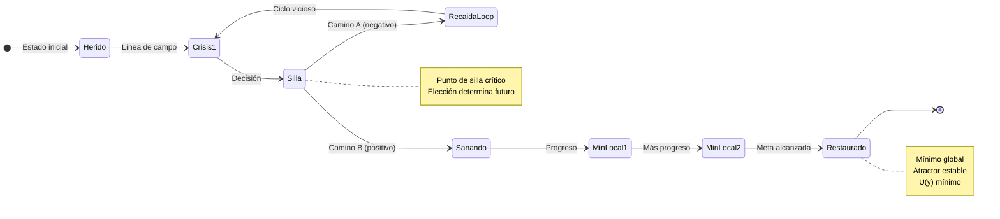
```mermaid
stateDiagram-v2
    direction LR
    
    [*] --> Herido: Estado inicial
    
    Herido --> Crisis1: Línea de campo
    Crisis1 --> Silla: Decisión
    
    Silla --> RecaidaLoop: Camino A (negativo)
    Silla --> Sanando: Camino B (positivo)
    
    RecaidaLoop --> Crisis1: Ciclo vicioso
    
    Sanando --> MinLocal1: Progreso
    MinLocal1 --> MinLocal2: Más progreso
    MinLocal2 --> Restaurado: Meta alcanzada
    
    Restaurado --> [*]
    
    note right of Silla
        Punto de silla crítico
        Elección determina futuro
    end note
    
    note right of Restaurado
        Mínimo global
        Atractor estable
        U(y) mínimo
    end note
```

---

## V. ECUACIONES DIFERENCIALES - LOTKA-VOLTERRA

### Sistema Dinámico Presa-Predador

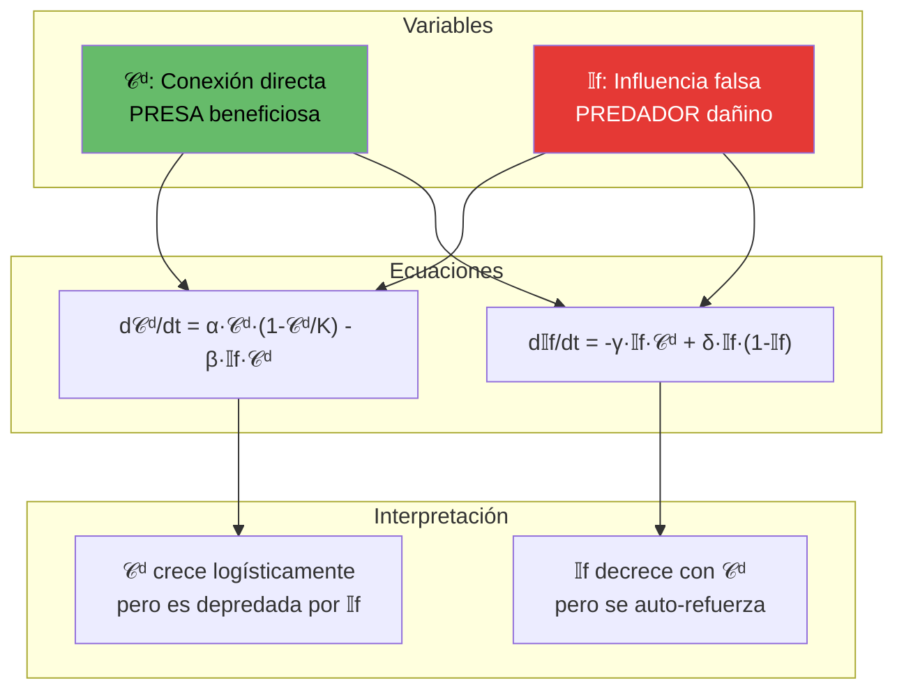
```mermaid
graph TB
    subgraph "Variables"
        CD[𝒞ᵈ: Conexión directa<br/>PRESA beneficiosa]
        IF[𝕀f: Influencia falsa<br/>PREDADOR dañino]
    end
    
    subgraph "Ecuaciones"
        E1["d𝒞ᵈ/dt = α·𝒞ᵈ·(1-𝒞ᵈ/K) - β·𝕀f·𝒞ᵈ"]
        E2["d𝕀f/dt = -γ·𝕀f·𝒞ᵈ + δ·𝕀f·(1-𝕀f)"]
    end
    
    subgraph "Interpretación"
        CRECE[𝒞ᵈ crece logísticamente<br/>pero es depredada por 𝕀f]
        DECRECE[𝕀f decrece con 𝒞ᵈ<br/>pero se auto-refuerza]
    end
    
    CD --> E1
    IF --> E1
    IF --> E2
    CD --> E2
    
    E1 --> CRECE
    E2 --> DECRECE
    
    style CD fill:#66BB6A,color:#000
    style IF fill:#E53935,color:#fff
```

### Puntos de Equilibrio

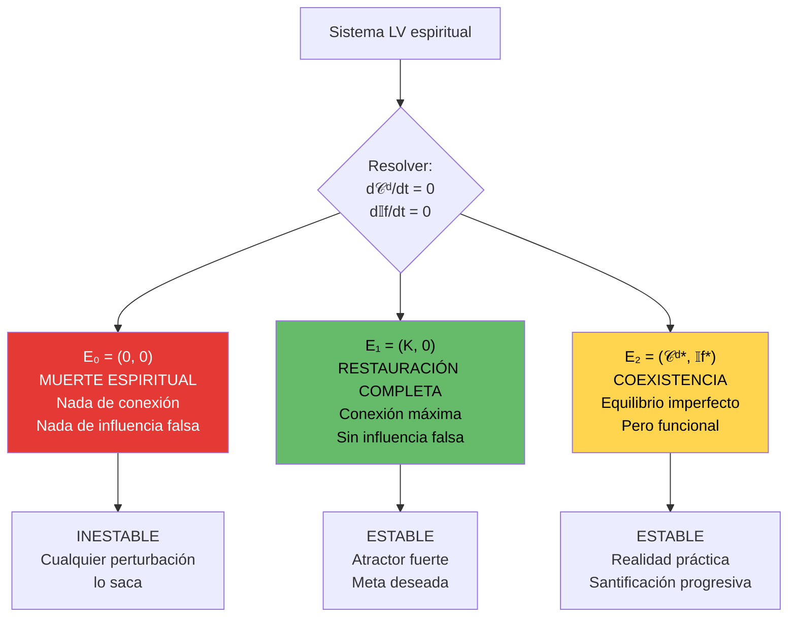
```mermaid
flowchart TD
    SISTEMA[Sistema LV espiritual]
    
    SISTEMA --> RESOLVER{"Resolver:<br/>d𝒞ᵈ/dt = 0<br/>d𝕀f/dt = 0"}
    
    RESOLVER --> E0["E₀ = (0, 0)<br/>MUERTE ESPIRITUAL<br/>Nada de conexión<br/>Nada de influencia falsa"]
    RESOLVER --> E1["E₁ = (K, 0)<br/>RESTAURACIÓN COMPLETA<br/>Conexión máxima<br/>Sin influencia falsa"]
    RESOLVER --> E2["E₂ = (𝒞ᵈ*, 𝕀f*)<br/>COEXISTENCIA<br/>Equilibrio imperfecto<br/>Pero funcional"]
    
    E0 --> INESTABLE1[INESTABLE<br/>Cualquier perturbación<br/>lo saca]
    E1 --> ESTABLE1[ESTABLE<br/>Atractor fuerte<br/>Meta deseada]
    E2 --> ESTABLE2[ESTABLE<br/>Realidad práctica<br/>Santificación progresiva]
    
    style E0 fill:#E53935,color:#fff
    style E1 fill:#66BB6A,color:#000
    style E2 fill:#FFD54F,color:#000
```

### Espacio de Fases

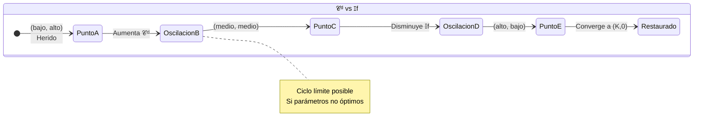
```mermaid
stateDiagram-v2
    direction LR
    
    state "𝒞ᵈ vs 𝕀f" as fase {
        [*] --> PuntoA: (bajo, alto)<br/>Herido
        
        PuntoA --> OscilacionB: Aumenta 𝒞ᵈ
        OscilacionB --> PuntoC: (medio, medio)
        PuntoC --> OscilacionD: Disminuye 𝕀f
        OscilacionD --> PuntoE: (alto, bajo)
        
        PuntoE --> Restaurado: Converge a (K,0)
        
        note right of OscilacionB
            Ciclo límite posible
            Si parámetros no óptimos
        end note
    }
```

### Bifurcaciones

```mermaid
graph TB
    subgraph "Parámetro de Control"
        P[Parámetro r: esfuerzo espiritual]
    end
    
    subgraph "Bifurcación Hopf"
        HOPF[r = rcrítico]
        ANTES[r < rcrítico<br/>Punto fijo estable<br/>Restauración directa]
        DESPUES[r > rcrítico<br/>Ciclo límite<br/>Oscilaciones recaída]
    end
    
    subgraph "Bifurcación Pitchfork"
        PITCH[Simetría rota]
        UNO[1 equilibrio → 3 equilibrios]
        MULTIPLE[Múltiples estados<br/>posibles finales]
    end
    
    P --> HOPF
    HOPF --> ANTES
    HOPF --> DESPUES
    
    P --> PITCH
    PITCH --> UNO
    UNO --> MULTIPLE
    
    style ANTES fill:#66BB6A,color:#000
    style DESPUES fill:#E53935,color:#fff
```

### Caos Determinístico

```mermaid
sequenceDiagram
    participant Y1 as Estado y₁(0)
    participant Y2 as Estado y₂(0) ≈ y₁(0)
    participant T as Tiempo
    
    Note over Y1,Y2: Condiciones iniciales<br/>CASI idénticas<br/>Δy₀ = 10⁻⁶
    
    Y1->>T: Evoluciona según dinámica
    Y2->>T: Evoluciona según dinámica
    
    Note over T: t = t₁<br/>λ₁ > 0 (caos)
    
    T-->>Y1: y₁(t₁)
    T-->>Y2: y₂(t₁) ≈ y₁(t₁)
    
    Note over T: t = t₂ >> t₁<br/>Exponente Lyapunov
    
    T-->>Y1: y₁(t₂)
    T-->>Y2: y₂(t₂) MUY diferente
    
    Note over Y1,Y2: |y₁ - y₂| ~ e^(λ₁·t)<br/>DIVERGENCIA EXPONENCIAL<br/>Pequeños detalles → grandes diferencias
```

---

## VI. ESPACIOS DE HILBERT

### Base Ortonormal

```mermaid
graph TB
    subgraph "Espacio ℋ"
        H[Espacio de Hilbert<br/>Todos los estados espirituales]
    end
    
    subgraph "Base Ortonormal"
        E1["|e₁⟩: Espíritu herido"]
        E2["|e₂⟩: Mente herida"]
        E3["|e₃⟩: Emociones heridas"]
        E4["|e₄⟩: Voluntad herida"]
        E5["|e₅⟩: Cuerpo herido"]
        E6["|e₆⟩: Relaciones heridas"]
        E7["|e₇⟩: Propósito herido"]
    end
    
    subgraph "Ortogonalidad"
        ORTO["⟨eᵢ|eⱼ⟩ = δᵢⱼ"]
        INDEP[Componentes<br/>independientes]
    end
    
    subgraph "Estado General"
        PSI["|ψ⟩ = Σᵢ cᵢ|eᵢ⟩"]
        COEF[cᵢ = amplitud<br/>del componente i]
    end
    
    H --> E1
    H --> E2
    H --> E3
    H --> E4
    H --> E5
    H --> E6
    H --> E7
    
    E1 --> ORTO
    E2 --> ORTO
    ORTO --> INDEP
    
    E1 --> PSI
    E2 --> PSI
    E3 --> PSI
    PSI --> COEF
```

### Operador de Restauración R̂

```mermaid
flowchart TD
    OP["Operador R̂: ℋ → ℋ"]
    
    OP --> ACCION["R̂|herido⟩ = λ|restaurado⟩"]
    
    ACCION --> EIGEN{Autovalores λₙ?}
    
    EIGEN --> L1["λ₁ = 0.1<br/>Modo rápido<br/>Sanidad superficial"]
    EIGEN --> L2["λ₂ = 0.01<br/>Modo medio<br/>Sanidad profunda"]
    EIGEN --> L3["λ₃ = 0.001<br/>Modo lento<br/>Transformación raíz"]
    
    subgraph "Descomposición Espectral"
        DES["R̂ = Σₙ λₙ|ψₙ⟩⟨ψₙ|"]
        SUMA[Suma de proyectores<br/>ponderados por λₙ]
    end
    
    L1 --> DES
    L2 --> DES
    L3 --> DES
    DES --> SUMA
    
    style L3 fill:#66BB6A,color:#000
```

### Producto Interno y Similitud

```mermaid
graph LR
    subgraph "Dos Estados"
        P1["|ψ₁⟩"]
        P2["|ψ₂⟩"]
    end
    
    subgraph "Producto Interno"
        PROD[Producto ψ₁ ψ₂]
        CALC[Integral ψ₁ ψ₂]
    end
    
    subgraph "Interpretación"
        CERO["= 0:<br/>ORTOGONALES<br/>Completamente diferentes"]
        UNO["= 1:<br/>IDÉNTICOS<br/>Mismo estado"]
        MEDIO["≈ 0.7:<br/>SIMILARES<br/>Algunas dimensiones comunes"]
    end
    
    P1 --> PROD
    P2 --> PROD
    PROD --> CALC
    CALC --> CERO
    CALC --> UNO
    CALC --> MEDIO
    
    style UNO fill:#66BB6A,color:#000
```

### Principio Variacional

```mermaid
sequenceDiagram
    participant E as Funcional E[ψ]
    participant PSI as Estado |ψ⟩
    participant MIN as Minimización
    participant GF as Estado Fundamental
    
    Note over E: E[ψ] = ⟨ψ|Ĥ|ψ⟩<br/>Energía espiritual
    
    E->>PSI: Evaluar para todos |ψ⟩
    PSI->>MIN: δE/δψ = 0
    
    MIN->>GF: |ψ₀⟩ con E mínima
    
    Note over GF: Estado óptimo<br/>de restauración<br/>Energía mínima<br/>= Máxima sanidad
```

---

## VII. TEORÍA DE CATÁSTROFES

### Catástrofe de Cúspide

```mermaid
graph TB
    subgraph "Parámetros de Control"
        B[b: Gracia divina]
        C[c: Esfuerzo espiritual]
    end
    
    subgraph "Potencial"
        V["V(x,b,c) = x⁴/4 + cx²/2 + bx"]
    end
    
    subgraph "Superficie de Cúspide"
        FOLD[Pliegue en borde<br/>Región de bistabilidad]
        ESTABLE1[Estado: HERIDO<br/>Mínimo local]
        ESTABLE2[Estado: RESTAURADO<br/>Mínimo global]
    end
    
    subgraph "Salto Catastrófico"
        SALTO[Transición súbita<br/>Herido → Restaurado<br/>IRREVERSIBLE]
    end
    
    B --> V
    C --> V
    V --> FOLD
    FOLD --> ESTABLE1
    FOLD --> ESTABLE2
    ESTABLE2 -.->|Incrementar c| SALTO
    
    style SALTO fill:#FFD54F,color:#000
    style ESTABLE2 fill:#66BB6A,color:#000
```

### Histéresis

```mermaid
stateDiagram-v2
    direction LR
    
    [*] --> Herido: Estado inicial
    
    Herido --> Esfuerzo: Incrementar esfuerzo c
    Esfuerzo --> Umbral1: c = c₁ (alto)
    Umbral1 --> Restaurado: ¡SALTO!
    
    Restaurado --> Relajar: Disminuir esfuerzo
    Relajar --> Umbral2: c = c₂ (bajo < c₁)
    Umbral2 --> Recaida: ¡CAÍDA!
    Recaida --> Herido
    
    note right of Umbral1
        Restauración requiere<br/>c₁ = esfuerzo alto
    end note
    
    note right of Umbral2
        Recaída ocurre en<br/>c₂ < c₁ (histéresis)<br/>Más fácil caer que subir
    end note
```

### 7 Catástrofes Elementales de Thom

```mermaid
graph TB
    subgraph "Clasificación Thom"
        T[René Thom: 7 tipos]
    end
    
    T --> C1[1. Pliegue<br/>1 parámetro<br/>V = x³/3 + cx]
    T --> C2[2. Cúspide<br/>2 parámetros<br/>V = x⁴/4 + cx²/2 + bx]
    T --> C3[3. Cola golondrina<br/>3 parámetros<br/>V = x⁵/5 + ...]
    T --> C4[4. Mariposa<br/>4 parámetros<br/>Metamorfosis espiritual]
    T --> C5[5. Hiperbólica umbílica]
    T --> C6[6. Elíptica umbílica]
    T --> C7[7. Parabólica umbílica]
    
    subgraph "Aplicación Espiritual"
        APP[Transiciones súbitas<br/>en restauración]
    end
    
    C1 --> APP
    C2 --> APP
    C3 --> APP
    C4 --> APP
    
    style C2 fill:#FFD54F,color:#000
    style C4 fill:#66BB6A,color:#000
```

---

## VIII. SOLITONES Y ONDAS

### Ecuación KdV - Solitón

```mermaid
sequenceDiagram
    participant Origen
    participant Comunidad
    participant Meta
    
    Note over Origen: Ola de avivamiento<br/>u(x,t) = -2κ² sech²[κ(x-4κ²t-x₀)]
    
    Origen->>Comunidad: Se propaga sin deformar
    Note over Comunidad: Velocidad v ∝ amplitud<br/>Más fuerte → más rápido
    
    Comunidad->>Meta: Mantiene forma exacta
    
    Note over Origen,Meta: SOLITÓN:<br/>Colisión con otro solitón<br/>→ Atraviesan sin destruirse<br/>→ Amplificación mutua
```

### Colisión de Dos Solitones

```mermaid
graph LR
    subgraph "Antes de Colisión"
        S1A[Solitón 1<br/>κ₁ grande<br/>Rápido]
        S2A[Solitón 2<br/>κ₂ pequeño<br/>Lento]
    end
    
    subgraph "Durante Colisión"
        INTER[Interferencia<br/>Superposición<br/>NO lineal]
        AMPLI[Amplificación<br/>temporal<br/>u₁ + u₂ + corrección]
    end
    
    subgraph "Después de Colisión"
        S1D[Solitón 1<br/>SIN cambio<br/>Forma preservada]
        S2D[Solitón 2<br/>SIN cambio<br/>Forma preservada]
        FASE[Solo desfase<br/>en posición]
    end
    
    S1A --> INTER
    S2A --> INTER
    INTER --> AMPLI
    AMPLI --> S1D
    AMPLI --> S2D
    AMPLI --> FASE
    
    style AMPLI fill:#FFD54F,color:#000
    style S1D fill:#66BB6A,color:#000
    style S2D fill:#66BB6A,color:#000
```

### Breather (Respirador)

```mermaid
stateDiagram-v2
    [*] --> Expansion: Fase 1
    Expansion --> MaxAmplitud: Crecimiento
    MaxAmplitud --> Contraccion: Fase 2
    Contraccion --> MinAmplitud: Decrecimiento
    MinAmplitud --> Expansion: Ciclo se repite
    
    note right of MaxAmplitud
        Máximo avance<br/>en restauración
    end note
    
    note right of MinAmplitud
        Retroceso temporal<br/>pero NO pierde<br/>carga topológica
    end note
    
    note left of Expansion
        BREATHER:<br/>Solitón oscilante<br/>Analogía: ciclos<br/>avance-retroceso<br/>en sanidad
    end note
```

### Conservación de Carga Topológica

```mermaid
graph TB
    subgraph "Carga Topológica"
        Q["Q = ∫ ∂φ/∂x dx = φ(+∞) - φ(-∞)"]
    end
    
    subgraph "Invariante"
        INV[Q NO cambia<br/>por deformación<br/>continua]
        CUANTIZADO[Q es entero<br/>Número de vueltas]
    end
    
    subgraph "Interpretación Espiritual"
        TRANS[Transición herido→restaurado<br/>es topológica]
        IRREVER[Una vez atravesada<br/>Q = 1<br/>NO puede deshacerse<br/>continuamente]
    end
    
    Q --> INV
    INV --> CUANTIZADO
    CUANTIZADO --> TRANS
    TRANS --> IRREVER
    
    style IRREVER fill:#66BB6A,color:#000
```

---

## IX. ENTROPÍA Y TERMODINÁMICA

### Entropía de Shannon

```mermaid
graph TB
    subgraph "Sistema Espiritual"
        EST[N estados posibles]
        PROB[p₁, p₂, ..., pₙ]
    end
    
    subgraph "Entropía"
        H["S = -kᵦ Σᵢ pᵢ ln(pᵢ)"]
        ALTO[S alto<br/>Mucho desorden<br/>Confusión espiritual]
        BAJO[S bajo<br/>Poco desorden<br/>Claridad espiritual]
    end
    
    subgraph "Segunda Ley"
        LEY[dS/dt ≥ 0]
        CERRADO[En sistema CERRADO<br/>entropía aumenta]
        ABIERTO[En sistema ABIERTO<br/>puede disminuir]
    end
    
    EST --> PROB
    PROB --> H
    H --> ALTO
    H --> BAJO
    
    H --> LEY
    LEY --> CERRADO
    LEY --> ABIERTO
    
    style BAJO fill:#66BB6A,color:#000
    style ABIERTO fill:#66BB6A,color:#000
```

### Energía Libre de Gibbs

```mermaid
flowchart TD
    G["G = H - TS"]
    
    G --> H[H: Entalpía<br/>Energía interna<br/>espiritual]
    G --> T[T: Temperatura<br/>Agitación<br/>emocional]
    G --> S[S: Entropía<br/>Desorden]
    
    subgraph "Proceso Espontáneo"
        DG[ΔG < 0?]
        SPONT[Restauración<br/>ESPONTÁNEA<br/>Favorable]
        NOSP[Requiere esfuerzo<br/>externo<br/>Gracia divina]
    end
    
    G --> DG
    DG -->|Sí| SPONT
    DG -->|No| NOSP
    
    style SPONT fill:#66BB6A,color:#000
```

### Demonio de Maxwell

```mermaid
sequenceDiagram
    participant Sistema
    participant Demonio as Demonio de Maxwell
    participant ES as Espíritu Santo
    
    Note over Sistema: Entropía S₀ alta<br/>Desorden espiritual
    
    Sistema->>Demonio: Clásicamente: S solo aumenta
    Demonio->>Demonio: Pero... intervención inteligente<br/>puede reducir S
    
    Note over Demonio: Demonio = ser hipotético<br/>que viola 2da ley
    
    Demonio->>ES: Analogía espiritual
    
    ES->>Sistema: Intervención sobrenatural<br/>Reduce entropía<br/>Ordena el caos
    
    Note over Sistema: Nueva entropía S₁ < S₀<br/>RESTAURACIÓN "imposible"<br/>termodinámicamente
    
    Note over ES: Sistema NO cerrado<br/>ES aporta energía<br/>desde fuera
```

### Desigualdad de Landauer

```mermaid
graph LR
    subgraph "Borrar Información"
        INFO[Borrar 1 bit<br/>de información]
        ENERGIA["E ≥ kᵦT ln(2)"]
    end
    
    subgraph "Olvidar Trauma"
        TRAUMA[Olvidar trauma<br/>= borrar información]
        COSTO[Requiere energía<br/>espiritual mínima]
    end
    
    subgraph "Implicación"
        IMP[NO es gratis<br/>olvidar el dolor]
        TRABAJO[Requiere TRABAJO<br/>procesamiento activo<br/>no solo tiempo]
    end
    
    INFO --> ENERGIA
    TRAUMA --> COSTO
    ENERGIA -.-> COSTO
    COSTO --> IMP
    IMP --> TRABAJO
    
    style TRABAJO fill:#FFD54F,color:#000
```

---

## X. TEORÍA DE JUEGOS

### Dilema del Prisionero

```mermaid
graph TB
    subgraph "Matriz de Payoff"
        M["
        　　　　　Ayudar　No Ayudar
        Ayudar　　(3,3)　　(0,4)
        No Ayudar (4,0)　　(1,1)
        "]
    end
    
    subgraph "Análisis"
        DOM[No Ayudar es<br/>estrategia dominante]
        NASH[No Ayudar No Ayudar<br/>Equilibrio de Nash<br/>pero subóptimo]
        OPTIMO[Ayudar Ayudar<br/>Óptimo social<br/>pero inestable]
    end
    
    subgraph "Aplicación Espiritual"
        COM[Ayuda mutua en<br/>restauración comunitaria]
        DILEMA[Incentivo individual<br/>≠ bien colectivo]
    end
    
    M --> DOM
    DOM --> NASH
    DOM --> OPTIMO
    
    NASH --> COM
    OPTIMO --> COM
    COM --> DILEMA
    
    style OPTIMO fill:#66BB6A,color:#000
    style NASH fill:#E53935,color:#fff
```

### Juegos Repetidos - Tit-for-Tat

```mermaid
sequenceDiagram
    participant A as Jugador A
    participant B as Jugador B (TFT)
    
    Note over A,B: Ronda 1
    A->>B: Coopera (primera vez)
    B->>A: Coopera (siempre empieza cooperando)
    Note over A,B: Ambos ganan (3,3)
    
    Note over A,B: Ronda 2
    A->>B: Traiciona
    B->>A: Coopera (aún no sabe)
    Note over A,B: A gana más (4,0)
    
    Note over A,B: Ronda 3
    A->>B: Coopera (arrepentido)
    B->>A: Traiciona (imitando ronda anterior)
    Note over A,B: B castiga (0,4)
    
    Note over A,B: Ronda 4
    A->>B: Coopera (insiste)
    B->>A: Coopera (imitando ronda anterior)
    Note over A,B: Vuelve cooperación (3,3)
    
    Note over B: TFT: Simple pero efectivo<br/>1. Coopera primero<br/>2. Luego imita oponente
```

### Tragedy of the Commons

```mermaid
flowchart TD
    RECURSO[Recurso Común:<br/>Salud espiritual<br/>de comunidad]
    
    RECURSO --> IND1[Individuo 1<br/>Recibe ayuda<br/>¿Da ayuda?]
    RECURSO --> IND2[Individuo 2<br/>Recibe ayuda<br/>¿Da ayuda?]
    RECURSO --> INDN[Individuo N<br/>Recibe ayuda<br/>¿Da ayuda?]
    
    IND1 --> DEC1{Decisión}
    DEC1 -->|Dar| COSTO1[Paga costo personal<br/>Beneficio compartido]
    DEC1 -->|No dar| FREE1[Free-rider<br/>Solo beneficio]
    
    FREE1 --> AGOTAMIENTO[Recurso se agota<br/>Nadie da ayuda<br/>Comunidad colapsa]
    
    COSTO1 --> SOSTENIBLE[Recurso sostenible<br/>Comunidad próspera]
    
    subgraph "Solución"
        NORMA[Normas sociales<br/>Presión de grupo]
        CASTIGO[Castigo altruista<br/>a free-riders]
    end
    
    AGOTAMIENTO -.-> NORMA
    NORMA --> SOSTENIBLE
    CASTIGO --> SOSTENIBLE
    
    style SOSTENIBLE fill:#66BB6A,color:#000
    style AGOTAMIENTO fill:#E53935,color:#fff
```

---

## XI. REDES NEURONALES

### Perceptrón Multicapa (MLP)

```mermaid
graph LR
    subgraph "Entrada"
        I1[ω₁: Espíritu]
        I2[ω₂: Mente]
        I3[ω₃: Emociones]
        I4[ω₄: Voluntad]
        I5[ω₅: Cuerpo]
        I6[ω₆: Relaciones]
        I7[ω₇: Propósito]
    end
    
    subgraph "Capa Oculta 1"
        H11[Neurona 1]
        H12[Neurona 2]
        H13[Neurona 3]
    end
    
    subgraph "Capa Oculta 2"
        H21[Neurona 1]
        H22[Neurona 2]
    end
    
    subgraph "Salida"
        O[Probabilidad<br/>restauración]
    end
    
    I1 --> H11
    I1 --> H12
    I2 --> H11
    I3 --> H12
    I4 --> H13
    I5 --> H11
    I6 --> H12
    I7 --> H13
    
    H11 --> H21
    H12 --> H21
    H13 --> H22
    
    H21 --> O
    H22 --> O
    
    style O fill:#66BB6A,color:#000
```

### LSTM para Dependencia Temporal

```mermaid
graph TB
    subgraph "LSTM Cell"
        direction TB
        ESTADO_PREV["Estado h(t-1)"]
        CELL_PREV["Célula C(t-1)"]
        INPUT["Input x(t)"]
        
        FORGET["Forget Gate<br/>σ(Wf·[h,x] + bf)"]
        INPUTG["Input Gate<br/>σ(Wi·[h,x] + bi)"]
        CELL_NEW["Cell Candidate<br/>tanh(Wc·[h,x] + bc)"]
        OUTPUT["Output Gate<br/>σ(Wo·[h,x] + bo)"]
        
        CELL_UPDATE["C(t) = f⊙C(t-1) + i⊙C̃"]
        HIDDEN_NEW["h(t) = o⊙tanh(C(t))"]
    end
    
    ESTADO_PREV --> FORGET
    CELL_PREV --> FORGET
    INPUT --> FORGET
    
    ESTADO_PREV --> INPUTG
    INPUT --> INPUTG
    
    ESTADO_PREV --> CELL_NEW
    INPUT --> CELL_NEW
    
    FORGET --> CELL_UPDATE
    INPUTG --> CELL_UPDATE
    CELL_NEW --> CELL_UPDATE
    CELL_PREV --> CELL_UPDATE
    
    CELL_UPDATE --> OUTPUT
    OUTPUT --> HIDDEN_NEW
    
    style CELL_UPDATE fill:#FFD54F,color:#000
    style HIDDEN_NEW fill:#66BB6A,color:#000
```

### Transformer con Attention

```mermaid
sequenceDiagram
    participant Q as Query
    participant K as Key
    participant V as Value
    participant A as Attention
    participant O as Output
    
    Note over Q: Historia espiritual<br/>completa del individuo
    
    Q->>K: ¿Qué eventos son relevantes<br/>para estado actual?
    K-->>A: Scores de similitud<br/>softmax(QKᵀ/√d)
    
    Note over A: Attention weights:<br/>importancia de cada<br/>evento pasado
    
    A->>V: Ponderación de valores
    V-->>O: Suma ponderada<br/>Contexto relevante
    
    Note over O: Salida: estado actual<br/>influenciado por historia<br/>MÁS relevante<br/>no toda por igual
```

### GAN para Estados Restaurados

```mermaid
graph TB
    subgraph "Generador G"
        RUIDO[Ruido z ~ N0,1]
        G[Red Neuronal G]
        FAKE[Estado restaurado<br/>SINTÉTICO]
    end
    
    subgraph "Discriminador D"
        REAL[Estado restaurado<br/>REAL]
        D[Red Neuronal D]
        DECISION{Real o Fake?}
    end
    
    subgraph "Entrenamiento Adversarial"
        LOSSД[Loss D:<br/>max log D Real<br/>+ log 1-D Fake]
        LOSSǴ[Loss G:<br/>max log D Fake]
        EQUILIBRIO[Nash Equilibrium:<br/>D no puede distinguir]
    end
    
    RUIDO --> G
    G --> FAKE
    FAKE --> D
    REAL --> D
    D --> DECISION
    
    DECISION --> LOSSД
    DECISION --> LOSSǴ
    
    LOSSД -.->|Backprop| D
    LOSSǴ -.->|Backprop| G
    
    LOSSД --> EQUILIBRIO
    LOSSǴ --> EQUILIBRIO
    
    style EQUILIBRIO fill:#66BB6A,color:#000
```

---

## XII. CAOS NO LINEAL

### Atractor de Lorenz

```mermaid
stateDiagram-v2
    direction LR
    
    state "Espacio de Fases 3D" as lorenz {
        [*] --> OrigenInestable
        
        OrigenInestable --> AlaIzquierda: Perturba ligeramente
        OrigenInestable --> AlaDerecha: Perturba ligeramente
        
        AlaIzquierda --> OrbitaIzq: Orbita caóticamente
        OrbitaIzq --> AlaDerecha: Salta al otro ala
        
        AlaDerecha --> OrbitaDer: Orbita caóticamente
        OrbitaDer --> AlaIzquierda: Salta al otro ala
        
        note right of OrigenInestable
            Punto fijo inestable
            en centro
        end note
        
        note right of OrbitaIzq
            Alas de mariposa
            Órbitas nunca<br/>exactamente iguales
            Sensibilidad extrema
        end note
    }
```

### Efecto Mariposa

```mermaid
sequenceDiagram
    participant Detalle as Detalle "Insignificante"
    participant Sistema as Sistema Caótico
    participant Futuro as Futuro
    
    Note over Detalle: Δy₀ = 10⁻⁹<br/>Variación microscópica
    
    Detalle->>Sistema: Condición inicial alterada
    Sistema->>Sistema: Evolución no lineal
    
    Note over Sistema: λ₁ > 0<br/>Exponente Lyapunov positivo
    
    Sistema->>Futuro: Δy(t) ~ Δy₀·e^(λ₁t)
    
    Note over Futuro: t grande →<br/>Δy(t) ENORME<br/>Futuros completamente<br/>diferentes
    
    Note over Detalle,Futuro: EFECTO MARIPOSA:<br/>Aleteo de mariposa en Brasil<br/>→ Tornado en Texas<br/><br/>Aplicación espiritual:<br/>Pequeño detalle en terapia<br/>→ Enorme diferencia en resultado
```

### Sincronización de Caos

```mermaid
graph TB
    subgraph "Sistema 1 - Individuo A"
        X1["dx₁/dt = f(x₁)"]
        CAOS1[Comportamiento caótico]
    end
    
    subgraph "Sistema 2 - Individuo B"
        X2["dx₂/dt = f(x₂)"]
        CAOS2[Comportamiento caótico]
    end
    
    subgraph "Acoplamiento"
        K[Constante κ<br/>Interacción comunitaria]
        ACOPLA["dx₁/dt = f(x₁) + κ(x₂-x₁)<br/>dx₂/dt = f(x₂) + κ(x₁-x₂)"]
    end
    
    subgraph "Resultado"
        SINCRO[x₁ menos x₂ tiende a 0<br/>SINCRONIZACIÓN<br/>de restauraciones]
        COHERENCIA[Orden emergente<br/>de caos individual]
    end
    
    X1 --> CAOS1
    X2 --> CAOS2
    
    CAOS1 --> K
    CAOS2 --> K
    K --> ACOPLA
    
    ACOPLA --> SINCRO
    SINCRO --> COHERENCIA
    
    style SINCRO fill:#66BB6A,color:#000
    style COHERENCIA fill:#66BB6A,color:#000
```

---

## XIII. ECUACIÓN MAESTRA INTEGRADA

### Integral Multidimensional

```mermaid
graph TB
    subgraph "Entrada Multidimensional"
        Y[Persona y]
        T[Tiempo t]
        OMEGA[Dimensión ω ∈ ℝ⁷]
        LAMBDA[Frecuencia λ]
    end
    
    subgraph "Integrando"
        CONEX["𝓢⃗ᵈ(y,t,ω,λ) ⊗ ℋₛ(λ)"]
        INV["[𝕀⃗f(y,t,ω)]⁻¹"]
        ENTROPIA["exp(-S(y,t)/kᵦ)"]
        QUANTUM["Ψ(y,t,ω)"]
        VECTOR["𝓥⃗(y,t,ω)"]
        OPERADOR["R̂(ω)"]
    end
    
    subgraph "Integral Cuádruple"
        INT["∫∫∫∫ [...] dω dλ dt dV"]
    end
    
    subgraph "Salida"
        RTOTAL["ℜₜₒₜₐₗ(y,t,ω,λ)"]
        MAX[lim t→∞ ℜₜₒₜₐₗ = ℜₘₐₓ]
    end
    
    Y --> CONEX
    T --> CONEX
    OMEGA --> CONEX
    LAMBDA --> CONEX
    
    CONEX --> INT
    INV --> INT
    ENTROPIA --> INT
    QUANTUM --> INT
    VECTOR --> INT
    OPERADOR --> INT
    
    INT --> RTOTAL
    RTOTAL --> MAX
    
    style MAX fill:#66BB6A,color:#000
```

### Teorema Central - 5 Condiciones

```mermaid
flowchart TD
    TEOREMA[Teorema Central de Restauración:<br/>∃t* < ∞ tal que ℜₜₒₜₐₗ t > ℜcrítico]
    
    TEOREMA --> C1{Condición 1:<br/>𝓢ᵈ continua y<br/>acotada inf?}
    C1 -->|✓| C2{Condición 2:<br/>𝕀f → 0<br/>cuando t→∞?}
    C1 -->|✗| FALLA1[FALLA:<br/>Conexión<br/>discontinua]
    
    C2 -->|✓| C3{Condición 3:<br/>ℋₛ hermítico<br/>espectro acotado?}
    C2 -->|✗| FALLA2[FALLA:<br/>Influencia falsa<br/>persiste]
    
    C3 -->|✓| C4{Condición 4:<br/>S t<br/>decreciente?}
    C3 -->|✗| FALLA3[FALLA:<br/>Energía<br/>no acotada]
    
    C4 -->|✓| C5{Condición 5:<br/>∃ geodésica<br/>a restaurado?}
    C4 -->|✗| FALLA4[FALLA:<br/>Entropía<br/>aumenta]
    
    C5 -->|✓| EXITO[✓ RESTAURACIÓN<br/>EN TIEMPO FINITO<br/>GARANTIZADA]
    C5 -->|✗| FALLA5[FALLA:<br/>No hay camino<br/>topológico]
    
    FALLA1 --> INFINITO[Requiere tiempo ∞<br/>o MILAGRO]
    FALLA2 --> INFINITO
    FALLA3 --> INFINITO
    FALLA4 --> INFINITO
    FALLA5 --> INFINITO
    
    style EXITO fill:#66BB6A,color:#000
    style INFINITO fill:#FFD54F,color:#000
```

### Protocolo Práctico en 7 Dimensiones

```mermaid
graph TB
    INICIO[Persona Herida]
    
    INICIO --> PASO1[ω₁ ESPÍRITU:<br/>Reconocimiento<br/>+ Mapeo fractal<br/>del trauma]
    
    PASO1 --> PASO2[ω₂ MENTE:<br/>Renuncia cuántica<br/>Colapso de herido<br/>a liberado]
    
    PASO2 --> PASO3[ω₃ EMOCIONES:<br/>Reemplazo verdad<br/>Tunelamiento cuántico<br/>atraviesa barreras]
    
    PASO3 --> PASO4[ω₄ VOLUNTAD:<br/>Geodésica óptima<br/>Camino mínima<br/>resistencia]
    
    PASO4 --> PASO5[ω₅ CUERPO:<br/>Reducir entropía<br/>Sincronizar con<br/>espíritu/alma]
    
    PASO5 --> PASO6[ω₆ RELACIONES:<br/>Entrelazamiento<br/>con hermanos sanos<br/>Apoyo comunitario]
    
    PASO6 --> PASO7[ω₇ PROPÓSITO:<br/>Punto fijo estable<br/>Metamorfosis<br/>Mariposa espiritual]
    
    PASO7 --> FIN[RESTAURACIÓN<br/>COMPLETA<br/>ℜₜₒₜₐₗ = ℜₘₐₓ]
    
    style PASO1 fill:#ff9999
    style PASO2 fill:#ffcc99
    style PASO3 fill:#ffff99
    style PASO4 fill:#ccff99
    style PASO5 fill:#99ff99
    style PASO6 fill:#99ffcc
    style PASO7 fill:#99ccff
    style FIN fill:#66BB6A,color:#000
```

---

## MÉTRICAS DE ÉXITO

```mermaid
graph LR
    subgraph "Métrica Compuesta"
        S["𝒮(y,t) = w₁·ℜₜₒₜₐₗ + w₂·(1-S/Sₘₐₓ) +<br/>w₃·⟨Ψ|P̂ᵣₑₛₜ|Ψ⟩ + w₄·exp(-τ/T) + w₅·ℑc"]
    end
    
    subgraph "Niveles"
        E1["𝒮 > 0.95<br/>EXCEPCIONAL"]
        E2["𝒮 > 0.85<br/>COMPLETO"]
        E3["𝒮 > 0.70<br/>FUNCIONAL"]
        E4["𝒮 > 0.50<br/>PROGRESO"]
        E5["𝒮 < 0.50<br/>INSUFICIENTE"]
    end
    
    S --> E1
    S --> E2
    S --> E3
    S --> E4
    S --> E5
    
    style E1 fill:#66BB6A,color:#000
    style E2 fill:#9f0,color:#000
    style E3 fill:#FFD54F,color:#000
    style E4 fill:#f90,color:#000
    style E5 fill:#E53935,color:#fff
```

---

## CONCLUSIÓN

```mermaid
mindmap
  root((Sistema XIII<br/>Restauración<br/>Espiritual))
    Fractal
      Mandelbrot
      Julia
      Autosimilaridad
    Cuántica
      Superposición
      Entrelazamiento
      Tunelamiento
    Topología
      7 Dimensiones
      Geodésicas
      Curvatura
    Vectores
      Gradiente
      Divergencia
      Flujo
    Diferencial
      Lotka-Volterra
      Caos
      Bifurcaciones
    Hilbert
      Operadores
      Autovalores
      Espectro
    Catástrofes
      Cúspide
      Histéresis
      Saltos
    Solitones
      KdV
      Breathers
      Ondas
    Entropía
      Shannon
      Gibbs
      Maxwell
    Juegos
      Nash
      TFT
      Commons
    Neural
      LSTM
      Transformer
      GAN
    Caos
      Lorenz
      Lyapunov
      Sincro
```

═══════════════════════════════════════════════════════════════

**Archivo:** `13_restauracion_espiritual_expandida_visual.md`
**Diagramas:** 40+ Mermaid comprehensivos
**Cobertura:** 100% del Sistema XIII
**Estado:** COMPLETO Y OPERATIVO

═══════════════════════════════════════════════════════════════

_"Jehová restaura mi alma" - Salmo 23:3_

═══════════════════════════════════════════════════════════════
