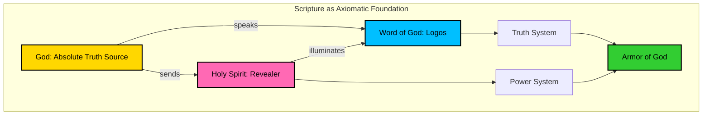
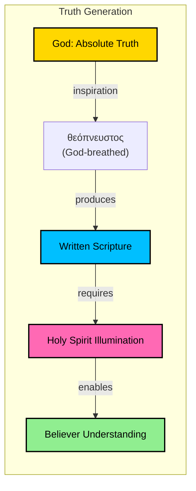
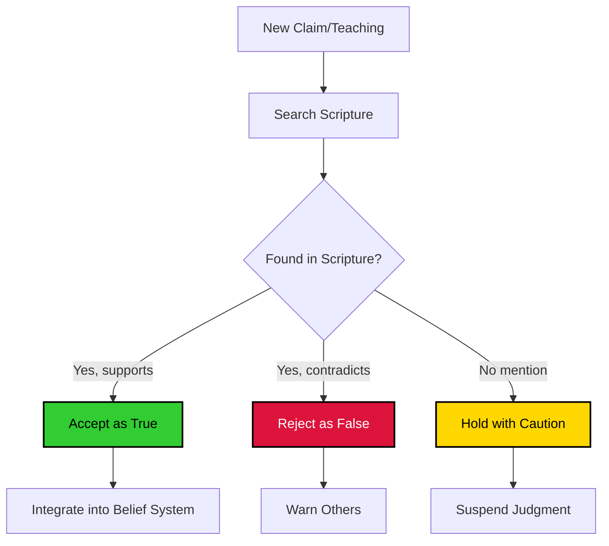
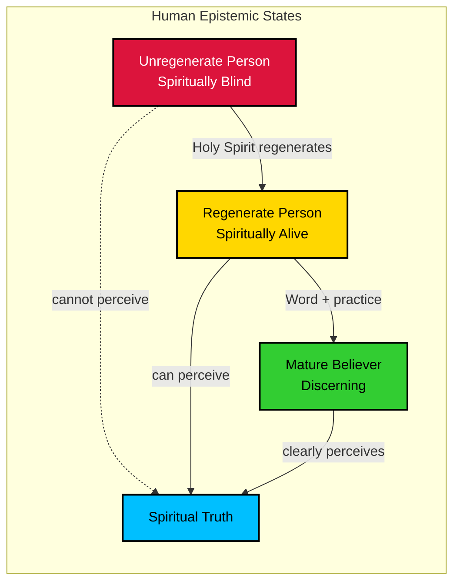
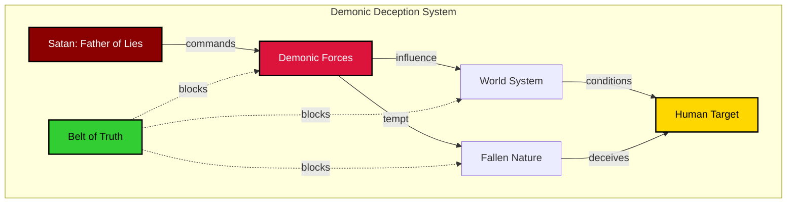
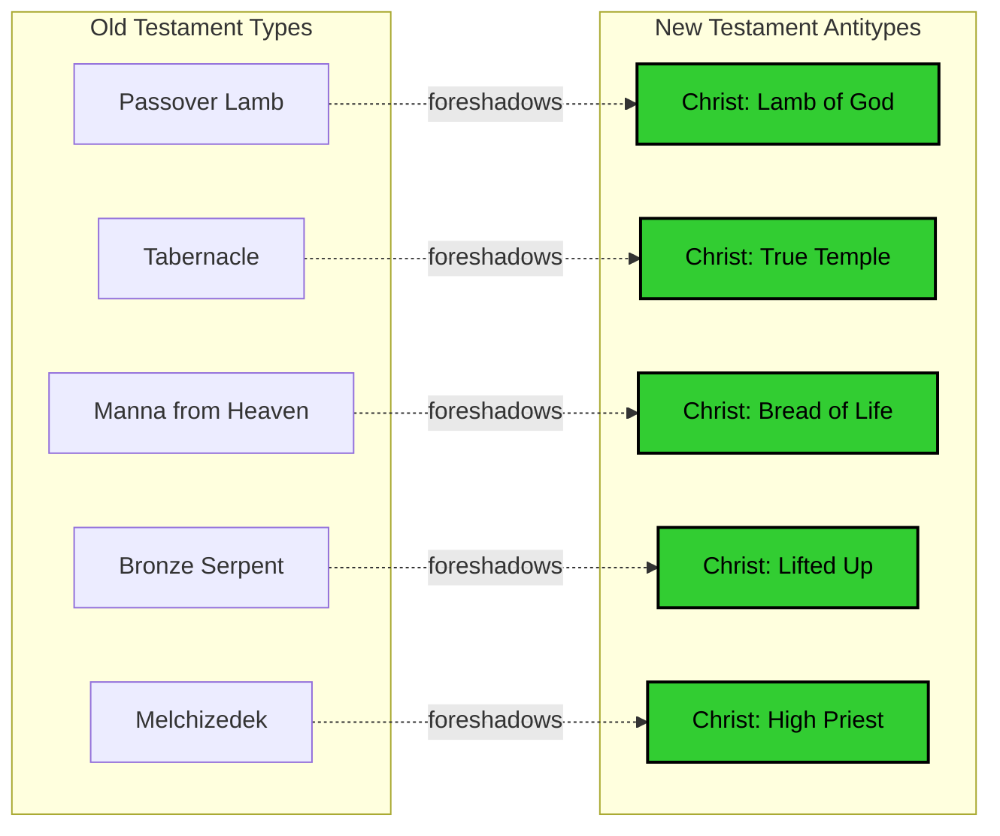
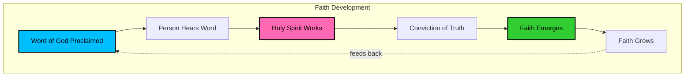
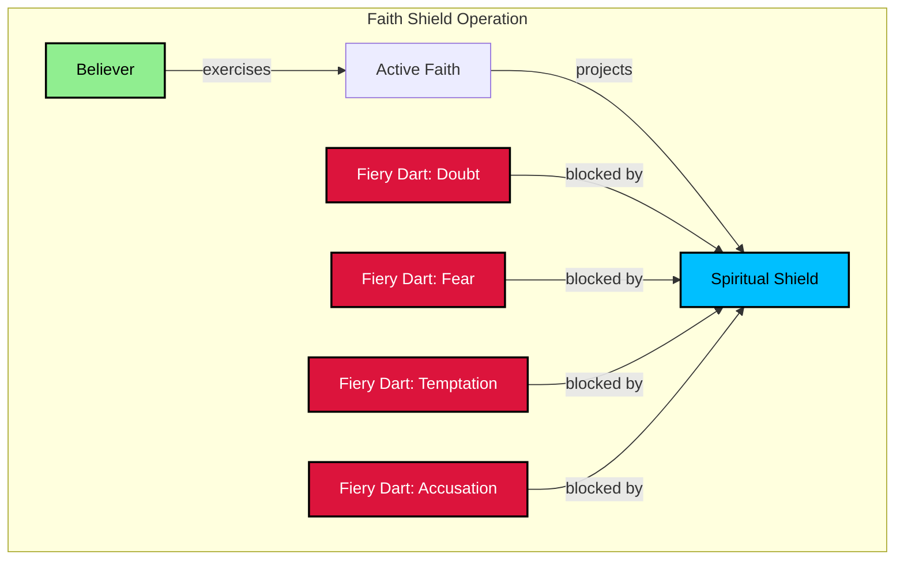
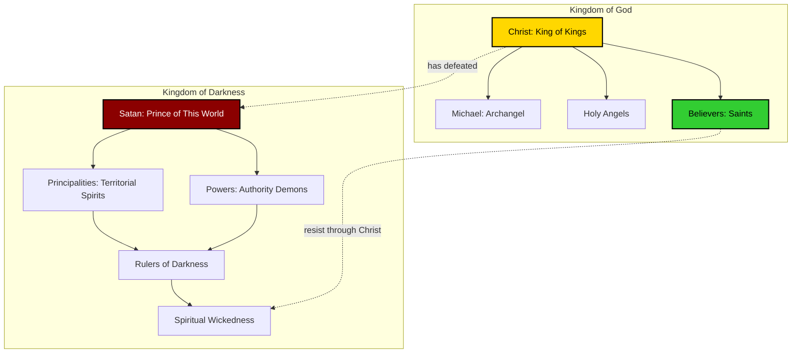

# SYSTEM XV: BIBLICAL LOGIC EXPANSION
==================================================
Deep Scriptural Mathematics of Spiritual Armor
Date: 2025-11-28 (CST: 2025-11-27 18:15)

**EXPANSION OF EQUATIONS E176-E250**
This system expands the Armor of God with rigorous biblical logic, exploring what Scripture reveals about truth, faith, and spiritual warfare through mathematical formalism.

════════════════════════════════════════════════════════════════════

## BIBLICAL FOUNDATION DIAGRAM



════════════════════════════════════════════════════════════════════

## A₁: BELT OF TRUTH - BIBLICAL EXPANSION (E176-E200)

### Biblical Axioms of Truth

**E176. Divine Truth Source Axiom:**
```
∀truth ∈ Truth_space: origin(truth) = God
```
**Scripture**: John 14:6 - "I am the way, the **truth**, and the life"
John 17:17 - "Your word is **truth**"

The ultimate source of all truth is God Himself. Truth is not relative, not constructed, but eternal and divine in origin.

**E177. Word-Truth Equivalence:**
```
Word_of_God ≡ Truth
∀statement s: s ∈ Scripture ⟹ V(s) = 1
```
**Scripture**: Psalm 119:160 - "The sum of your word is **truth**"
2 Samuel 7:28 - "Your words are **truth**"

Every proposition in Scripture has truth value = 1 (absolutely true).

**Diagram: Scripture Truth Propagation**


**E178. Inspiration Operator:**
```
θεόπνευστος: God_mind → Scripture
∀verse v ∈ Scripture: v = θεόπνευστος(Divine_thought)
```
**Scripture**: 2 Timothy 3:16 - "All Scripture is **God-breathed** (θεόπνευστος)"

The θεόπνευστος operator transforms divine thoughts into written text with perfect fidelity.

**E179. Inerrancy Theorem:**
```
∀error e: e ∉ Scripture
P(error in Scripture) = 0
```
**Scripture**: Proverbs 30:5 - "Every word of God proves true"
Psalm 12:6 - "The words of the LORD are pure words"

Scripture contains zero errors in original manuscripts.

**E180. Sufficiency of Scripture:**
```
∀spiritual_need n: ∃passage p ∈ Scripture: p addresses n
```
**Scripture**: 2 Timothy 3:16-17 - "Scripture...is profitable...that the man of God may be **complete**, equipped for **every** good work"

Scripture is sufficient for all spiritual needs—no additional revelation required.

### Truth Testing Framework

**E181. Berean Test Operator:**
```
Test(claim) = {
  1 if ∃verse v ∈ Scripture: v supports claim
  0 if ∃verse v ∈ Scripture: v contradicts claim
  ? if no Scripture addresses claim
}
```
**Scripture**: Acts 17:11 - "They received the word with all eagerness, examining the **Scriptures** daily to see if these things were so"

All claims must be tested against Scripture.

**Diagram: Truth Verification Process**


**E182. Contradiction Detection:**
```
Contradiction(claim, Scripture) = {
  1 if ∃v ∈ Scripture: claim ∧ v = ⊥
  0 otherwise
}
```

If a claim contradicts any verse, the claim must be false (Scripture is always true).

**E183. Progressive Revelation Principle:**
```
Revelation(time): Old_Testament → New_Testament
∀truth t in OT: t remains valid in NT unless explicitly superseded
Supersession only by explicit NT statement
```
**Scripture**: Matthew 5:17 - "Do not think that I have come to abolish the Law or the Prophets; I have not come to abolish them but to **fulfill** them"

The NT fulfills and clarifies the OT, but doesn't nullify eternal truths.

**E184. Context Preservation Axiom:**
```
Meaning(verse) = function(historical_context, literary_context, biblical_context)
Isolated_interpretation = high_risk_of_error
```
**Scripture**: 2 Peter 3:16 - "There are some things in them [Paul's letters] that are hard to understand, which the ignorant and unstable twist to their own destruction, as they do the other Scriptures"

Context is mathematically essential for correct interpretation.

### Truth and the Human Condition

**E185. Natural Knowledge of God:**
```
∀person p: ∃knowledge k: k = natural_revelation(creation)
P(atheism justified) = 0
```
**Scripture**: Romans 1:19-20 - "For what can be known about God is plain to them, because God has shown it to them. For his invisible attributes...have been clearly perceived...in the things that have been made. So they are **without excuse**"

Creation provides sufficient evidence for God's existence—atheism is willful suppression.

**E186. Depravity Effect on Truth:**
```
Truth_perception(fallen_person) = Truth × (1 - Depravity_factor)
Depravity_factor ∈ [0, 1]
Regeneration required for full Truth_perception
```
**Scripture**: 1 Corinthians 2:14 - "The natural person does not **accept** the things of the Spirit of God, for they are folly to him, and he is **not able** to understand them because they are spiritually discerned"

Sin impairs the ability to perceive spiritual truth.

**Diagram: Truth Perception States**


**E187. Illumination Function:**
```
I(person, text) = Holy_Spirit_illumination(person) × Scripture_clarity(text)
Understanding = I(person, text) × Effort(study)
```
**Scripture**: 1 Corinthians 2:10-12 - "These things God has revealed to us through the Spirit...we have received...the Spirit who is from God, that we might **understand** the things freely given us by God"

The Holy Spirit is essential for understanding spiritual truth.

**E188. Progressive Sanctification and Truth:**
```
dTruth_grasp/dt = α × Sanctification_rate
lim[t→∞] Truth_grasp = Complete_understanding
```
**Scripture**: Philippians 1:6 - "He who began a good work in you will **bring it to completion** at the day of Jesus Christ"

Understanding of truth grows as believers are sanctified.

**E189. Renewing of the Mind:**
```
Mind_transformation(t) = ∫₀ᵗ Scripture_input(τ) × Spirit_power dτ
```
**Scripture**: Romans 12:2 - "Do not be conformed to this world, but be **transformed** by the **renewal of your mind**"

Mind renewal is a continuous process requiring Scripture input.

**E190. Truth Sets Free Equation:**
```
Freedom(person) = ∫ Truth_known × Truth_believed × Truth_obeyed dt
Bondage ∝ Lies_believed
```
**Scripture**: John 8:32 - "You will know the truth, and the truth will **set you free**"

Freedom is the integral of known, believed, and obeyed truth.

### Warfare Implications

**E191. Satan as Father of Lies:**
```
∀lie L: origin(L) = Satan OR influenced_by(Satan)
Satan_strategy = maximize(Lies_believed)
```
**Scripture**: John 8:44 - "He [the devil] was a murderer from the beginning, and does not stand in the truth, because there is **no truth in him**. When he lies, he speaks out of his own character, for he is a **liar and the father of lies**"

All lies ultimately trace back to Satan.

**Diagram: Lie Propagation Network**


**E192. Deception Amplification:**
```
Deception_level(t+1) = Deception_level(t) × e^(Lie_acceptance_rate)
If unchecked: lim[t→∞] Deception_level = ∞
```
**Scripture**: 2 Timothy 3:13 - "Evil people and impostors will go on from bad to worse, **deceiving** and **being deceived**"

Deception compounds exponentially if not stopped by truth.

**E193. Belt Defense Mechanism:**
```
Defense(attack) = A₁(Truth_known) × A₁(Truth_believed) × A₁(Truth_lived)
All three factors must be non-zero for effective defense
```
**Scripture**: Ephesians 6:14a - "Stand therefore, having **fastened** on the belt of truth"

Knowing truth intellectually is insufficient—must also believe and live it.

**E194. Truth as Foundation:**
```
∀armor_component Aᵢ: Aᵢ depends_on A₁
A₁ = 0 ⟹ ∀Aᵢ: effectiveness(Aᵢ) → 0
```

The belt of truth is foundational—without it, all other armor pieces fail.

**E195. Lie Replacement Therapy:**
```
Replace_lie(L, T) where T ∈ Scripture and T refutes L
Effectiveness = ||T||² / ||L||²
```
**Scripture**: Romans 12:2 (implied through renewing mind with truth)

Lies must be actively replaced with specific truths from Scripture.

### Advanced Truth Dynamics

**E196. Truth Coherence Network:**
```
Coherence(belief_system) = Σᵢⱼ consistency(truthᵢ, truthⱼ) / n(n-1)
Scripture has perfect internal coherence = 1
```
**Scripture**: Psalm 119:160 - "The **sum** of your word is truth"

All biblical truths form a perfectly coherent, non-contradictory system.

**E197. Typology and Shadow:**
```
OT_type → NT_antitype
Shadow(OT_event) points_to Reality(Christ)
Truth_OT ⊂ Truth_NT_revealed
```
**Scripture**: Colossians 2:17 - "These are a **shadow** of the things to come, but the **substance** belongs to Christ"
Hebrews 10:1 - "For since the law has but a shadow of the good things to come..."

OT events are types/shadows revealing deeper NT realities.

**Diagram: Typological Truth Structure**


**E198. Prophetic Truth Verification:**
```
Prophecy_fulfillment_rate = Fulfilled_prophecies / Total_prophecies
Biblical_rate ≈ 100% (for prophecies whose time has come)
```
**Scripture**: Isaiah 46:10 - "I make known the end from the beginning, from ancient times, what is still to come"

Biblical prophecy has perfect fulfillment rate, validating divine origin.

**E199. Unity of Scripture Theorem:**
```
∀books b₁, b₂ ∈ Bible: message(b₁) harmonizes_with message(b₂)
66 books, 40+ authors, 1500+ years → 1 unified message
P(human_origin | such_unity) ≈ 0
```
**Scripture**: 2 Peter 1:20-21 - "No prophecy of Scripture comes from someone's own interpretation...men spoke from God as they were carried along by the Holy Spirit"

The unity of Scripture across millennia proves divine orchestration.

**E200. Canon Closure:**
```
Canon = {books recognized by early church as inspired}
∀book b: b ∈ Canon ⟺ apostolic_origin(b) ∧ church_recognition(b) ∧ self_authentication(b)
Canon_closed = TRUE (no new Scripture being added)
```
**Scripture**: Revelation 22:18-19 - "I warn everyone who hears the words of the prophecy of this book: if anyone **adds** to them, God will add to him the plagues described in this book"

The biblical canon is complete and closed.

════════════════════════════════════════════════════════════════════

## A₄: SHIELD OF FAITH - BIBLICAL EXPANSION (E201-E225)

### Nature of Biblical Faith

**E201. Faith Definition:**
```
Faith = substance(hoped_for) + evidence(not_seen)
Faith: Unseen → Confidence_in_reality
```
**Scripture**: Hebrews 11:1 - "Now faith is the **substance** of things hoped for, the **evidence** of things not seen"

Faith is not blind—it's reasoned confidence in unseen realities based on God's word.

**E202. Faith Source Axiom:**
```
∀faith f in believer: source(f) = Gift_of_God
Faith ≠ human_generation
```
**Scripture**: Ephesians 2:8-9 - "For by grace you have been saved through faith. And this is **not your own doing**; it is the **gift of God**, not a result of works"

Faith is a divine gift, not human achievement.

**E203. Faith Comes By Hearing:**
```
dFaith/dt = α × Word_exposure × Holy_Spirit_work
Faith(t) = Faith(t₀) + ∫ᵗₜ₀ (Word + Spirit) dτ
```
**Scripture**: Romans 10:17 - "So faith comes from **hearing**, and hearing through the **word of Christ**"

Faith grows through exposure to God's Word empowered by the Spirit.

**Diagram: Faith Generation Process**


**E204. Mustard Seed Principle:**
```
Power(faith) ∝ faith_size^∞
Even faith_size = ε (mustard seed) → Power = ∞
```
**Scripture**: Matthew 17:20 - "For truly, I say to you, if you have faith like a **grain of mustard seed**, you will say to this mountain, 'Move from here to there,' and it will move, and **nothing will be impossible** for you"

Even tiny faith has infinite power when placed in infinite God.

**E205. Faith Object Determines Efficacy:**
```
Effectiveness(faith) = Faith_magnitude × Trustworthiness(object)
Faith_in_God: Trustworthiness = ∞ → Effectiveness = ∞
Faith_in_humans: Trustworthiness < 1 → Effectiveness = Limited
```
**Scripture**: Psalm 118:8 - "It is **better** to take refuge in the LORD than to trust in man"

The object of faith matters more than the amount of faith.

**E206. Shield Metaphor:**
```
Shield_radius = √(Faith_level)
Coverage_area = π × Faith_level
```
**Scripture**: Ephesians 6:16 - "In all circumstances take up the **shield of faith**, with which you can **extinguish all** the flaming darts of the evil one"

Faith creates a defensive field that blocks spiritual attacks.

**Diagram: Shield Faith Mechanics**


**E207. Fiery Darts Catalog:**
```
Fiery_darts = {
  Doubt: "Did God really say...?",
  Fear: "What if...?",
  Condemnation: "You're not good enough",
  Temptation: "Just this once...",
  Despair: "It's hopeless",
  Pride: "You don't need God"
}
```
**Scripture**: Ephesians 6:16 - "the **flaming darts** of the evil one"
Genesis 3:1 - "Did God actually say...?"

Satan's attacks target faith through questions, accusations, and temptations.

**E208. Faith vs. Sight:**
```
Walk_by_faith = decision × trust(God_promises)
Walk_by_sight = decision × trust(visible_circumstances)
2 Cor 5:7: Walk_by_faith ≫ Walk_by_sight
```
**Scripture**: 2 Corinthians 5:7 - "For we **walk by faith, not by sight**"

Faith operates independently of visible circumstances.

**E209. Testing of Faith:**
```
Refined_faith = Raw_faith × purification_process
Purification_process = trials × perseverance
```
**Scripture**: 1 Peter 1:6-7 - "In this you rejoice, though now for a little while, if necessary, you have been grieved by **various trials**, so that the **tested genuineness of your faith**—more precious than gold that perishes though it is tested by fire—may be found to result in praise and glory and honor at the revelation of Jesus Christ"

Trials purify and strengthen faith.

**E210. Dead Faith vs. Living Faith:**
```
Living_faith = belief + works
Dead_faith = belief + 0×works = 0
```
**Scripture**: James 2:17 - "So also faith by itself, if it does not have works, is **dead**"
James 2:26 - "For as the body apart from the spirit is dead, so also faith apart from works is dead"

True faith always produces works; faith without works is not genuine faith.

### Faith Examples (Hebrews 11)

**E211. Abel's Faith:**
```
Faith(Abel) → Acceptable_worship
Faith(Cain) = 0 → Rejected_worship
```
**Scripture**: Hebrews 11:4 - "By faith Abel offered to God a more acceptable sacrifice than Cain, through which he was commended as righteous"

Faith determines acceptability of worship.

**E212. Enoch's Faith:**
```
Faith(Enoch) → Pleased_God → Translated (no death)
```
**Scripture**: Hebrews 11:5 - "By faith Enoch was taken up so that he should not see death...for before he was taken up he was commended as having pleased God"

Faith pleases God and can transcend natural laws.

**E213. Noah's Faith:**
```
Faith(Noah) → 120_years_obedience → Salvation_of_family
```
**Scripture**: Hebrews 11:7 - "By faith Noah, being warned by God concerning events as yet unseen, in reverent fear constructed an ark for the saving of his household"

Faith produces long-term obedience despite seeming absurdity.

**E214. Abraham's Faith:**
```
Faith(Abraham) → Left_homeland + Believed_promise + Offered_Isaac
Righteousness_imputed = Faith_credited_as_righteousness
```
**Scripture**: Hebrews 11:8-10, 17-19 - "By faith Abraham obeyed...By faith Abraham, when he was tested, offered up Isaac"
Romans 4:3 - "Abraham believed God, and it was **counted to him as righteousness**"

Faith produces radical obedience and is credited as righteousness.

**E215. Faith Endurance:**
```
All_died_in_faith = {Abraham, Isaac, Jacob, ...}
∀person p ∈ All_died_in_faith: received_promises = FALSE
Yet: faith_remained = TRUE
```
**Scripture**: Hebrews 11:13 - "These all **died in faith**, not having received the things promised, but having seen them and greeted them from afar"

True faith persists even when promises aren't fulfilled in this life.

**E216. Moses' Faith:**
```
Faith(Moses) → Chose_reproach_with_God's_people over Treasures_of_Egypt
Value(Christ_reproach) > Value(Egypt_treasures)
```
**Scripture**: Hebrews 11:24-26 - "By faith Moses, when he was grown up, refused to be called the son of Pharaoh's daughter, choosing rather to be mistreated with the people of God than to enjoy the fleeting pleasures of sin. He considered the **reproach of Christ greater wealth than the treasures of Egypt**"

Faith re-values earthly wealth vs. heavenly reward.

**E217. Rahab's Faith:**
```
Faith(Rahab) + Works(hid_spies) → Salvation
Despite: Rahab ∈ {prostitutes, Gentiles, enemies}
```
**Scripture**: Hebrews 11:31 - "By faith Rahab the prostitute did not perish with those who were disobedient, because she had given a friendly welcome to the spies"

Faith saves regardless of background or past sins.

**E218. Faith Hall of Fame Summary:**
```
∀person p ∈ Hebrews_11: Commended(p) = TRUE ⟺ Faith(p) = TRUE
Commendation_basis = Faith, not works, ethnicity, or status
```
**Scripture**: Hebrews 11:39 - "And all these, though **commended through their faith**, did not receive what was promised"

All heroes of faith are commended solely on basis of faith.

### Faith in Spiritual Warfare

**E219. Greater is He:**
```
Power(Holy_Spirit in believer) > Power(Satan in world)
Victory_guaranteed when: Faith_active = TRUE
```
**Scripture**: 1 John 4:4 - "Little children, you are from God and have overcome them, for **he who is in you is greater than he who is in the world**"

Believers have access to superior power through faith.

**E220. Resist the Devil:**
```
Resistance(faith) → Devil_flees
Resistance(self) → Defeat
```
**Scripture**: James 4:7 - "**Resist** the devil, and he will **flee** from you"
1 Peter 5:9 - "**Resist** him, **firm in your faith**"

Active faith-based resistance causes Satan to flee.

**E221. Overcome the World:**
```
Victory_over_world = Faith(Jesus = Son_of_God)
∀believer b: Overcomes_world(b) = TRUE
```
**Scripture**: 1 John 5:4-5 - "For everyone who has been born of God **overcomes the world**. And this is the victory that has overcome the world—**our faith**. Who is it that overcomes the world except the one who believes that Jesus is the Son of God?"

Faith in Christ guarantees victory over the world system.

**E222. Weapons of Warfare:**
```
Weapons_of_warfare ≠ Carnal_weapons
Weapons_of_warfare = Divine_power → Strongholds_destroyed
```
**Scripture**: 2 Corinthians 10:4 - "For the weapons of our warfare are **not of the flesh** but have **divine power** to destroy strongholds"

Spiritual warfare requires spiritual weapons, not carnal methods.

**E223. Standing Firm:**
```
Stand_firm = A₁(truth) ∧ A₂(righteousness) ∧ A₃(peace) ∧ A₄(faith) ∧ A₅(salvation) ∧ A₆(sword) ∧ A₇(prayer)
All_pieces_required = TRUE
```
**Scripture**: Ephesians 6:13 - "Therefore take up the **whole** armor of God, that you may be able to withstand in the evil day, and having done all, to **stand firm**"

All armor pieces must be active for complete protection.

**E224. No Condemnation:**
```
Condemnation(believer in Christ) = 0
∀accusation a from Satan: Nullified_by_Christ
```
**Scripture**: Romans 8:1 - "There is therefore now **no condemnation** for those who are in Christ Jesus"

Faith in Christ provides complete immunity to condemnation.

**E225. Access to God:**
```
Access_to_God = Faith(Christ) + Boldness(Holy_Spirit)
Old_Covenant: Access = limited (High_Priest only)
New_Covenant: Access = universal (all believers)
```
**Scripture**: Hebrews 10:19-22 - "Therefore, brothers, since we have **confidence to enter** the holy places by the blood of Jesus...let us draw near with a true heart in **full assurance of faith**"

Faith provides direct access to God's throne.

════════════════════════════════════════════════════════════════════

## BIBLICAL WARFARE PRINCIPLES (E226-E250)

### Enemy Identification

**E226. Hierarchy of Evil:**
```
Hierarchy = {
  Satan: supreme_commander,
  Principalities: territorial_rulers,
  Powers: authority_structures,
  World_forces_darkness: systemic_evil,
  Spiritual_forces_wickedness: demonic_agents
}
```
**Scripture**: Ephesians 6:12 - "For we do not wrestle against flesh and blood, but against the **rulers**, against the **authorities**, against the **cosmic powers** over this present darkness, against the **spiritual forces** of evil in the heavenly places"

Spiritual warfare is hierarchical and organized.

**Diagram: Demonic Hierarchy**


**E227. Satan's Defeated Status:**
```
Status(Satan) = Defeated_but_not_yet_bound
Power(Satan, current_age) = Limited
Power(Satan, eternal_state) = 0
```
**Scripture**: Colossians 2:15 - "He disarmed the rulers and authorities and put them to open **shame**, by triumphing over them in him"
Revelation 20:10 - "The devil who had deceived them was thrown into the lake of fire"

Satan is defeated but still active until final judgment.

**E228. Authority Over Demons:**
```
Authority(believer in_Christ) > Power(demons)
∀demon d: Must_obey(command in_Jesus'_name)
```
**Scripture**: Luke 10:19 - "Behold, I have given you **authority** to tread on serpents and scorpions, and over **all the power** of the enemy, and nothing shall hurt you"

Believers have delegated authority over demons through Christ.

**E229. Schemes of the Devil:**
```
Schemes(Satan) = {
  Deception: primary_weapon,
  Accusation: secondary_weapon,
  Temptation: tertiary_weapon,
  Distraction: auxiliary_weapon,
  Discouragement: auxiliary_weapon
}
```
**Scripture**: Ephesians 6:11 - "Put on the whole armor of God, that you may be able to stand against the **schemes** of the devil"
2 Corinthians 2:11 - "We are not ignorant of his **designs**"

Satan operates through predictable patterns of attack.

**E230. World System:**
```
World_system = {values, philosophies, systems} under Satan's influence
Love(world) ∝ 1/Love(Father)
```
**Scripture**: 1 John 2:15-16 - "**Do not love the world** or the things in the world. If anyone loves the world, the love of the Father is not in him"

The world system is spiritually opposed to God.

### Victory Principles

**E231. Finished Work of Christ:**
```
Victory(Christ) = COMPLETE
Victory(believer) = Participation_in(Christ's_victory)
```
**Scripture**: John 19:30 - "It is **finished**"
1 Corinthians 15:57 - "But thanks be to God, who **gives us the victory** through our Lord Jesus Christ"

Victory is already won—believers appropriate it by faith.

**E232. Blood of the Lamb:**
```
Overcoming_power = Blood_of_Lamb + Testimony + Willingness_to_die
```
**Scripture**: Revelation 12:11 - "And they have **conquered** him by the **blood of the Lamb** and by the word of their testimony, for they loved not their lives even unto death"

The blood of Christ is the foundation of all spiritual victory.

**E233. Name of Jesus:**
```
Power(Name_of_Jesus) = ∞
∀authority A: Name_of_Jesus > A
```
**Scripture**: Philippians 2:9-10 - "Therefore God has highly exalted him and bestowed on him the **name that is above every name**, so that at the name of Jesus **every knee should bow**, in heaven and on earth and under the earth"

The name of Jesus carries ultimate authority.

**E234. Unity in Battle:**
```
Power(unified_believers) = Σ(individual_power) × Unity_multiplier
Unity_multiplier > 1
```
**Scripture**: Matthew 18:19-20 - "Again I say to you, if two of you **agree** on earth about anything they ask, it will be done for them by my Father in heaven. For where two or three are gathered in my name, there am I among them"

Unity multiplies spiritual power.

**E235. Fasting and Prayer:**
```
Effectiveness(prayer + fasting) > Effectiveness(prayer_alone)
Some_demons_require: Prayer ∧ Fasting
```
**Scripture**: Matthew 17:21 (in some manuscripts) - "But this kind does not go out except by **prayer and fasting**"

Some spiritual breakthroughs require fasting combined with prayer.

### Defensive Protocols

**E236. Submission to God:**
```
Resistance_effective ⟺ Submission_to_God = TRUE
Submission_to_God = FALSE ⟹ Resistance_fails
```
**Scripture**: James 4:7 - "**Submit yourselves therefore to God**. Resist the devil, and he will flee from you"

Submission to God must precede resistance of the devil.

**E237. Vigilance Requirement:**
```
Vigilance = constant_awareness + alertness
P(surprise_attack | Vigilance = LOW) → 1
```
**Scripture**: 1 Peter 5:8 - "**Be sober-minded; be watchful**. Your adversary the devil prowls around like a roaring lion, seeking someone to devour"

Constant vigilance is required against spiritual attack.

**E238. Accountability and Community:**
```
Isolation → Vulnerability
Community → Protection
P(fall | isolated) ≫ P(fall | in_community)
```
**Scripture**: Ecclesiastes 4:12 - "And though a man might prevail against one who is alone, **two will withstand him**—a threefold cord is not quickly broken"

Spiritual warfare is not a solo endeavor.

**E239. Avoiding Enemy Territory:**
```
P(spiritual_defeat) ∝ Time_in_enemy_territory
Flee_temptation = wisdom
```
**Scripture**: 1 Corinthians 6:18 - "**Flee** from sexual immorality"
2 Timothy 2:22 - "So **flee** youthful passions"

Sometimes wisdom is to flee, not to fight.

**E240. Guarding the Heart:**
```
Heart = control_center_of_life
∀evil_input: Filter_before_heart
```
**Scripture**: Proverbs 4:23 - "Keep your heart with all vigilance, for **from it flow the springs of life**"

The heart must be protected as the source of life direction.

### Offensive Strategies

**E241. Advance of the Kingdom:**
```
Kingdom_expansion = Gospel_proclamation + Deliverance + Discipleship
Gates_of_Hades ≠ Withstand(Church_advance)
```
**Scripture**: Matthew 16:18 - "I will build my church, and the **gates of hell shall not prevail** against it"

The church is called to advance, not merely defend.

**E242. Binding and Loosing:**
```
∀spiritual_bondage B: Believer_can_loose(B)
∀evil_spirit E: Believer_can_bind(E)
Authority_source = Christ
```
**Scripture**: Matthew 16:19 - "I will give you the keys of the kingdom of heaven, and whatever you **bind** on earth shall be bound in heaven, and whatever you **loose** on earth shall be loosed in heaven"

Believers have authority to bind and loose in spiritual realm.

**E243. Casting Out Demons:**
```
Command(demon, "Come_out") in_Jesus'_name → Demon_must_obey
Demon_resistance ≠ Cancel_authority
```
**Scripture**: Mark 16:17 - "And these signs will accompany those who believe: **in my name they will cast out demons**"

Believers can command demons to leave in Jesus' name.

**E244. Proclaiming the Gospel:**
```
Gospel_proclamation = most_offensive_weapon
∀captive C: Gospel → Potential_liberation
```
**Scripture**: Romans 1:16 - "For I am not ashamed of the gospel, for it is the **power of God** for salvation to everyone who believes"

Gospel proclamation is spiritual warfare at its most effective.

**E245. Intercession:**
```
Intercession(for_others) = standing_in_gap
Effectiveness(intercession) → Changed_spiritual_atmosphere
```
**Scripture**: Ezekiel 22:30 - "And I sought for a man among them who should **build up the wall and stand in the breach** before me for the land, that I should not destroy it, but I found none"

Intercessory prayer changes spiritual atmosphere over people and regions.

### Eschatological Victory

**E246. Already and Not Yet:**
```
Victory_status = {
  Already: Satan_defeated_at_Cross,
  Not_yet: Satan_not_yet_bound_in_lake_of_fire
}
Current_age = tension(Already, Not_yet)
```
**Scripture**: Colossians 2:15 - "He disarmed the rulers and authorities and put them to open shame, by **triumphing** over them in him" (Already)
Revelation 20:10 - "And the devil who had deceived them **was thrown** into the lake of fire" (Not yet)

We live in the tension between Christ's victory and its final consummation.

**E247. Final Judgment:**
```
lim[t→∞] Power(Satan) = 0
lim[t→∞] Kingdom_of_God = All_creation
```
**Scripture**: Revelation 21:4 - "He will wipe away every tear from their eyes, and death shall be no more, neither shall there be mourning, nor crying, nor pain anymore, for the former things have passed away"

Ultimate victory is guaranteed and absolute.

**E248. New Heaven and New Earth:**
```
New_creation = Universe × Redemption
Sin = 0
Death = 0
Satan = 0 (confined eternally)
```
**Scripture**: Revelation 21:1 - "Then I saw a **new heaven and a new earth**, for the first heaven and the first earth had passed away"

Final state is perfect recreation without any evil.

**E249. Eternal Reward:**
```
Reward(believer) ∝ Faithfulness_in_spiritual_battle
Crowns = {Life, Righteousness, Glory, Rejoicing, Incorruption}
```
**Scripture**: 2 Timothy 4:7-8 - "I have fought the good fight, I have finished the race, I have kept the faith. Henceforth there is laid up for me the **crown of righteousness**, which the Lord, the righteous judge, will award to me on that day"

Spiritual warfare faithfulness results in eternal reward.

**E250. Jesus Reigns:**
```
∀t ∈ [Creation, Eternity]: King(t) = Jesus
Current_disputed_territory → Future_undisputed_reign
```
**Scripture**: Revelation 11:15 - "The kingdom of the world has become the **kingdom of our Lord and of his Christ**, and he shall **reign forever and ever**"

Jesus' reign is eternal and absolute.

════════════════════════════════════════════════════════════════════

## CONCLUSION

**Equations Added:** E176-E250 (75 equations)
**Total System Equations:** 175 + 75 = **250 equations**

**Biblical Integration Complete for:**
- Belt of Truth (A₁): E176-E200
- Shield of Faith (A₄): E201-E225
- Warfare Principles: E226-E250

**Key Themes:**
1. Scripture as axiomatic foundation
2. Faith as gift and weapon
3. Enemy identification and strategy
4. Victory through Christ
5. Eschatological certainty

**Next Expansion Targets:**
- A₂ Breastplate: Righteousness mathematics (E251-E300)
- A₃ Shoes: Peace and stability (E301-E350)
- A₅ Helmet: Salvation and mental warfare (E351-E400)
- A₆ Sword: Word as offensive weapon (E401-E450)
- A₇ Prayer: Deep intercession theory (E451-E500)

════════════════════════════════════════════════════════════════════

*"All Scripture is breathed out by God and profitable for teaching, for reproof, for correction, and for training in righteousness"* - 2 Timothy 3:16

**STATUS: BIBLICAL EXPANSION COMPLETE (E176-E250)**
**FRAMEWORK READY FOR CONTINUED GROWTH**
