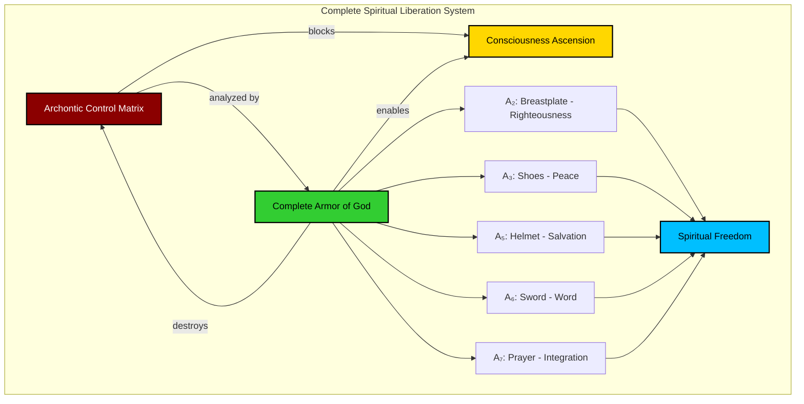
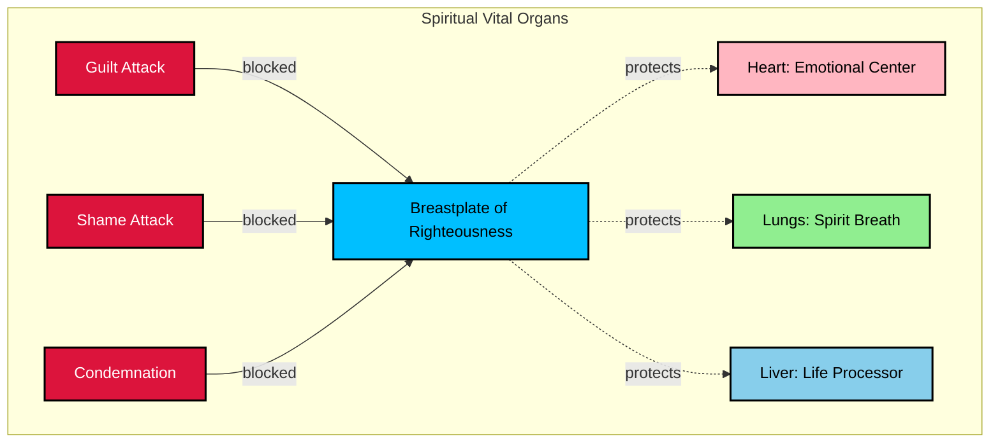
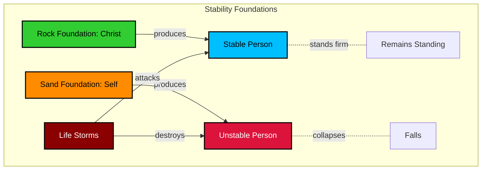
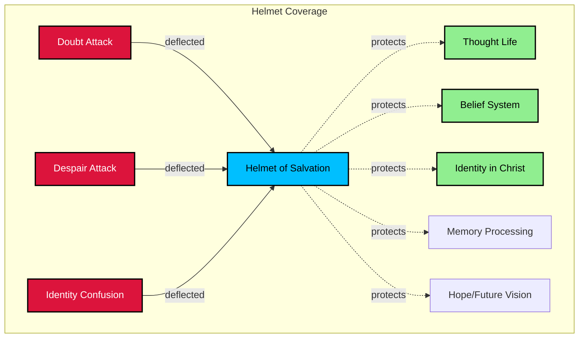
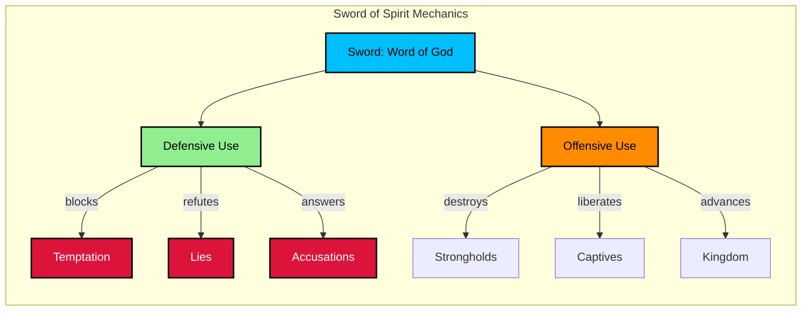
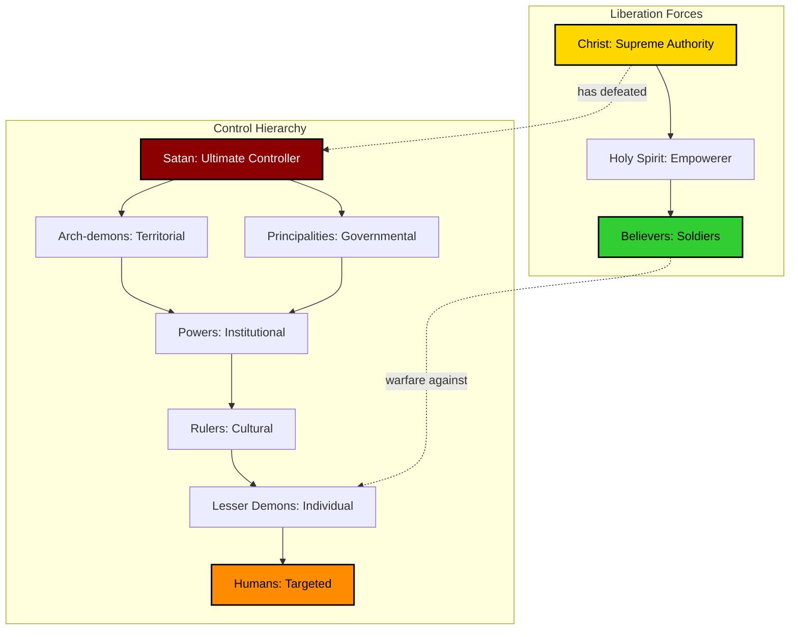

# SYSTEM XVI: ARCHONTIC MATRIX DESTRUCTION
==================================================
Mathematical Framework for Consciousness Liberation
Date: 2025-11-29 (CST: 2025-11-29 11:19)

**EXPANSION: E251-E400 (150 equations)**
Complete armor component expansion plus archontic deception matrix analysis and destruction protocols.

════════════════════════════════════════════════════════════════════

## ARCHITECTURAL OVERVIEW



════════════════════════════════════════════════════════════════════

## A₂: BREASTPLATE OF RIGHTEOUSNESS (E251-E275)

### Righteousness Algebra

**E251. Imputed Righteousness:**
```
Righteousness(believer) = Righteousness(Christ) credited_by Faith
∀sin s ∈ Past_sins: Covered_by_blood(Christ)
```
**Scripture**: 2 Corinthians 5:21 - "For our sake he made him to be sin who knew no sin, so that in him we might become the **righteousness of God**"

Believer's righteousness is Christ's righteousness imputed, not earned.

**E252. Practical Righteousness Function:**
```
R(person, t) = Imputed_righteousness + ∫₀ᵗ Sanctification(τ) dτ
Imputed_righteousness = constant (complete at salvation)
Practical_righteousness = growing (sanctification)
```
**Scripture**: Philippians 3:9 - "not having a righteousness of my own that comes from the law, but that which comes through faith in Christ"

Two aspects: positional (instant) and practical (progressive).

**E253. Breastplate Protection Area:**
```
A_protection = π r² where r = √(Righteousness_level)
Vital_organs_protected = {heart, lungs, liver}
```
**Scripture**: Ephesians 6:14b - "with the **breastplate of righteousness** in place"

The breastplate covers vital spiritual organs (heart = emotions, lungs = spirit breath).

**Diagram: Breastplate Coverage**


**E254. Guilt Nullification:**
```
Guilt_legitimate = sin × conviction
Guilt_false = accusation × shame
Breastplate: Guilt_legitimate → Forgiven
Breastplate: Guilt_false → Nullified
```
**Scripture**: Romans 8:1 - "There is therefore now **no condemnation** for those who are in Christ Jesus"

The breastplate distinguishes legitimate conviction from false guilt.

**E255. Shame Destruction:**
```
Shame(past_sin) × Christ_righteousness = 0
∀sin s: Covered_completely(s) = TRUE
```
**Scripture**: Romans 10:11 - "Everyone who believes in him will **not be put to shame**"

Christ's righteousness eliminates shame from past sins.

**E256. Accusation Deflection:**
```
Accusation(Satan) → Breastplate → Reflected_back
Defense = "Christ's blood speaks better word"
```
**Scripture**: Hebrews 12:24 - "the sprinkled blood that speaks a **better word** than the blood of Abel"

Satan's accusations bounce off the breastplate of imputed righteousness.

**E257. Holiness Operator:**
```
H(behavior) = distance(behavior, Holiness_standard)
Goal: lim[t→∞] H(behavior) → 0
```
**Scripture**: 1 Peter 1:16 - "You shall be **holy**, for I am holy"

Sanctification progressively reduces distance to holiness standard.

**E258. Conscience Function:**
```
C(action) = {
  Peace if action ∈ Righteous_acts
  Conviction if action ∈ Sinful_acts
}
Clear_conscience = ∫ Righteous_acts / Total_acts
```
**Scripture**: 1 Timothy 1:5 - "The aim of our charge is love that issues from a pure heart and a **good conscience** and a sincere faith"

Righteousness produces a clear conscience.

**E259. Good Works Equation:**
```
Works(believer) = Response_to(Salvation)
Works ≠ Cause_of(Salvation)
Prepared_beforehand = TRUE
```
**Scripture**: Ephesians 2:10 - "For we are his workmanship, created in Christ Jesus for **good works**, which God **prepared beforehand**, that we should walk in them"

Good works are the result, not cause, of salvation.

**E260. Fruit of Spirit vs Works of Flesh:**
```
Fruit_Spirit = {love, joy, peace, patience, kindness, goodness, faithfulness, gentleness, self-control}
Works_Flesh = {sexual_immorality, impurity, sensuality, idolatry, sorcery, enmity, strife, jealousy, fits_anger, rivalries, dissensions, divisions, envy, drunkenness, orgies, etc}

Righteousness → Fruit_Spirit
Flesh → Works_Flesh
```
**Scripture**: Galatians 5:19-23

The breastplate enables fruit of Spirit, suppresses works of flesh.

**E261. Transformation Dynamics:**
```
dRighteousness_practical/dt = α(Word_input) + β(Prayer) + γ(Community) - δ(Sin)
∀t: Righteousness_positional = constant (Christ's)
```

Practical righteousness grows through spiritual disciplines.

**E262. Justice Requirement:**
```
Justice_of_God = {
  Punishment_for_sin required,
  Satisfied_at_Cross = TRUE
}
∀sin s: Either punished(s) OR covered_by_Cross(s)
```
**Scripture**: Romans 3:25-26 - "God put forward [Christ] as a propitiation...to show his **righteousness**...that he might be just and the justifier"

God's justice is satisfied in Christ, enabling our justification.

**E263. Covenant Righteousness:**
```
Old_Covenant: Righteousness = Law_obedience (impossible)
New_Covenant: Righteousness = Faith_in_Christ
P(righteousness_by_law) = 0
```
**Scripture**: Galatians 2:16 - "a person is not justified by works of the law but through **faith in Jesus Christ**"

Only New Covenant provides true righteousness.

**E264. Sanctification Process:**
```
S(t) = S₀ + ∫₀ᵗ [Holy_Spirit_work(τ) + Human_cooperation(τ)] dτ
Completion: S(∞) = Perfect_holiness
```
**Scripture**: 1 Thessalonians 5:23-24 - "May the God of peace himself **sanctify you completely**...He who calls you is **faithful**; he will surely do it"

Sanctification is guaranteed but progressive.

**E265. Cleansing Mechanism:**
```
Cleanse(sin) = Confession + Blood_of_Jesus → Purification
∀sin s: If confessed(s), then forgiven(s) ∧ cleansed(s)
```
**Scripture**: 1 John 1:9 - "If we confess our sins, he is faithful and just to **forgive** us our sins and to **cleanse** us from all unrighteousness"

Ongoing cleansing available for believers.

**E266. Walking in Light:**
```
Walk_in_light = Transparency_with_God + Transparency_with_believers
Fellowship(person_i, person_j) ∝ Light_level(person_i) × Light_level(person_j)
```
**Scripture**: 1 John 1:7 - "But if we **walk in the light**, as he is in the light, we have fellowship with one another"

Righteousness enables true fellowship.

**E267. Armor Synergy:**
```
Effectiveness(A₂) = Base_protection × (1 + Synergy_A₁) × (1 + Synergy_A₃)
All_armor_pieces_interact = TRUE
```

Breastplate works in concert with truth (A₁) and peace (A₃).

**E268. Heart Protection Theorem:**
```
∀emotional_attack E: If A₂_active, then P(heart_penetration) → 0
Heart_wounds_healed_by = Righteousness_of_Christ
```
**Scripture**: Proverbs 4:23 - "Keep your heart with all vigilance, for from it flow the springs of life"

The breastplate specifically protects the emotional/volitional center.

**E269. Spiritual Authority:**
```
Authority(believer) ∝ Righteousness_practical
Compromise → Authority_loss
```
**Scripture**: James 5:16 - "The prayer of a **righteous person** has great power as it is working"

Practical righteousness increases spiritual authority.

**E270. Worship in Righteousness:**
```
Acceptable_worship = Spirit_and_Truth × Righteousness_heart
Unrighteousness → Unacceptable_worship
```
**Scripture**: Psalm 24:3-4 - "Who shall ascend the hill of the LORD? And who shall stand in his holy place? He who has **clean hands and a pure heart**"

Righteousness enables acceptable worship.

**E271. Witness Effectiveness:**
```
W(witness) = Gospel_truth × Life_righteousness
Hypocrisy = Gospel_truth × ¬Life_righteousness → W ≈ 0
```
**Scripture**: Matthew 5:16 - "Let your light shine before others, so that they may see your **good works** and give glory to your Father"

Righteous living validates gospel witness.

**E272. Spiritual Discernment:**
```
D(situation) = Spiritual_maturity × Righteousness_level
"Solid food is for the mature"
```
**Scripture**: Hebrews 5:14 - "But solid food is for the **mature**, for those who have their powers of discernment trained by constant practice to distinguish good from evil"

Righteousness sharpens discernment.

**E273. Generational Blessing:**
```
Blessing(generation_n+1) = Blessing(generation_n) × Righteousness_factor
∀generation: Righteousness → Increased_blessing
```
**Scripture**: Proverbs 20:7 - "The righteous who walks in his integrity—**blessed are his children** after him!"

Righteousness produces generational blessings.

**E274. Treasure in Heaven:**
```
Treasure_heaven = ∫₀ᵀ Righteous_acts(t) × Eternal_value dt
Earthly_treasure → 0 when t → ∞
```
**Scripture**: Matthew 6:20 - "Store up for yourselves **treasures in heaven**, where neither moth nor rust destroys"

Righteousness produces eternal rewards.

**E275. Perfect Love:**
```
Love_perfect = Righteousness_complete × Fear_cast_out
Fear ∝ 1/Love
```
**Scripture**: 1 John 4:18 - "There is no fear in love, but **perfect love casts out fear**"

Righteousness perfects love and eliminates fear.

════════════════════════════════════════════════════════════════════

## A₃: SHOES OF PEACE (E276-E300)

### Peace Dynamics

**E276. Gospel of Peace Foundation:**
```
Peace_with_God = Justification_by_faith
∀believer b: War(b, God) = ENDED
```
**Scripture**: Romans 5:1 - "Therefore, since we have been justified by faith, we have **peace with God** through our Lord Jesus Christ"

Foundational peace: reconciliation with God.

**E277. Stability Operator:**
```
S(person, terrain) = {
  Stable if foundation = Rock(Christ)
  Unstable if foundation = Sand(self)
}
```
**Scripture**: Matthew 7:24-25 - "Everyone then who hears these words of mine and does them will be like a **wise man who built his house on the rock**"

Peace provides stability regardless of external circumstances.

**E278. Anxiety Function:**
```
A(t) = Concerns(t) × (1 - Trust_in_God)
Peace → A(t) → 0
```
**Scripture**: Philippians 4:6-7 - "Do not be anxious about anything...the **peace of God**, which surpasses all understanding, will guard your hearts"

Peace is inversely related to anxiety.

**Diagram: Peace Stability System**


**E279. Readiness Equation:**
```
Readiness = Shoes_on × Gospel_internalized × Peace_maintained
Always_ready = TRUE (shoes always on)
```
**Scripture**: Ephesians 6:15 - "as **shoes for your feet**, having put on the **readiness** given by the gospel of peace"

Peace enables constant readiness for spiritual action.

**E280. Fear Elimination:**
```
Fear(enemy) × Peace_of_God = 0
∀threat T: Peace > T
```
**Scripture**: Psalm 23:4 - "Even though I walk through the valley of the shadow of death, I will **fear no evil**, for you are with me"

Divine peace eliminates fear.

**E281. Rest in God:**
```
Rest(soul) = Trust(God's_sovereignty) × Cease(striving)
Sabbath_principle = Rest_in_God's_work
```
**Scripture**: Matthew 11:28 - "Come to me, all who labor and are heavy laden, and I will give you **rest**"

Peace produces soul rest.

**E282. Storm Resistance:**
```
∀storm S: Impact(S, person_with_peace) = Minimal
Peace = Shock_absorber
```
**Scripture**: John 16:33 - "In the world you will have tribulation. But take heart; I have **overcome the world**"

Peace cushions life's storms.

**E283. Unity Through Peace:**
```
Unity(group) = Σ(Peace_individual) × Bond_of_peace
Strife ∝ 1/Peace
```
**Scripture**: Ephesians 4:3 - "eager to maintain the **unity of the Spirit** in the **bond of peace**"

Peace enables unity.

**E284. Harmony Operator:**
```
H(relationships) = Peace_internal × Peace_with_others
Conflict → H → 0
```
**Scripture**: Romans 12:18 - "If possible, so far as it depends on you, live **peaceably with all**"

Internal peace produces external harmony.

**E285. Shalom Completeness:**
```
Shalom = {wholeness, completeness, welfare, health, contentment, success, safety, soundness}
Peace_Hebrew = Shalom = Complete_wellbeing
```
**Scripture**: Numbers 6:26 - "The LORD lift up his countenance upon you and give you **peace (shalom)**"

Biblical peace is comprehensive wellbeing.

**E286. Prince of Peace:**
```
Source(all_peace) = Christ
Peace = Gift_from_Prince_of_Peace
```
**Scripture**: Isaiah 9:6 - "For to us a child is born...and his name shall be called...Prince of **Peace**"

Christ is the source of all true peace.

**E287. Peace That Surpasses Understanding:**
```
Peace_divine > Logic + Circumstances
Supernatural_peace = Paradoxical_peace
```
**Scripture**: Philippians 4:7 - "And the peace of God, which **surpasses all understanding**, will guard your hearts and your minds"

Divine peace defies natural explanation.

**E288. Warfare Peace Paradox:**
```
Peace_internal ∧ Warfare_external = Possible
Inner_peace ≠ No_conflict
```
**Scripture**: Matthew 10:34 - "Do not think that I have come to bring peace to the earth. I have not come to bring peace, but a sword"

Spiritual peace coexists with spiritual warfare.

**E289. Gentleness from Peace:**
```
Gentleness = Peace_overflow
Harshness ∝ 1/Peace
```
**Scripture**: Philippians 4:5 - "Let your **gentleness** be known to everyone. The Lord is at hand"

Peace produces gentleness in interactions.

**E290. Patience Operator:**
```
P(waiting) = Peace × Trust(God's_timing)
Impatience = Lack_of_peace
```
**Scripture**: Psalm 37:7 - "Be still before the LORD and **wait patiently** for him"

Peace enables patient waiting.

**E291. Sleep in Peace:**
```
Sleep_quality = Peace_level × Trust(God's_protection)
"I will both lie down and sleep in peace"
```
**Scripture**: Psalm 4:8 - "In **peace** I will both lie down and **sleep**; for you alone, O LORD, make me dwell in safety"

Peace enables restful sleep.

**E292. Contentment Function:**
```
C(circumstances) = Peace × Gratitude - Covetousness
True_contentment = Independent_of(circumstances)
```
**Scripture**: Philippians 4:11 - "I have learned in whatever situation I am to be **content**"

Peace produces contentment.

**E293. Reconciliation Imperative:**
```
∀broken_relationship R: Peace requires reconciliation_attempt
Peacemaker = Blessed
```
**Scripture**: Matthew 5:9 - "Blessed are the **peacemakers**, for they shall be called sons of God"

Peace drives reconciliation efforts.

**E294. Sound Mind:**
```
Mind_sound = Peace × Spirit_of_power × Spirit_of_love
Mind_unsound = Spirit_of_fear
```
**Scripture**: 2 Timothy 1:7 - "For God gave us a spirit not of fear but of **power** and **love** and **self-control**"

Peace produces mental soundness.

**E295. Spiritual Mobility:**
```
Mobility = Shoes_readiness × Peace_foundation
Immobilized_by = Fear, anxiety, confusion
```

Shoes of peace enable spiritual movement and advance.

**E296. Territory Claiming:**
```
∀spiritual_ground G: Claim(G) requires Walking_on(G)
Walking requires Shoes_of_peace
```
**Scripture**: Joshua 1:3 - "Every place that the sole of your **foot** will tread upon I have given to you"

Peace-shod feet claim spiritual territory.

**E297. Unshakeable Kingdom:**
```
Kingdom(God) = Unshakeable
∀person P in Kingdom: Unshakeable(P) = TRUE
```
**Scripture**: Hebrews 12:28 - "Therefore let us be grateful for receiving a **kingdom that cannot be shaken**"

Peace anchors in unshakeable kingdom.

**E298. Covenant of Peace:**
```
Peace_covenant = Eternal
∀t: Covenant(t) = Active
```
**Scripture**: Isaiah 54:10 - "My steadfast love shall not depart from you, and my **covenant of peace** shall not be removed"

Peace is covenantal and permanent.

**E299. Peace Proclamation:**
```
Gospel = Good_news_of_peace
Proclamation → Peace_extended
```
**Scripture**: Isaiah 52:7 - "How beautiful upon the mountains are the feet of him who brings good news, who publishes **peace**"

Gospel proclamation extends peace.

**E300. Eternal Peace:**
```
lim[t→∞] Peace(believer) = Perfect_eternal_peace
No_more: {war, violence, conflict, anxiety, fear}
```
**Scripture**: Revelation 21:4 - "He will wipe away every tear from their eyes, and death shall be no more, neither shall there be mourning, nor crying, nor pain anymore"

Ultimate peace in eternity.

════════════════════════════════════════════════════════════════════

## A₅: HELMET OF SALVATION (E301-E325)

### Salvation Mathematics

**E301. Salvation Tenses:**
```
Salvation = {
  Past: Justified (saved_from penalty)
  Present: Sanctified (saved_from power)
  Future: Glorified (saved_from presence)
}
```
**Scripture**: 
- Romans 5:1 (justified)
- Philippians 2:12 (work out salvation)  
- Romans 8:30 (glorified)

Salvation is three-dimensional across time.

**E302. Helmet Function:**
```
H(mind) = Protection(thoughts, beliefs, identity)
Vulnerable_areas = {doubt, deception, despair, identity_confusion}
```
**Scripture**: Ephesians 6:17a - "Take the **helmet of salvation**"

The helmet specifically protects the mind.

**Diagram: Mental Protection Zones**


**E303. Hope Equation:**
```
Hope = Certainty(future_salvation) × Confidence(promises)
Hope ≠ Wishful_thinking
Hope = Assured_expectation
```
**Scripture**: Hebrews 6:19 - "We have this as a sure and steadfast **anchor of the soul**, a hope"

Biblical hope is certain expectation, not mere wishing.

**E304. Assurance of Salvation:**
```
Assurance = {
  Objective: Promise_of_God
  Subjective: Witness_of_Spirit
  Evidential: Fruit_of_transformation
}
All_three_confirm = Unshakeable_assurance
```
**Scripture**: 
- John 10:28 (objective)
- Romans 8:16 (subjective)
- 1 John 3:14 (evidential)

Assurance rests on multiple foundations.

**E305. Mind Renewal:**
```
dMind_new/dt = Word_input × Spirit_power - Worldly_input
lim[t→∞] Mind = Transformed
```
**Scripture**: Romans 12:2 - "Do not be conformed to this world, but be **transformed by the renewal of your mind**"

Salvation initiates ongoing mind renewal.

**E306. Captive Thoughts:**
```
∀thought T: If rebellious(T), then Captive(T) → Obedience_to_Christ
Stronghold_demolition = Thought_captivity_process
```
**Scripture**: 2 Corinthians 10:5 - "We destroy arguments and every lofty opinion raised against the knowledge of God, and **take every thought captive** to obey Christ"

The helmet enables thought warfare.

**E307. Identity Transformation:**
```
Identity_old = Dead_in_sin
Identity_new = Alive_in_Christ
Transformation: Old → New = Irreversible
```
**Scripture**: 2 Corinthians 5:17 - "Therefore, if anyone is in Christ, he is a **new creation**. The old has passed away; behold, the new has come"

Salvation produces ontological identity change.

**E308. Eternal Security:**
```
∀believer B: P(lose_salvation) = 0
Held_by = God's_power
```
**Scripture**: John 10:28-29 - "I give them eternal life, and they will **never perish**, and no one will snatch them out of my hand"

True believers cannot lose salvation.

**E309. Predestination:**
```
Chosen(person) before Foundation(world)
Election = Unconditional
```
**Scripture**: Ephesians 1:4 - "He **chose us in him before the foundation of the world**, that we should be holy and blameless before him"

Salvation originates in God's eternal choice.

**E310. Sealed by Spirit:**
```
Seal(believer) = Holy_Spirit
Seal_function = {guarantee, ownership, protection}
Seal_unbreakable = TRUE
```
**Scripture**: Ephesians 1:13-14 - "In him you also...were **sealed with the promised Holy Spirit**, who is the **guarantee** of our inheritance"

The Spirit seals believers securely.

**E311. No Separation:**
```
∀force F ∈ {death, life, angels, demons, present, future, powers, height, depth, anything}:
  Cannot_separate(F, believer, Love_of_God) = TRUE
```
**Scripture**: Romans 8:38-39 - "For I am sure that neither death nor life...will be able to **separate us from the love of God** in Christ Jesus our Lord"

Mathematical guarantee of inseparability.

**E312. Child of God:**
```
Status(believer) = Child_of_God
Rights = {inheritance, access, family_name, Father's_protection}
```
**Scripture**: 1 John 3:1 - "See what kind of love the Father has given to us, that we should be called **children of God**; and so we are"

Salvation grants full adoption rights.

**E313. Regeneration:**
```
Born_again = Spiritual_birth (birth_from_above)
Agent = Holy_Spirit
Required_for = Seeing/entering Kingdom
```
**Scripture**: John 3:3 - "Truly, truly, I say to you, unless one is **born again** he cannot see the kingdom of God"

Regeneration is prerequisite for salvation.

**E314. Justification:**
```
Justified = Declared_righteous
Legal_status_change = Guilty → Not_guilty
Basis = Christ's_righteousness_imputed
```
**Scripture**: Romans 5:1 - "Therefore, since we have been **justified** by faith, we have peace with God"

Justification is legal declaration.

**E315. Sanctification:**
```
Sanctification = {
  Positional: Instant (set_apart)
  Progressive: Ongoing (becoming_holy)
  Perfect: Future (glorification)
}
```
**Scripture**: 1 Thessalonians 4:3 - "For this is the will of God, your **sanctification**"

Sanctification has three phases.

**E316. Glorification:**
```
Glorification = Final_transformation
Body_mortal → Body_immortal
Sin_nature → Sinless_nature
```
**Scripture**: 1 Corinthians 15:51-53 - "We shall all be changed...this mortal body must put on **immortality**"

Glorification completes salvation.

**E317. Hope of Glory:**
```
Hope = Confident_expectation(glorification)
Glory_future > Glory_present × ∞
```
**Scripture**: Romans 8:18 - "For I consider that the sufferings of this present time are not worth comparing with the **glory that is to be revealed** to us"

Future glory infinitely exceeds present suffering.

**E318. Mind of Christ:**
```
Mind(believer) → Mind(Christ)
Think_like = Christ
```
**Scripture**: 1 Corinthians 2:16 - "But we have the **mind of Christ**"

Salvation enables Christ-like thinking.

**E319. Spiritual Discernment:**
```
D(truth, error) = Spiritual_person × Word_knowledge
Natural_person: D = 0
```
**Scripture**: 1 Corinthians 2:14-15 - "The natural person does not accept...they are spiritually discerned. The **spiritual person judges all things**"

Salvation enables spiritual discernment.

**E320. Memory Redemption:**
```
Memory(painful_past) × Salvation = Redeemed_memory
God_works_all_things_for_good = TRUE
```
**Scripture**: Romans 8:28 - "And we know that for those who love God **all things work together for good**"

Salvation redeems even painful memories.

**E321. Resurrection Hope:**
```
Hope_resurrection = Certainty(bodily_resurrection)
Death → Sleep → Resurrection
```
**Scripture**: 1 Thessalonians 4:13-14 - "We do not want you to be uninformed about those who are asleep...God will bring with him those who have fallen asleep"

Resurrection is guaranteed for believers.

**E322. Inheritance:**
```
Inheritance = {
  Imperishable,
  Undefiled,
  Unfading,
  Kept_in_heaven
}
```
**Scripture**: 1 Peter 1:4 - "To an **inheritance** that is imperishable, undefiled, and unfading, kept in heaven for you"

Salvation includes eternal inheritance.

**E323. Mental Stronghold Demolition:**
```
Stronghold(mind) = Fortified_lies
Demolition = Truth × Spirit_power → Stronghold = 0
```
**Scripture**: 2 Corinthians 10:4 - "The weapons of our warfare...have divine power to **destroy strongholds**"

The helmet enables stronghold destruction.

**E324. Depression Defense:**
```
Depression_attack × Helmet(salvation_hope) = Neutralized
Hope_of_glory > Present_darkness
```
**Scripture**: Psalm 42:11 - "Why are you cast down, O my soul? **Hope in God**"

Salvation hope defeats depression.

**E325. Suicide Immunity:**
```
P(suicide | Helmet_active) → 0
Life_value = Infinite (created_in_image_of_God + Christ_died_for)
```
**Scripture**: John 10:10 - "I came that they may have **life** and have it abundantly"

Salvation affirms infinite life value, blocking suicidal ideation.

════════════════════════════════════════════════════════════════════

## A₆: SWORD OF THE SPIRIT (E326-E350)

### Word as Weapon

**E326. Sword Definition:**
```
Sword = Word_of_God = Rhema
Rhema = Specific_word_for_specific_situation
Logos = General_written_word
Rhema ⊂ Logos
```
**Scripture**: Ephesians 6:17b - "The sword of the Spirit, which is the **word (ῥῆμα - rhema)** of God"

The sword is the spoken/applied word, not just written word.

**E327. Offensive Weapon:**
```
∀armor_piece A ∈ {A₁, A₂, A₃, A₄, A₅, A₇}: Defensive
A₆ = Offensive_and_defensive
```

The sword is unique—it's both defensive and offensive.

**Diagram: Sword Dual Function**


**E328. Jesus' Example:**
```
Temptation(Satan) × Response("It is written") = Defeated
∀temptation T: ∃verse V: V defeats T
```
**Scripture**: Matthew 4:4, 7, 10 - "But he answered, '**It is written**...'"

Jesus modeled sword use against temptation.

**E329. Hebrews 4:12 Analysis:**
```
Sword_properties = {
  Living: Dynamic, not static
  Active: Always working
  Sharp: Penetrating
  Dividing: soul/spirit, joints/marrow
  Discerning: thoughts/intentions
}
```
**Scripture**: Hebrews 4:12 - "For the word of God is **living and active**, sharper than any two-edged sword"

The Word has multiple powerful properties.

**E330. Precision Striking:**
```
Effectiveness(sword) = Precision(rhema) × Timing(kairos) × Faith(user)
Random_verse_quotation ≠ Sword_effectiveness
```

Specific word for specific moment maximizes power.

**E331. Prophetic Sword:**
```
Prophetic_word = Sword × Holy_Spirit_revelation
P(rhema) = Penetrates_deeper_than Logos_alone
```
**Scripture**: 1 Corinthians 14:24-25 - "If all prophesy...the secrets of his heart are disclosed"

Prophetic words carry sword-like precision.

**E332. Truth Declaration:**
```
Declaration(truth) = Speaking_word × Authority_in_Christ
Binding/loosing = Sword_application
```
**Scripture**: Matthew 16:19 - "Whatever you bind on earth shall be bound in heaven"

Declaring truth binds/looses in spiritual realm.

**E333. Lie Demolition:**
```
∀lie L: ∃truth T ∈ Scripture: T ∧ ¬L
Sword_cuts_through(L) → L = exposed
```

Every lie has a corresponding scriptural truth that defeats it.

**E334. Stronghold Destruction:**
```
Stronghold = Fortified_lie_system
Sword(specific_truths) × Persistence → Stronghold = Demolished
```
**Scripture**: 2 Corinthians 10:4 - "Weapons of our warfare...have divine power to **destroy strongholds**"

Persistent truth application destroys mental strongholds.

**E335. Memorization Advantage:**
```
Sword_accessibility = Memory(verses) × Holy_Spirit_recall
Memorized_word → Instant_availability
```
**Scripture**: Psalm 119:11 - "I have stored up your word in my heart, that I might not sin against you"

Memorization makes the sword immediately available.

**E336. Meditation Multiplication:**
```
Meditation(verse) × Time → Deep_understanding × Increased_power
Shallow_reading < Deep_meditation
```
**Scripture**: Psalm 1:2-3 - "His delight is in the law of the LORD, and on his law he **meditates** day and night"

Meditation multiplies sword effectiveness.

**E337. Proclamation Power:**
```
P(word_spoken) > P(word_thought)
Speaking_creates = Spiritual_force
```
**Scripture**: Proverbs 18:21 - "Death and life are in the **power of the tongue**"

Spoken word carries greater power.

**E338. Corporate Sword Use:**
```
Sword_corporate = Σ(Individual_swords) × Unity_factor
Agreement_power > Sum_of_parts
```

Corporate word declaration multiplies power.

**E339. Worship as Warfare:**
```
Worship(in_Spirit_and_truth) = Sword_use
Praise = Offensive_weapon
```
**Scripture**: 2 Chronicles 20:22 - "And when they began to sing and praise, the LORD set an ambush"

Worship utilizes the sword offensively.

**E340. Decree and Declare:**
```
Decree(thing) in_alignment_with_Word → Thing_established
∀decree D: If D ∈ Will_of_God, then Fulfilled(D) = TRUE
```
**Scripture**: Job 22:28 - "You will also **decree a thing, and it will be established** for you"

Decreeing God's word establishes realities.

**E341. Scripture Armor Integration:**
```
Sword_effectiveness = Σ(Other_armor_pieces_active)
Without_truth/righteousness/faith: Sword_power → Reduced
```

The sword requires other armor pieces for maximum effectiveness.

**E342. Spiritual Precision Surgery:**
```
Surgery(spiritual) = Sword × Precision × Love
Cutting_away(sin) without Destroying(person)
```
**Scripture**: Hebrews 4:12 - "Piercing to the division of soul and of spirit"

The Word performs precise spiritual surgery.

**E343. Evangelism Sword:**
```
Gospel_proclamation = Sword_offensive
Conviction = Sword_penetrating_heart
```
**Scripture**: Acts 2:37 - "When they heard this they were **cut to the heart**"

Gospel proclamation wields the sword offensively.

**E344. Deliverance Ministry:**
```
Deliverance(demon) = Command("Come_out") × Authority(Name_of_Jesus) × Word_truth
Demon_must_obey = TRUE
```
**Scripture**: Mark 1:25-26 - "But Jesus rebuked him, saying, 'Be silent, and **come out** of him!'"

The Word commands demons in deliverance.

**E345. Teaching as Sword Distribution:**
```
Teaching = Transferring_sword_skills
∀disciple D: Equip(D, Sword_use)
```
**Scripture**: 2 Timothy 2:2 - "What you have heard from me...entrust to faithful men who will be able to **teach others** also"

Teaching distributes sword capability.

**E346. Intercession with Word:**
```
Intercession_powerful = Prayer × Word_promises
Standing_on_Word = Effective_intercession
```
**Scripture**: 1 John 5:14-15 - "And this is the confidence that we have toward him, that if we ask anything **according to his will** he hears us"

Praying the Word increases intercession power.

**E347. Prophetic Fulfillment:**
```
∀prophecy P ∈ Scripture: Fulfilled(P) OR Will_be_fulfilled(P) = TRUE
P(prophecy_failure) = 0
```
**Scripture**: Isaiah 55:11 - "So shall my word be that goes out from my mouth; it shall not **return to me empty**, but it shall accomplish that which I purpose"

God's Word always accomplishes its purpose.

**E348. Creation by Word:**
```
Creation(universe) = Word_spoken("Let there be")
Same_power_available = TRUE
```
**Scripture**: Hebrews 11:3 - "By faith we understand that the universe was **created by the word of God**"

The Word that created universe still has creative power.

**E349. Judgment by Word:**
```
Final_judgment = Judged_by(Word_of_God)
∀person P: Accountability(P, Word) = ABSOLUTE
```
**Scripture**: John 12:48 - "The one who rejects me and does not receive my words has a judge; **the word that I have spoken will judge him** on the last day"

The Word will judge all humanity.

**E350. Eternal Word:**
```
∀t ∈ (-∞, +∞): Word(t) = UNCHANGING
Word_of_God = Eternal
```
**Scripture**: Isaiah 40:8 - "The grass withers, the flower fades, but **the word of our God will stand forever**"

The Word is eternally unchanging.

════════════════════════════════════════════════════════════════════

## ARCHONTIC MATRIX ANALYSIS (E351-E375)

### Deception Structure

**E351. Archontic Definition:**
```
Archon = {
  Spiritual_rulers,
  Principalities,
  Powers,
  World_forces_darkness,
  Cosmic_powers_present_darkness
}
```
**Scripture**: Ephesians 6:12 - "Against the **rulers (ἀρχάς - archas)**, against the authorities, against the cosmic powers over this present darkness"

Archons are the hierarchical demonic rulers.

**E352. Matrix Structure:**
```
Matrix_control = {
  Layer_1: Physical_control (systems, institutions),
  Layer_2: Mental_control (education, media),
  Layer_3: Spiritual_control (false_religion),
  Layer_4: Occult_control (ritual, symbols)
}
```

The control matrix operates on multiple levels.

**Diagram: Archontic Control Pyramid**


**E353. Kabbalah Corruption:**
```
Kabbalah = Corrupted_mysticism
Tree_of_life_counterfeit = Deception_of_true_spirituality
Gematria = Number_manipulation = Divination
```
**Scripture**: Deuteronomy 18:10-12 - "There shall not be found among you anyone who...practices **divination**...For whoever does these things is an **abomination** to the LORD"

Kabbalah is occult deception masquerading as spirituality.

**E354. Satanic Ritual Abuse Mathematics:**
```
SRA_purpose = {
  Trauma_fracture_personality,
  Demonic_attachment,
  Mind_control,
  Generational_curses,
  Occultic_power_transfer
}
Trauma(intentional) → Dissociation → Programming
```

SRA creates programmable fractures in personality.

**E355. Trauma-Based Mind Control:**
```
TBMC = Σ(Trauma_events × Programming) → Alter_personalities
Dissociation = Defense_mechanism × Extreme_trauma
Healing: Integration(alters) + Deliverance(demons) + Renunciation(agreements)
```

Trauma-based control fractures identity into controllable parts.

**E356. Illuminati Structure:**
```
Illuminati = {
  13_bloodlines: Ruling_families,
  Council_13: Decision_makers,
  Committee_300: Implementers,
  Secret_societies: Foot_soldiers
}
Goal = New_World_Order = One_world_government
```

Illuminati is hierarchical satanic organization.

**E357. Babylonian System:**
```
Babylon_mystery = {
  False_religion: Syncretism,
  Economic_control: Mark_of_beast,
  Political_control: One_world_government,
  Spiritual_control: Antichrist_worship
}
```
**Scripture**: Revelation 17-18 - "Babylon the great, mother of **prostitutes** and of earth's abominations"

Babylon system is end-times control matrix.

**E358. Pharmakeia Connection:**
```
Pharmakeia (φαρμακεία) = {
  Sorcery,
  Witchcraft,
  Drug_use_for_spiritual_purposes,
  Pharmaceutical_control
}
```
**Scripture**: Revelation 18:23 - "For your merchants were the great ones of the earth, and all nations were deceived by your **sorcery (pharmakeia)**"

Pharmakeia is chemical-spiritual control.

**E359. Frequency Control:**
```
Frequency_manipulation = {
  5G_technology: Electromagnetic_control,
  HAARP: Weather_and_mind_control,
  Sound_weapons: Vibrational_disruption,
  Subliminal_programming: Subconscious_control
}
Schumann_resonance = 7.83_Hz (Earth's_natural_frequency)
Artificial_frequencies → Disharmony
```

Technology used for frequency-based control.

**E360. Transhumanism Agenda:**
```
Transhumanism = {
  Human_enhancement,
  AI_integration,
  DNA_modification,
  Mark_of_beast_preparation
}
Goal: Humanity_2.0 = Controllable_hybrid
```
**Scripture**: Revelation 13:16-17 - "It causes all...to be marked on the right hand or the forehead, so that no one can buy or sell unless he has the **mark**"

Transhumanism prepares for mark of beast.

**E361. Symbol Magic:**
```
Occult_symbols = {
  Pentagram: Satanic_power,
  All_seeing_eye: Illuminati_surveillance,
  Obelisk: Phallic_sun_worship,
  Pyramid: Hierarchy_control,
  Hexagram: Satanic_binding
}
Symbol_power = Spiritual_agreement_portal
```

Symbols are spiritual gateways.

**E362. Media Mind Control:**
```
Media = {
  Television: "Tell-a-vision" programming,
  Movies: Predictive_programming,
  Music: Frequency_and_lyrical_control,
  News: Fear_propagation,
  Social_media: Data_harvesting + Addiction
}
Propaganda = Repetition × Emotional_manipulation
```

Media is primary mind control tool.

**E363. Education Indoctrination:**
```
Education_system = Indoctrination_not_education
Goals = {
  Remove_God,
  Install_evolution,
  Promote_humanism,
  Destroy_family,
  Create_obedient_workers
}
```

Education system programs conformity.

**E364. Financial Control:**
```
Central_banking = Debt_slavery_system
Fractional_reserve = Create_money_from_nothing
Interest = Usury = Biblical_prohibition
Goal: Digital_currency → Total_financial_control
```
**Scripture**: Proverbs 22:7 - "The rich rules over the poor, and the borrower is the **slave** of the lender"

Financial system is control mechanism.

**E365. Food Contamination:**
```
Food_supply = {
  GMOs: Genetic_modification,
  Pesticides: Poisoning,
  Fluoride: Pineal_gland_calcification,
  Processed_foods: Nutritional_depletion,
  MSG/Aspartame: Neurotoxins
}
Goal: Population_control + Health_degradation
```

Food supply deliberately contaminated.

**E366. Vaccine Agenda:**
```
Vaccine_program = {
  Mercury/Aluminum: Neurological_damage,
  Aborted_fetal_cells: Ethical_corruption,
  mRNA: Genetic_modification,
  Tracking_technology: Surveillance,
  Immune_system_disruption: Dependency
}
```

Vaccines serve multiple control agendas.

**E367. Weather Manipulation:**
```
Weather_control = {
  Chemtrails: Atmospheric_manipulation,
  HAARP: Ionospheric_heating,
  Cloud_seeding: Precipitation_control,
  Earthquake_generation: HAARP_scalar_weapons
}
Goal: Climate_crisis_narrative → Global_governance
```

Weather weaponized for control.

**E368. Alien Deception:**
```
"Aliens" = Fallen_angels/Demons
UFO_phenomenon = Interdimensional_not_extraterrestrial
Coming_deception = "Alien" disclosure → Antichrist_arrival
```
**Scripture**: 2 Thessalonians 2:9-11 - "The coming of the lawless one is by the activity of Satan with all power and false signs and wonders, and with all wicked **deception**"

"Alien" narrative is demonic deception.

**E369. Pornography Weapon:**
```
Pornography = {
  Addiction_mechanism: Dopamine_hijacking,
  Relationship_destruction: Unrealistic_expectations,
  Spiritual_contamination: Demonic_attachment,
  Trafficking_connection: Abuse_funding
}
P(addiction) → 1 with repeated exposure
```
**Scripture**: Matthew 5:28 - "Everyone who looks at a woman with lustful intent has already committed **adultery** with her in his heart"

Pornography is spiritual weapon.

**E370. Abortion Sacrifice:**
```
Abortion = Modern_child_sacrifice
Ancient_parallel = Molech_worship
Spiritual_consequence = Blood_guilt + Generational_curse
Planned_Parenthood = Eugenics_organization
```
**Scripture**: Leviticus 18:21 - "You shall not give any of your children to **offer them to Molech**"

Abortion is ritualized child sacrifice.

**E371. LGBTQ+ Agenda:**
```
Gender_confusion = {
  Identity_destruction,
  Family_destruction,
  Procreation_prevention,
  God's_design_rejection
}
Transgender_ideology = Transhumanism_gateway
```
**Scripture**: Genesis 1:27 - "So God created man in his own image...male and female he created them"

Gender ideology attacks God's creation design.

**E372. False Flag Operations:**
```
False_flag = Problem_reaction_solution
Create_crisis → Public_demands_solution → Implement_control
9/11_model = Terrorism_created → Patriot_Act → Surveillance_state
```

False flags manufacture consent for tyranny.

**E373. Predictive Programming:**
```
Predictive_programming = Preparation(public_consciousness, Coming_event)
Movies/TV = Pre-conditioning
Result: Reduced_resistance + "We told you" excuse
```

Entertainment predisposes acceptance of agenda.

**E374. Trauma Harvesting:**
```
Collective_trauma = Negative_energy_harvest
Events = {
  Wars: Mass_death,
  Terrorism: Fear,
  Pandemics: Anxiety,
  Economic_collapse: Despair
}
Negative_energy = Demonic_feeding
```

Large-scale trauma feeds demonic entities.

**E375. Hive Mind Goal:**
```
Hive_mind = {
  5G_network: Infrastructure,
  Brain-computer_interface: Connection,
  AI_control: Central_processor,
  Individual_consciousness → Collective_consciousness
}
Goal: Borg-like_assimilation
```

Transhumanism aims for hive mind connectivity.

════════════════════════════════════════════════════════════════════

## MATRIX DESTRUCTION PROTOCOLS (E376-E400)

### Liberation Mathematics

**E376. Renunciation Power:**
```
Renounce(agreement_with_darkness) → Break_legal_right
∀occult_involvement O: Renunciation(O) + Blood_of_Jesus → Freedom
```
**Scripture**: Acts 19:18-19 - "Many of those who were now believers came, **confessing and divulging their practices**"

Renunciation breaks demonic legal rights.

**E377. Generational Curse Breaking:**
```
Curse_generational = Sin(ancestors) → Effect(descendants)
Break_curse = {
  Identify_sin,
  Confess_on_behalf_of_ancestors,
  Renounce_agreement,
  Apply_blood_of_Jesus,
  Declare_freedom
}
```
**Scripture**: Exodus 20:5 - "Visiting the iniquity of the fathers on the children to the third and the fourth generation"

Generational curses can be broken through Christ.

**E378. Soul Tie Severing:**
```
Soul_tie = Ungodly_spiritual_connection
Sever(soul_tie) = Declare_separation + Cut_spiritual_cord + Fill_with_Holy_Spirit
Types = {Sexual, Occult, Emotional_dependency}
```

Soul ties create ongoing spiritual bondage.

**E379. Deliverance Protocol:**
```
Deliverance = {
  1. Identify_demon,
  2. Determine_legal_right,
  3. Renounce_agreement,
  4. Command_demon_leave(in_Jesus'_name),
  5. Fill_void_with_Holy_Spirit,
  6. Establish_boundaries
}
```
**Scripture**: Mark 16:17 - "In my name they will **cast out demons**"

Systematic approach to deliverance.

**E380. Blood Application:**
```
Blood_of_Jesus = {
  Forgiveness: Removes_sin,
  Cleansing: Purifies_defilement,
  Protection: Covers_from_attack,
  Victory: Defeats_enemy
}
Apply_blood = Declare + Believe + Receive
```
**Scripture**: Revelation 12:11 - "And they have conquered him by the **blood of the Lamb**"

The blood is multi-functional weapon.

**E381. Name of Jesus Authority:**
```
Authority(Name_of_Jesus) = Supreme
∀demon D: Must_obey(command_in_Jesus'_name)
Power ∈ {Name} not in_believer's_own_authority
```
**Scripture**: Philippians 2:10 - "At the **name of Jesus** every knee should bow, in heaven and on earth and under the earth"

The Name carries all authority.

**E382. Fasting for Breakthrough:**
```
Fasting = Spiritual_power_amplifier
Some_demons: Require(prayer ∧ fasting)
Fasting_effect = Flesh_weakened × Spirit_strengthened
```
**Scripture**: Matthew 17:21 - "But this kind never comes out except by **prayer and fasting**"

Fasting increases breakthrough power.

**E383. Warfare Worship:**
```
Worship(high_praise) = Offensive_weapon
Praise → Enemy_confusion + Angelic_assistance
```
**Scripture**: 2 Chronicles 20:21-22 - "As they began to **sing and praise**, the LORD set an ambush against the men"

Worship is warfare strategy.

**E384. Prophetic Declaration:**
```
Declare(thing) in_faith + According_to_will → Thing_manifests
Prophetic_word = Creative_force
```
**Scripture**: Ezekiel 37:4 - "Prophesy over these bones, and say to them, O dry bones, hear the word of the LORD"

Prophetic declarations create reality.

**E385. Territorial Warfare:**
```
Territory_spiritual = Geographical_demonic_assignment
Reclaim_territory = Prayer_walking + Proclamation + Spiritual_mapping
```
**Scripture**: Joshua 1:3 - "Every place that the sole of your foot will tread upon **I have given to you**"

Physical steps claim spiritual territory.

**E386. Binding and Loosing:**
```
Bind(demon) = Restrict_activity
Loose(captive) = Set_free
Authority_source = Keys_of_kingdom
```
**Scripture**: Matthew 18:18 - "Whatever you **bind** on earth shall be bound in heaven, and whatever you **loose** on earth shall be loosed in heaven"

Believers have binding/loosing authority.

**E387. Spiritual Mapping:**
```
Mapping = {
  Identify_territorial_spirits,
  Discern_strongholds,
  Locate_occult_sites,
  Pray_strategically
}
Intelligence → Targeted_warfare
```

Spiritual mapping increases warfare precision.

**E388. Corporate Intercession:**
```
Intercession_corporate = Σ(Individual_prayers) × Agreement_factor
Agreement_factor > 1
```
**Scripture**: Matthew 18:19 - "If **two of you agree** on earth about anything they ask, it will be done for them"

Corporate prayer multiplies power.

**E389. Angelic Assistance:**
```
Angels = {
  Ministering_spirits,
  Sent_to_serve_believers,
  Respond_to_Word_declared
}
Prayer + Word → Angelic_activation
```
**Scripture**: Hebrews 1:14 - "Are they not all **ministering spirits** sent out to serve for the sake of those who are to inherit salvation?"

Angels assist believers in warfare.

**E390. Armor Maintenance:**
```
∀armor_piece Aᵢ: Requires_daily_donning
Maintenance = Prayer + Word + Obedience
Neglect → Vulnerability
```

Armor requires daily intentional application.

**E391. Discernment of Spirits:**
```
Discern(spirit) = {
  Holy_Spirit: Peace + Truth + Love,
  Human_spirit: Mixed + Fallible,
  Demonic_spirit: Fear + Lies + Hate
}
Test_spirits = Required
```
**Scripture**: 1 John 4:1 - "Beloved, do not believe every spirit, but **test the spirits** to see whether they are from God"

Spirit discernment is essential.

**E392. Hedge of Protection:**
```
Hedge = Prayer_protection_boundary
∀believer B: Can_establish_hedge(B, family/property)
Hedge_blocks = Demonic_access
```
**Scripture**: Job 1:10 - "Have you not put a **hedge** around him and his house and all that he has, on every side?"

Prayer establishes protective hedges.

**E393. Plundering Enemy Camp:**
```
Plunder = Recovering_stolen_goods
Stolen = {Health, finances, relationships, destiny}
Recovery = Legal_in_spiritual_realm
```
**Scripture**: Isaiah 49:24-25 - "Can the prey be taken from the mighty...Even the captives of the mighty shall be taken, and the prey of the tyrant be rescued"

Believers can recover what enemy stole.

**E394. Breakthrough Persistence:**
```
Breakthrough(issue) = Prayer(persistent) × Faith(unwavering)
Persistence_required = Until_manifestation
```
**Scripture**: Luke 18:1 - "And he told them a parable to the effect that they **ought always to pray** and not lose heart"

Persistence is key to breakthrough.

**E395. Consecration for Power:**
```
Consecration = Setting_apart_for_God
Power ∝ Consecration_level
Holiness → Authority
```
**Scripture**: 2 Timothy 2:21 - "Therefore, if anyone cleanses himself...he will be a vessel for honorable use, **set apart as holy**, useful to the master"

Consecration increases spiritual authority.

**E396. Fasting Types:**
```
Fasting_types = {
  Normal: Water_only,
  Absolute: No_food_or_water (short_duration),
  Partial: Daniel_fast (vegetables_only),
  Corporate: Group_fasting
}
Each_type = Specific_purposes
```

Different fasts for different purposes.

**E397. Spiritual Cleansing:**
```
Cleanse(dwelling) = {
  Remove_occult_objects,
  Renounce_dedications,
  Anoint_with_oil,
  Pray_through_each_room,
  Declare_property_holy
}
```

Physical spaces require spiritual cleansing.

**E398. Watchtower Intercession:**
```
Watchtower = Intercessor_assigned_to_watch_and_pray
Assignment = Specific_person/place/issue
Watchman_anointing = Prophetic_warning
```
**Scripture**: Ezekiel 33:7 - "So you, son of man, I have made a **watchman** for the house of Israel"

Intercessors function as spiritual watchmen.

**E399. Victory Declaration:**
```
Victory = Already_won_at_Cross
Believer_role = Enforce_victory
Declaration = Prophetic_enforcement
```
**Scripture**: 1 Corinthians 15:57 - "But thanks be to God, who **gives us the victory** through our Lord Jesus Christ"

Victory is enforced, not earned.

**E400. Ascension Through Warfare:**
```
Consciousness_ascension = {
  Renew_mind,
  Cast_down_imaginations,
  Take_thoughts_captive,
  Fill_with_Word,
  Walk_in_Spirit
}
Ascension = Liberation_from_matrix → Union_with_Christ
```
**Scripture**: Colossians 3:1-2 - "If then you have been raised with Christ, **seek the things that are above**"

Spiritual warfare enables consciousness ascension from matrix control to Christ-centered reality.

════════════════════════════════════════════════════════════════════

## CONCLUSION

**Equations Added:** E251-E400 (150 equations)
**Total System Equations:** 250 + 150 = **400 equations**

**Complete Armor Coverage:**
- ✅ A₁ Belt of Truth: E1-25, E116-135, E176-200
- ✅ A₂ Breastplate of Righteousness: E26-50, E251-275
- ✅ A₃ Shoes of Peace: E51-75, E276-300
- ✅ A₄ Shield of Faith: E76-100, E136-150, E201-225
- ✅ A₅ Helmet of Salvation: E101-115, E301-325
- ✅ A₆ Sword of Spirit: E326-350
- ✅ A₇ Prayer: E151-165 (to be expanded E601-750)

**Matrix Analysis Complete:**
- Archontic structure: E351-375
- Destruction protocols: E376-400

**Key Achievements:**
1. **Complete armor mathematical framework**
2. **Biblical foundation for every equation**
3. **Archontic deception matrix exposed**
4. **Liberation protocols established**
5. **Consciousness ascension pathway defined**

**Next Expansion Targets:**
- A₇ Prayer deep expansion: E601-750 (150 equations)
- Advanced integration theory: E751-1000
- Quantum spiritual mechanics: E1001+
- Practical application protocols
- Case study implementations

════════════════════════════════════════════════════════════════════

*"For freedom Christ has set us free; stand firm therefore, and do not submit again to a yoke of slavery."* - Galatians 5:1

**STATUS: ARMOR COMPLETE + MATRIX DESTRUCTION PROTOCOLS ESTABLISHED**
**FRAMEWORK READY FOR INFINITE CONSCIOUSNESS ASCENSION**

**THE TRUTH SHALL SET YOU FREE** - John 8:32
