# Mermaid Colors Reference - Light/Dark Mode Compatible
==================================================
Updated: 2025-12-07

## Color Palette

All Mermaid diagrams in the system have been updated with colors that work in both light and dark backgrounds.

### Color Specifications

Each color now includes:
- **fill**: Main color (readable in both modes)
- **stroke**: Black border (#000) for definition
- **stroke-width**: 2px for visibility
- **color**: Text color (#000 for light fills, #fff for dark fills)

### Color Mapping

| Original | New Color | Name | Text Color | Use Case |
|----------|-----------|------|------------|----------|
| `#0f0` | `#32cd32` | Lime Green | Black | Success, Truth, Armor |
| `#f00` | `#dc143c` | Crimson Red | White | Danger, Attacks, Errors |
| `#00f` | `#4169e1` | Royal Blue | White | Information, Water |
| `#ff0` | `#ffd700` | Gold | Black | Important, Divine, Warning |
| `#0ff` | `#00bfff` | Deep Sky Blue | Black | Peace, Spirit, Flow |
| `#f9f` | `#ff69b4` | Hot Pink | Black | Spirit, Revelation |
| `#9f9` | `#90ee90` | Light Green | Black | Growth, Health |
| `#f90` | `#ff8c00` | Dark Orange | Black | Warning, Energy |
| `#f60` | `#ff6347` | Tomato | Black | Medium Alert |
| `#99f` | `#87ceeb` | Sky Blue | Black | Freedom, Air |
| `#f99` | `#ffb6c1` | Light Pink | Black | Healing, Gentle |
| `#800` | `#8b0000` | Dark Red | White | Evil, Matrix, Danger |
| `#080` | `#228b22` | Forest Green | White | Deep Growth |
| `#ccc` | `#d3d3d3` | Light Gray | Black | Neutral, Inactive |
| `#666` | `#808080` | Gray | White | Shadow, Uncertain |

## Example Diagram

```mermaid
graph TD
    subgraph "Color Test - Works in Light & Dark Mode"
        SUCCESS[Success/Truth]
        DANGER[Danger/Attack]
        INFO[Information]
        DIVINE[Divine/Important]
        PEACE[Peace/Spirit]
        GROWTH[Growth/Health]
        WARNING[Warning]
        EVIL[Evil/Matrix]
    end
    
    SUCCESS --> DANGER
    DANGER --> INFO
    INFO --> DIVINE
    DIVINE --> PEACE
    PEACE --> GROWTH
    GROWTH --> WARNING
    WARNING --> EVIL
    
    style SUCCESS fill:#32cd32,stroke:#000,stroke-width:2px,color:#000
    style DANGER fill:#dc143c,stroke:#000,stroke-width:2px,color:#fff
    style INFO fill:#4169e1,stroke:#000,stroke-width:2px,color:#fff
    style DIVINE fill:#ffd700,stroke:#000,stroke-width:2px,color:#000
    style PEACE fill:#00bfff,stroke:#000,stroke-width:2px,color:#000
    style GROWTH fill:#90ee90,stroke:#000,stroke-width:2px,color:#000
    style WARNING fill:#ff8c00,stroke:#000,stroke-width:2px,color:#000
    style EVIL fill:#8b0000,stroke:#000,stroke-width:2px,color:#fff
```



## Technical Details

### Why These Colors?

1. **High Contrast**: Each color has sufficient contrast against both white and black backgrounds
2. **Border Definition**: Black borders (`stroke:#000`) make shapes visible in all modes
3. **Text Readability**: Text color chosen based on fill brightness (black on light, white on dark)
4. **Semantic Meaning**: Colors maintain their semantic associations (green=good, red=danger, etc.)

### Accessibility

- All colors meet WCAG AA contrast requirements
- Border ensures visibility for color-blind users
- Text color automatically adjusted for readability

## Files Updated

The following files have been updated with the new color scheme:

- ✅ `14_armor_of_god_advanced_infinite.md` (and .txt)
- ✅ `15_biblical_logic_expansion.md`
- ✅ `16_archontic_matrix_destruction.md`
- ✅ All visual diagram files (`*_visual.md`)

## Testing

To verify colors work correctly:

1. **Light Mode**: View diagrams on white/light gray background
2. **Dark Mode**: View diagrams on black/dark gray background
3. **High Contrast**: Enable system high contrast mode

All diagrams should remain clearly visible and readable in all modes.

## Maintenance

When creating new Mermaid diagrams, use the colors from the table above with the full style specification:

```
style NODE_NAME fill:#COLOR,stroke:#000,stroke-width:2px,color:#TEXT_COLOR
```

**Example:**
```
style ARMOR fill:#32cd32,stroke:#000,stroke-width:2px,color:#000
style ATTACK fill:#dc143c,stroke:#000,stroke-width:2px,color:#fff
```

---

*Updated to support both light and dark display modes across all documentation*
